<h3 align="center">“Київський фаховий коледж зв’язку” 
Циклова комісія Комп’ютерної інженерії</h3>

 
 
 
 
 
 

<h1 align="center">ЗВІТ ПО ВИКОНАННЮ 
ЛАБОРАТОРНОЇ РОБОТИ № 2</h1>

 

<h3 align="center">з дисципліни: «Операційні системи»</h3>

<h2 align="center">Тема: “Знайомство з інтерфейсом  
та можливостями OC Linux"</h2>

    <b>Виконали студенти   групи РПЗ-13а   Команда OSGURU:   Войтенко В.С.,    Селезень Є.С.   Перевірив викладач   Сушанова В.С. </b>

 
 
 

<h2 align="center">Київ 2024</h2>

**Мета роботи:**
1. Знайомство з інтерфейсами ОС Linux.
2. Отримання практичних навиків роботи в середовищах ОС Linux та мобільної ОС – їх графічною
оболонкою, входом і виходом з системи, ознайомлення зі структурою робочого столу, вивчення
основних дій та налаштувань при роботі в системі
   
**Матеріальне забезпечення занять**
1. ЕОМ типу IBM PC.
2. ОС сімейства Windows (Windows 7).
3. Віртуальна машина – Virtual Box (Oracle).
4. Операційна система GNU/Linux – CentOS.
5. Сайт мережевої академії Cisco netacad.com та його онлайн курси по Linux

**Завдання для попередньої підготовки.** 
*Готував матеріал студент Войтенко В.*

1. Прочитайте короткі теоретичні відомості до лабораторної роботи та зробіть невеликий словник базових англійських термінів з питань класифікації віртуальних середовищ.

<h2 align="center"><b>A BRIEF GLOSSARY OF BASIC ENGLISH TERMS RELATED  
TO THE CLASSIFICATION OF VIRTUAL ENVIRONMENTS</b></h2>

|                       Термін англійською                   |                                    Термін українською                                            |
|------------------------------------------------------------|--------------------------------------------------------------------------------------------------|
| Command Line Interface (CLI) (a simple text input system for entering anything from single-word commands to complicated scripts) | Інтерфейс командного рядка (CLI) (це проста система введення тексту для введення як окремих команд так і складних сценаріїв)|
| GUI terminal (a program within the GUI environment that emulates a terminal window)| GUI-термінал (це програма в межах середовища GUI, яка емулює вікно терміналу)|
| Virtual Terminal (a terminal interface accessed independently of the graphical interface, typically requiring user login before executing commands) | Віртуальний термінал (інтерфейс терміналу, доступний незалежно від графічного інтерфейсу, який зазвичай вимагає входу користувача перед виконанням команд) |
| Kernel (the core component of an operating system responsible for managing system resources, handling tasks, and facilitating communication between hardware and software) | Ядро (основний компонент операційної системи, що відповідає за управління системними ресурсами, обробку завдань і полегшення комунікації між апаратним та програмним забезпеченням) |
| Application (software programs that perform specific tasks or functions on a computer system, interacting with the kernel to access resources) | Додаток (програмне забезпечення, що виконує конкретні завдання або функції на комп'ютерній системі, взаємодіючи з ядром для доступу до ресурсів)|
|  API (Application Programming Interface) (a set of protocols, tools, and definitions that allow different software applications to communicate with each other) | API (Інтерфейс програмування додатків) (набір протоколів, інструментів і визначень, що дозволяють різним програмним додаткам взаємодіяти один з одним) |
| Multitasking (the process by with the kernel handles the switching of applications) | Багатозадачність (це процес, при якому ядро керує перемиканням додатків) |
| Process (is one task that is loaded and tracked by the kernel) | Процес (це одне завдання, яке завантажується і відстежується ядром) |
| Server Applications (software designed to provide services or data to other computers or clients over a network) | Серверні додатки (програмне забезпечення, призначене для надання послуг або даних іншим комп'ютерам або клієнтам через мережу) |
| Desktop Applications (software programs used directly by users for tasks such as browsing the web, editing documents, or playing media) | Додатки для робочого столу (програмне забезпечення, яке використовується безпосередньо користувачами для таких завдань, як перегляд веб-сторінок, редагування документів або відтворення медіафайлів) |
| Tools (software utilities or programs aimed at aiding in the management, configuration, or development of computer systems) | Інструменти (утиліти або програмне забезпечення, спрямовані на допомогу у керуванні, налаштуванні або розробці комп'ютерних систем) |
| Distribution (a variant of the Linux operating system, typically consisting of the Linux kernel, GNU utilities, and additional software packages, tailored for specific use cases or user preferences) | Розподілення (варіант операційної системи Linux, який зазвичай складається з ядра Linux, утиліт GNU та додаткових пакунків програмного забезпечення, налаштованих для конкретних випадків використання або вимог користувачів) |
| Evaluating application software (the process of analyzing and assessing software to determine its suitability for a specific use case, is an important skill to be learned by the aspiring Linux administrator) | Оцінка програмного забезпечення (процес аналізу та оцінки програмного забезпечення з метою визначення його придатності для конкретного використання, це важлива навичка, яку повинен засвоїти майбутній Linux-адміністратор) |

 

4. Дайте визначення наступним поняттям:

*Готував матеріал студент Войтенко В.(варіант - 3) та Селезень Є.(варіант - 16)*

 

**CLI-режим - CLI mode (Command Line Interface mode)**, which allows the user to interact with the computer by entering commands via text input.

**Термінал на основі графічного інтерфейсу користувача - GUI terminal (Graphical User Interface terminal)** - software that emulates a terminal in a graphical user interface, allowing users to execute commands and interact with the operating system using a text-based interface.

**Віртуальний термінал - Virtual Terminal** - a terminal interface accessed independently of the graphical interface, typically requiring user login before executing commands.

**Відповіді на контрольні запитання**
 

***Готував матеріал студент Войтенко В.***

**Хід роботи**

1. Робота в графічному режимі в ОС сімейства Linux (робота з інтернет-джерелами):

   1.1. Оберіть графічну оболонку для ОС сімейства Linux, яку ви хочете розглянути. Розгляньте
структуру робочого простору користувача, та опишіть основні його компоненти (***показано
основні компоненти оболонки Gnome):

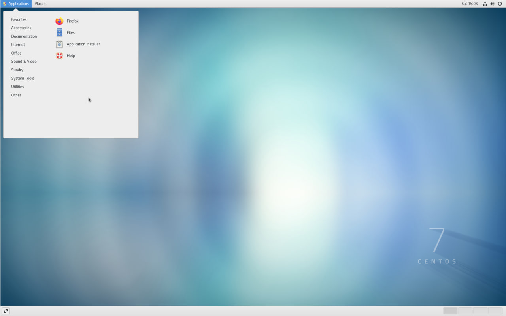

<h3 align="center"><b>Application</b></h3>

 

 

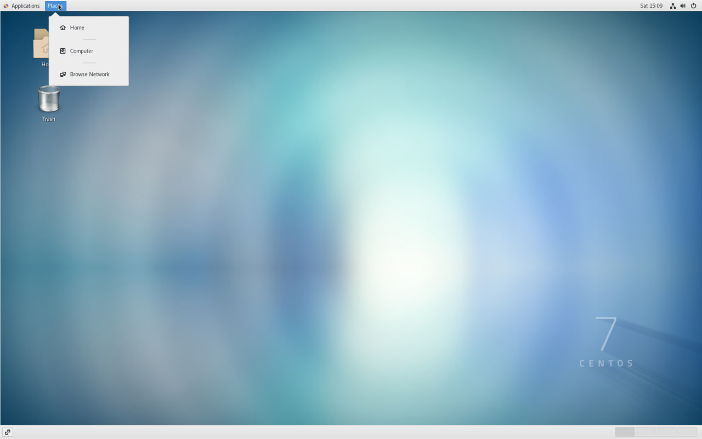

<h3 align="center"><b>Places</b></h3>

 

 

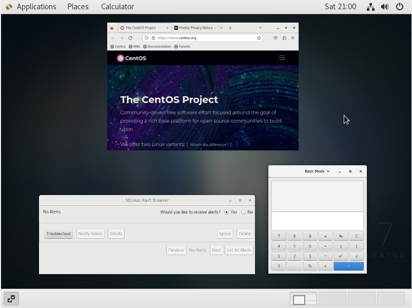

<h3 align="center"><b>Activity overview</b></h3>

 

 

&nbsp; &nbsp; &nbsp; 1.2 Запуск програм. Дослідіть можливості запуску додатків різними способами (описати спосіб і по-
можливості показати скріншоти):

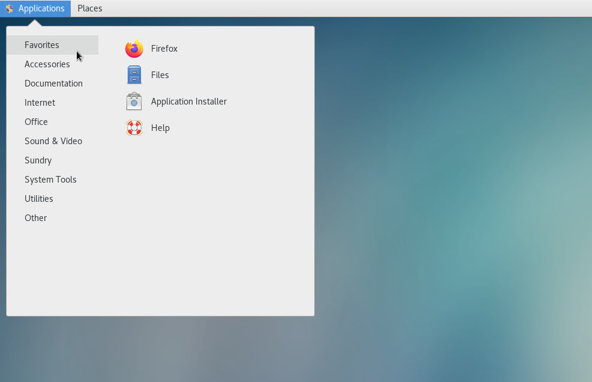

<h3 align="center"><b>Run via Favorites</b></h3>

 

 

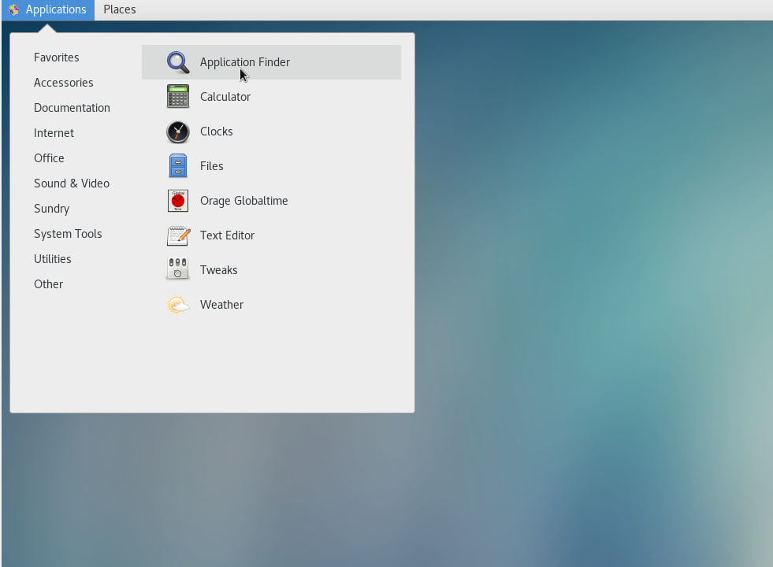

<h3 align="center"><b>Search in menu</b></h3>

 

 

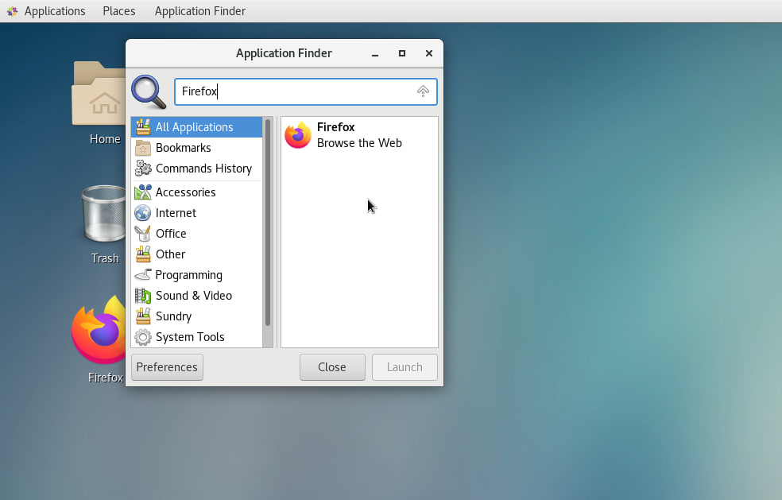

<h3 align="center"><b>Next step to search in menu</b></h3>

 

 

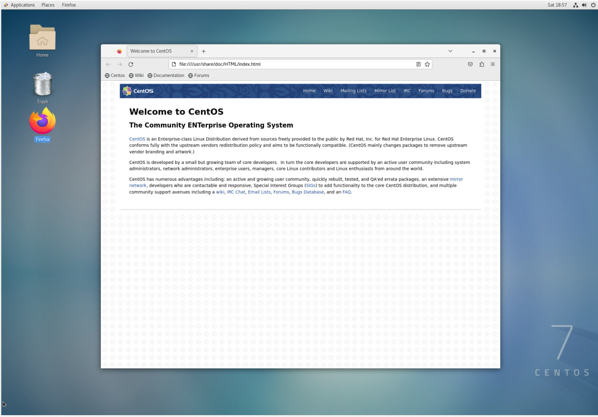

<h3 align="center"><b>Run via widget</b></h3>

 

 

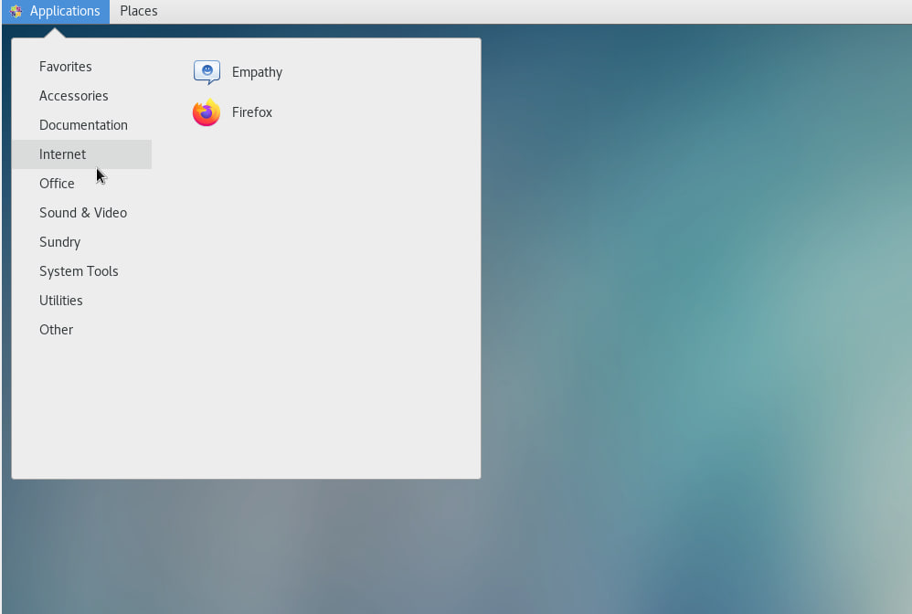

<h3 align="center"><b>Run via global menu</b></h3>

 

 

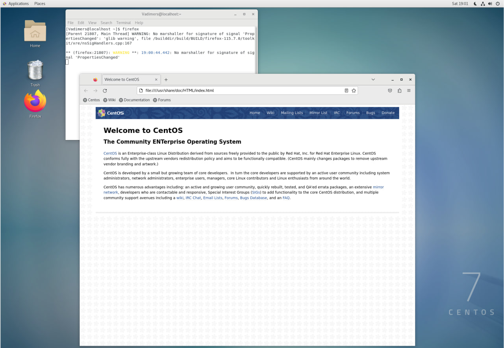

<h3 align="center"><b>Run via terminal</b></h3>

 

 

&nbsp; &nbsp; &nbsp; 1.3. Вихід з системи та завершення роботи в Linux. Як виконати в графічному інтерфейсі наступні дії
(наведіть скріни):

- Зміна користувача на root

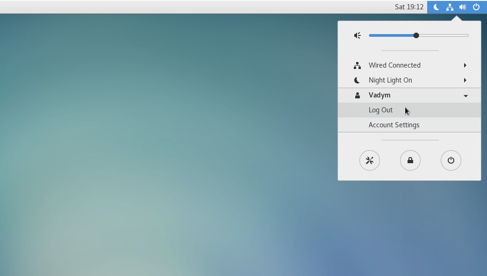

<h3 align="center"><b>Change user</b></h3>

 

 

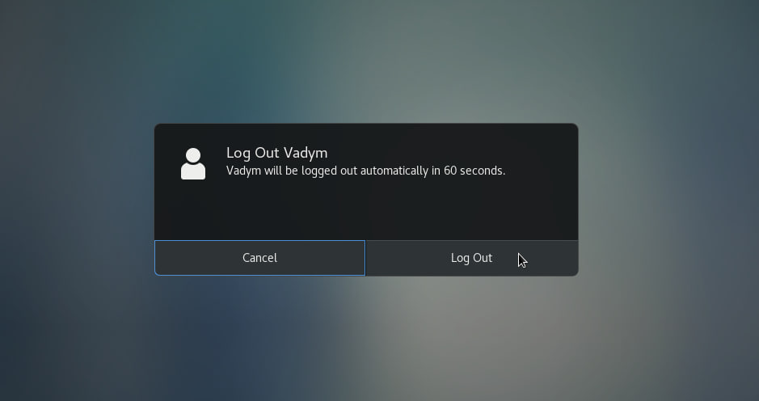

<h3 align="center"><b>Next step to change user</b></h3>

 

 

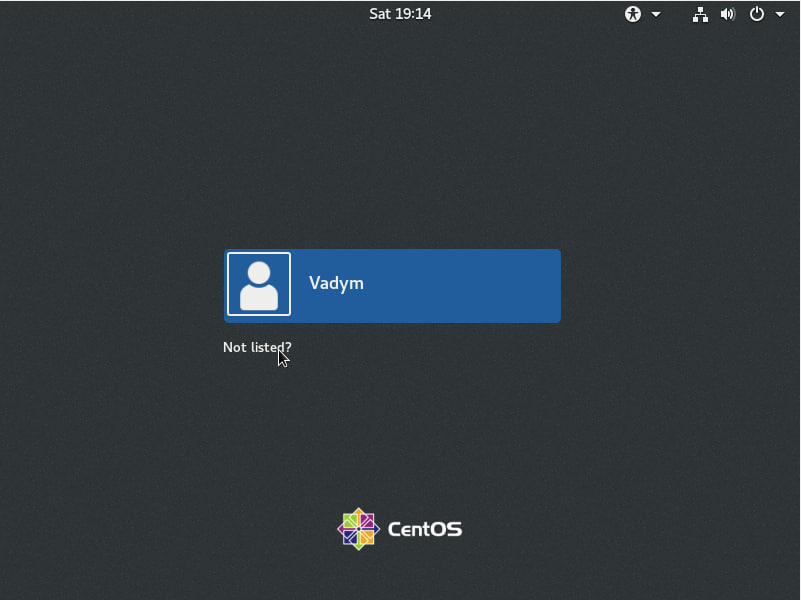

<h3 align="center"><b>Next step to change user</b></h3>

 

 

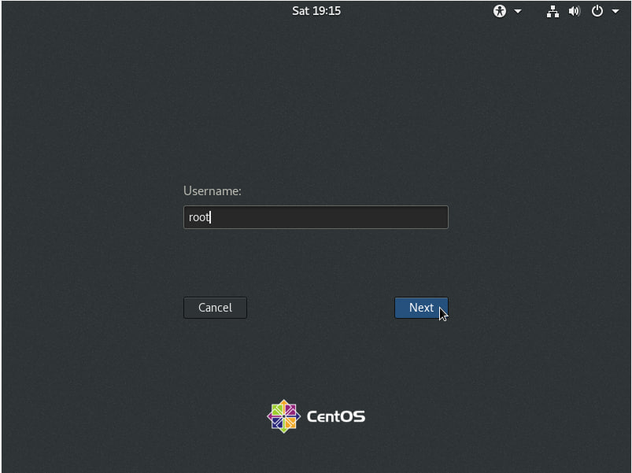

<h3 align="center"><b>Next step to change user</b></h3>

 

 

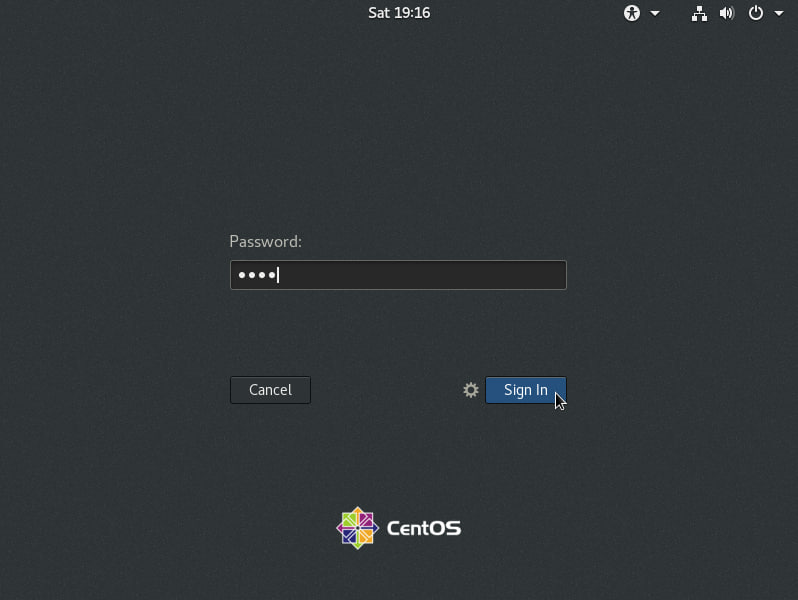

<h3 align="center"><b>Next step to change user</b></h3>

 

 

- Перезавантаження системи і вимкнення системи

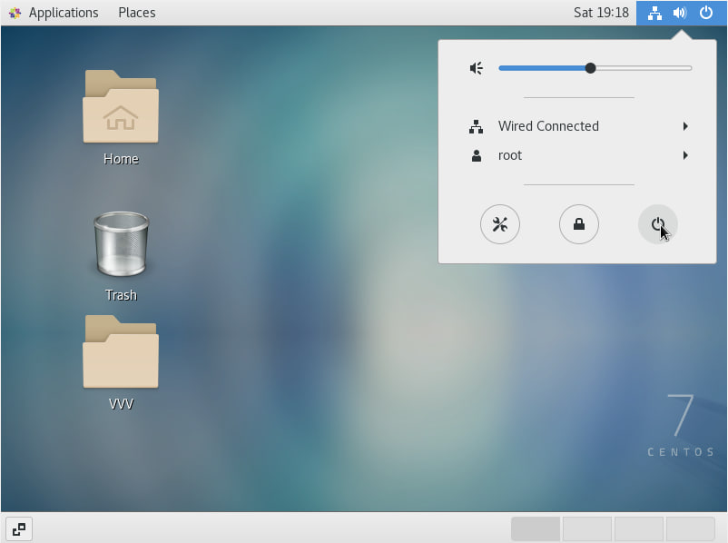

<h3 align="center"><b>Restart and power off system</b></h3>

 

 

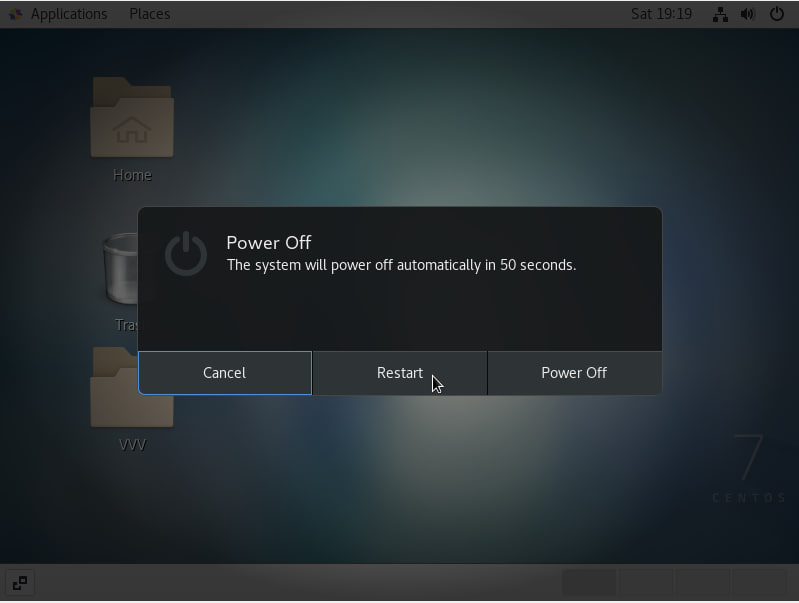

<h3 align="center"><b>Next step to restart and power off system</b></h3>

 

 

2. Робота в середовищі мобільної ОС.

   2.1. Опишіть головне меню вашої мобільної ОС, який графічний інтерфейс вона використовує?
Here are some of the key features of the Android main menu:

   **Icon grid:** The home screen is home to app icons that you can move, organize, and delete.
    
   **Quick access bar:** At the top of the screen is the quick access bar where you can find icons for Wi-Fi, Bluetooth, screen brightness, and other settings.
    
   **Widget:** You can add widgets to the Home screen to get quick access to information and features such as weather, calendar, news, and more.
    
   **Folder:** You can create folders to organize similar apps or widgets.
    
   **Search:** You can use the search bar to find apps, contacts, files, and other data on your device.
    
   **Android's graphical user interface**

   Android uses ***Material Design***, a design language developed by Google. Material Design focuses on simplicity, clarity, and intuitiveness. It uses smooth animations, shadows, and vibrant colors to make the user interface feel pleasant and comfortable.

&nbsp; &nbsp; &nbsp; 2.2. Опишіть меню налаштувань компонентів мобільного телефону.

   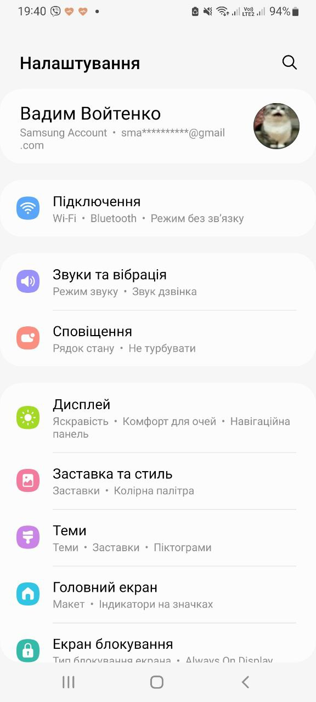

<h3 align="center"><b>My phone setting</b></h3>

&nbsp; &nbsp; &nbsp; 2.3. Використання комбінацій клавіш для виконання спеціальних дій.

   *Go to the Home screen:* Press the Home key.
    
   *Open your recent apps:* Press the View key.
    
   *Take a screenshot:* Press the Volume Down and Power keys simultaneously.
    
   *Turn Do Not Disturb mode on/off:* Press the Volume Down key for 3 seconds.
    
   *Turn off the phone:* Press the Power key for 10 seconds.
    
   *Restart the phone:* Hold down the Power and Volume Down keys for 7 seconds.
   
   Android has a gesture control feature.

   Gestures can be different: resetting, pressing, moving a finger along a certain trajectory, etc. Each smartphone manufacturer may have its own gestures and settings.

&nbsp; &nbsp; &nbsp; 2.4. Вхід у систему та завершення роботи пристрою. Особливості налаштувань живлення батареї.

Logging in to the system:

а)
 
Power on: Hold down the Power key for a few seconds.
Unlock: Enter PIN, password, pattern key or use biometric authentication (fingerprint, face and eyes recognition)
 
Turn off: Hold down the Power key for a few seconds.

b)
 
Power saving mode: This mode helps extend battery life by limiting background activity and some functions.
Adaptive Battery: Android automatically learns your usage habits and optimizes your battery life by limiting battery usage to unused apps.
 
Battery usage statistics: You can see which apps consume the most battery power.
Battery optimization: Android can help you optimize your battery usage by recommending settings and actions.

**Відповіді на контрольні запитання**

1. Наведіть приклади серверних додатків Linux для сервера баз даних, серверів розсилки повідомлень та файлообмінників.

1) Database server:
   - MySQL or MariaDB: Popular open-source relational database management system (RDBMS).
   - PostgreSQL: Another powerful relational DBMS supporting advanced SQL extensions and ACID properties.
   - MongoDB: A NoSQL database storing data in JSON-like documents.

2) Mail servers:
   - Postfix: Popular Mail Transfer Agent (MTA) used for sending and receiving email.
   - Sendmail: Another MTA providing similar functionality to Postfix.
   - Exim: Another MTA with extensive customization and extension capabilities.

3) File exchanges:
   - vsftpd: Very Secure FTP Daemon, a fast and secure FTP server for file transfer.
   - ProFTPD: Another powerful FTP server with many features and customization options.
   - Samba: Allows file sharing between Linux systems and Windows computers using the SMB/CIFS protocol.

2. Порівняйте оболонки Bourne, C, Bourne Again (Bash), the tcsh, Korn shell (Ksh) та zsh.

1. Bourne Shell (sh):
   - One of the first Unix shells.
   - Has limited functionality compared to modern shells.
   - Used as the standard shell for many Unix systems.

2. C Shell (csh):
   - Has a syntax similar to the C programming language.
   - Supports a range of useful features, such as command history and pseudographic capabilities.

3. Bourne Again Shell (Bash):
   - Extension of the Bourne Shell with many enhancements and additional features.
   - Used by default in many modern Linux distributions.
   - Supports command history, job control, environment variables, and other useful features.

4. Tcsh:
   - Extension of the C Shell with additional features such as autocompletion and error correction.
   - Has a similar syntax to the C Shell but with more capabilities.

5. Korn Shell (Ksh):
   - Combines functionality from the Bourne Shell and C Shell.
   - Has many extensions and enhancements, including support for dynamic variables, branching, and loops.

6. Z Shell (Zsh):
   - Has many features that enhance user convenience and productivity.
   - Provides better autocompletion, directory management, and other advanced capabilities compared to other shells.
   - Often used as an alternative shell to Bash on Unix systems.

Each of these shells has its own characteristics