<h3 align="center">“Київський фаховий коледж зв’язку” 
Циклова комісія Комп’ютерної інженерії</h3>

 
 
 
 
 
 

<h1 align="center">ЗВІТ ПО ВИКОНАННЮ 
ЛАБОРАТОРНОЇ РОБОТИ № 3</h1>

 

<h3 align="center">з дисципліни: «Операційні системи»</h3>

<h2 align="center">Тема: “Знайомство з базовими командами   
CLI-режиму в Linux  </h2>

    <b>Виконали студенти   групи РПЗ-13а   Команда OSGURU:   Войтенко В.С.,    Селезень Є.С.   Перевірив викладач   Сушанова В.С. </b>

 
 
 

<h2 align="center">Київ 2024</h2>

**Мета роботи:**
1. Знайомство з базовими командами CLI-режиму в Linux.
2. Знайомство з базовими текстовими командами в термінальному режимі роботи в різних ОС.

**Матеріальне забезпечення занять**
1. ЕОМ типу IBM PC.
2. ОС сімейства Windows (Windows 7).
3. Віртуальна машина – Virtual Box (Oracle).
4. Операційна система GNU/Linux – CentOS.
5. Сайт мережевої академії Cisco netacad.com та його онлайн курси по Linux

**Завдання для попередньої підготовки.** 
*Готував матеріал студент Войтенко В.*

1. Прочитайте короткі теоретичні відомості до лабораторної роботи та зробіть невеликий словник базових англійських термінів з питань призначення команд та їх параметрів.

<h2 align="center"><b>A BRIEF GLOSSARY OF BASIC ENGLISH TERMS RELATED  
TO THE CLASSIFICATION OF VIRTUAL ENVIRONMENTS</b></h2>

|                       Термін англійською                   |                                    Термін українською                                            |
|------------------------------------------------------------|--------------------------------------------------------------------------------------------------|
| Shell (the command line interpreter that translates commands entered by a user into actions to be performed by the operating system). | Оболонка (інтерпретатор командного рядка, який перекладає команди, введені користувачем, на дії, які повинна виконати операційна система.)|
| Command Line Interface (CLI) (a text-based interface for interacting with a computer through typed commands)| Інтерфейс командного рядка (CLI) (текстовий інтерфейс для взаємодії з комп'ютером за допомогою введених команд)|
| Bash Shell (The most commonly used shell for Linux distributions, which features  command line history, inline editing, scripting, aliases, and variables.) | Оболонка Bash (Найпоширеніша оболонка для дистрибутивів Linux, яка має такі функції: історія команд, вбудований редактор, скриптування, псевдоніми та змінні) |
| Prompt (Displays information about the user and the system in the command-line interface. Typically includes the username, system name, and current directory) | Віртуалізація (технологія, яка дозволяє створювати віртуальні версії апаратного забезпечення, операційних систем, сховищ даних та інших ресурсів) |
| Command (A software program that, when executed on the CLI, performs an action on the computer) | Команда (Програмне забезпечення, яке, коли виконується у CLI, виконує дію на комп'ютері.)|
| Arguments (the data passed to a specific command in the command line, indicate something for the command to act upon or which parameters it should use) | Аргументи (це дані, які передаються певній команді у командному рядку. Вони вказують на щось, на що має впливати команда або які параметри вона має використовувати)  |
| Options (used with commands to expand or modify the way a command behaves) | Опції (параметри) (використовуються з командами для розширення або модифікації способу поведінки команди) |
| Internal commands (built-in commands) | Вбудовані команди (внутрішні команди) |
| External commands (stored in files) | Зовнішні команди (зберігаються в файлах) |
| Aliases (map longer commands to shorter key sequences) | Псевдоніми (відображення довших команд на короткі послідовності клавіш) |
| Functions (built using existing commands to create new commands or override existing ones) | Функції (створюються за допомогою існуючих команд для створення нових команд або перевизначення вбудованих або команд, що зберігаються у файлах) |
| Quoting (the use of various types of quotation marks or quotes in programming and working with the command line to specify how text should be processed) | Укладення (цитування) (це використання різних видів лапок або кавичок у програмуванні та роботі з командним рядком для вказання, як текст має бути оброблений) |
| Double quotes (") Single quotes (') Back quotes (`) | Подвійні лапки (") Одинарні лапки (') Зворотні лапки (`) |
| Control statements (Allow the use of multiple commands at once or run additional commands) | Керуючі оператори (Дозволяють використовувати кілька команд одночасно або запускати додаткові команди) |
| Semicolon ( ; )  | Крапка з комою |
| Double ampersand (&&) | Подвійний амперсанд |
| Double pipe (\|\|) | Подвійна вертикальна риска |
| Variables (is a feature that allows the user or the shell to store data temporarily in memory) | Змінні (можливість, яка дозволяє користувачеві або оболонці зберігати дані тимчасово в памяті) |
| Command Types | Типи команд |

4. Дайте визначення наступним поняттям:

1\)	**Command Prompt:** This is software that executes commands provided by the user or other programs and interacts with the operating system to perform specific tasks. A command prompt takes commands from the user via the command line or other sources and executes them on the system.

2\)	**Shell:** This is the interface between the user and the operating system that accepts commands from the user and passes them to the operating system kernel for execution. The shell can provide access to functions such as running programs, managing files, and inputting/outputting data.

3\) **Command:** This is an instruction or direction that a user or program provides to an operating system to perform a specific action. A command can be entered on the command line or invoked from a program interface, and it tells the operating system what to do. Commands can perform a variety of actions, from managing files and processes to configuring the system and interacting with the user.

5. Дайте відповіді на наступні питання:

*- Яку базову інформацію надає рядок запрошення prompt?*

The prompt line provides basic information about the current working environment and system status. It usually includes the user name, system or host name, and the path to the current working directory. 
 
For example, a typical prompt string might look like this:
 

**sysadmin@localhost:~$**

The prompt string contains the following information:
- User name (sysadmin)
- System name (localhost)
- Current directory (~)
- Current Directory (~) "$" is usually a character that indicates the end of the prompt line

*Для чого команді потрібні параметри та аргументи?*

Arguments indicate something that the command should act on or what parameters it should use.  Variables are used with commands to extend or modify the way the command behaves.

*- Яке призначення команд ls, які параметри та аргументи вона може мати? Наведіть 3 приклади.*

The main parameters and arguments of the ls command:

Option -l: Displays detailed information about files and directories, such as access permissions, owner, group, file size, date and time of modification.

Example: ls -l.

The -a option: Shows all files, including hidden files, that start with a dot.

Example: ls -a

The directory argument: Shows the contents of the specified directory instead of the current directory.

Example: ls /home/user/documents

*- Яким чином можна використати історію команд, які переваги це надає?*

Allows users to view and repeat previously entered commands in the terminal: 

а\) The user can simply view the command history by typing the history command in the terminal. This will show a list of recently entered commands and their numbers.

b\) Repeating the previous command: To repeat the last command entered, you can use the up arrow key or type !!.

c\) Repeating a command by its number: The user can repeat any command from the history using its number. For example, !23 will repeat the 23rd command in the history.

d\) Search for commands in the history: Using the Ctrl+R key, the user can search for previous commands by partial phrase or word.
Benefits: automation and error correction.

*- Яке призначення команди echo?*

echo is used to output text or variables to the screen or to a file 

*- Охарактеризуйте поняття змінної в оболонці Bash, які типи змінних вона підтримує?*

A variable in the Bash shell is a named container that is used to store a value.

**Types of variables:**

Local variables: available only within the current script or shell.
 
Environment variables: available to all child processes running from the current shell.
 
Export variables: available to all child processes as well as to other shells running from the current shell.

**Data types:**

String: text data.
 
Integer: numeric data.
 
Lists: ordered collections of data.
 
Associative arrays: unordered collections of data where each element has a key and a value.

*- Яке призначення команд env, export та unset?*

**env:** displays a list of all environment variablesб сan be used to run commands with a modified environment.
 

**export:** used to create environment variables or to extend the visibility of existing variables to all child processes.
 

**unset:** used to remove variables from the shell.

**Хід роботи.**

1. Опрацюйте всі приклади команд, що представлені у лабораторній роботі курсу NDG Linux Essentials - Lab 5: Command Line Skills та Lab 6: Getting Help. Створіть таблицю для опису цих команд

|                         Command                            |                                    Description                                  |
|------------------------------------------------------------|---------------------------------------------------------------------------------|
|                                ls                          | Displays information about directories and files. By default, without arguments, displays information for the current directory |
|                               ls -l                        | Using the -l option in the ls command allows you to display information about files located in the current working directory in a long format that provides more extensive additional information |
|                               ls -l /tmp                   | Using the /tmp argument in combination with the -l option in the ls command command allows you to display detailed information about the files in the /tmp directory |
|                               history                      | To view the entire history list of a terminal |
|                               !!                           | To execute the most recent command type |
|                            \$PATH                           | The PATH variable lists all the places that the system can look for programs to execute |
|                       type command                         | Command can be used to determine information about command type |
|                             cd                             | Change directory |
|                            which                           | Command searches for the location of a command by searching the PATH variable |
|                             date                           | Displays the current time and date |
|                            whereis                         | To search for the location of a command or the man pages for a command |
|                            locate                          | To find any file or directory |
|                             info                           | Command also provides documentation on operating system commands and features |
|                           --help                           | Command will provide basic information |

1. Робота в в терміналі (закріплення практичних навичок) обов'язково представити свої скріншоти:
   
2.1. Робота зі змінними (Variables) та псевдонімами (Aliases) в терміналі:
- Створіть змінні, що будуть містити Ваші імена та прізвища $var_name1, $var_name2, $var_name3

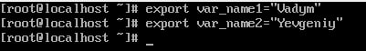

- За допомогою команди echo виведіть імена студентів вашої команди
  
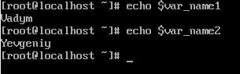

- Створіть псевдоніми mycal1, mycal2, mycal3 для команди cal для автоматичного виведення
календарю вашого року народження

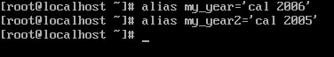

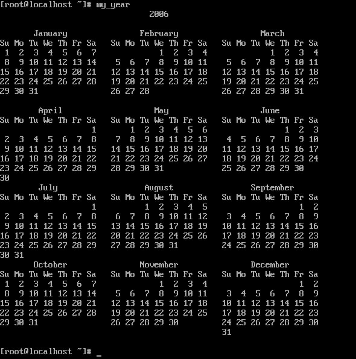

2.2. Робота з функціями (Functions) в терміналі:
- Створіть функцію students_report, що порядково буде виводити спочатку імена студентів Вашої
команди, а потім роки їх народження.

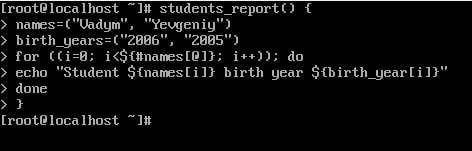

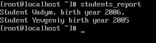

2.3. Робота з лапками (Quoting) в терміналі. Виведіть в командному рядку наступні речення:
- “We create such variables as \$var_name1, \$var_name2, \$var_name3, which stored our names Name1, Name2, Name3” (у реченні спочатку виводимо назви змінних, а потім їх вміст)

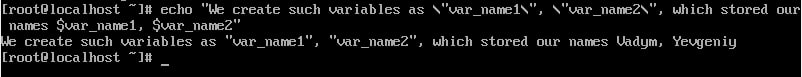

- “We create such Aliases as mycal1, mycal2, mycal3, which can show our calendars: Calendar1, Calendar2, Calendar3” (у реченні спочатку виводимо назву команди-псевдонімів, потім вивід
цих команд).

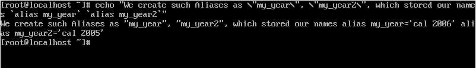

2.4. Робота з інструкціями керування (Control Statements) в терміналі:.
- Чи можна завдання 2.1 та 2.2 ходу роботи виконати через інструкції керування без написання
окремої функції, як це буде виглядати?

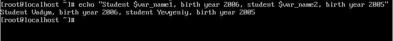

2.5. Робота з командами довідки (Man Pages) в терміналі:.
- На прикладі команди uname продемонструйте як отримати довідку. На основі отриманої додаткової інформації наведіть 5 різних варіантів виводу результату інформації по даній команді з використанням 5 різних параметрів (Options)

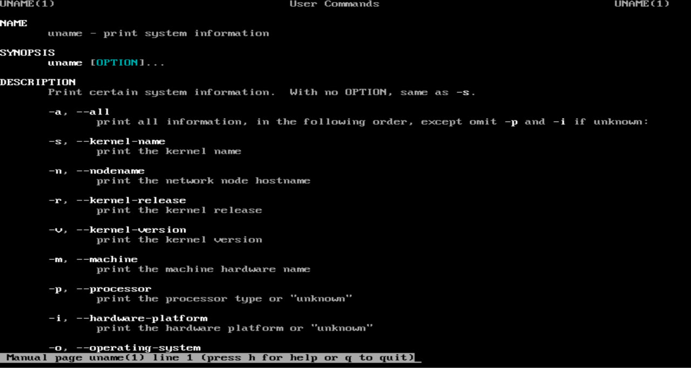

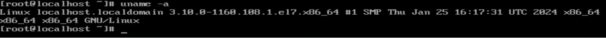

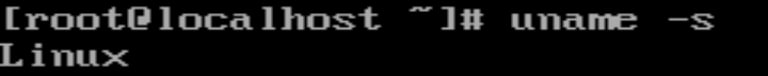

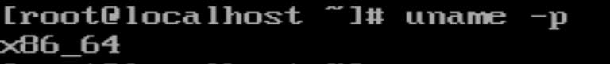

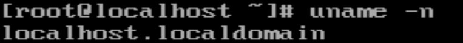

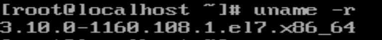

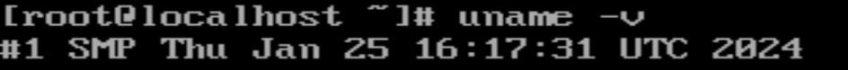

*Готував матеріал студент Селезень Є.*

**Контрольні запитання:**
1. Які типи команд існують в оболонці Bash?

   **ls Command** - The ls (list) command is used to list directories or files. By default (i.e., running ls with no options at all) the command will return the directories and files of the current directory, excluding any hidden files. Some of the most useful options are: 
*ls -a*: List all the files in the current directory including hidden files too
*ls -l*: Long listing of all the files and their size in the current directory 
**cd Command** - The cd (change directory) command is used to navigate the directory tree structure. 
**rm Command** - The rm (remove) command is used to delete files, directories or even symbolic links from your file system. Some of the most useful options are: 
*rm-i*: Remove all the files in the directory but let the user confirm before deleting it.
*rm-r*: Remove non-empty directories including all the files within them.
*rm-f*: Remove files or directories without prompting even if they are write-protected — the f stands for force. 
**mv Command** - The mv (move) command is used to move one or more directories or files from one location in the file system to another. 
**cp Command** - Cp is a utility that lets you copy files or directories within the file system. Some of the most useful options are: 
*cp -u file1.txt file1_final.txt*: Copy the content of file1.txt into file1_final.txt only if the former (source) is newer than the latter (destination).
*cp -R myDir/ myDir_BACKUP*: Copy directories
*cp -p file1.txt file1_final.txt*: Copy file1.txt and preserve ownership 
**mkdir Command** - The mkdir command is useful when it comes to creating new directories in the file system. 
**pwd Command** - The pwd (print working directory) command can be used to report the absolute path of the current working directory. 
**touch Command** - The touch command allows you to create new empty files or update the time stamp on existing files or directories. If you use touch with files that already exist, then the command will just update their time stamps. If the files do not exist, then this command will simply create them.
Some of the most useful options are: 
*touch -c file1.txt*: If file file1.txt already exists, then this command will update the file’s time stamps. Otherwise, it will do nothing.
*touch -a file1.txt*: Updates only the access time stamp of the file.
*touch -m file1.txt*: Updates only the modification time of the file. 
**cat Command** - Cat is a very commonly used command that allows users to read concatenate or write file contents to the standard output.
Some of the most useful options are: 
*cat-n file1.txt*: Display the contents of the file file1.txt along with line numbers.
*cat-T file1.txt*: Display the contents of the file file1.txt and distinguish tabs and spaces (tabs will be displayed as ^I in the output). 
**less Command** - The less command lets you display the contents of a file one page at a time. Less won’t read the entire file when it is being called; thus, it leads to way faster load times.
Some of the most useful options are: 
*less-N file1.txt*: Display the content (first page) of the file file1.txtand show line numbers.
*less-X file1.txt*: By default, when you exit less, the content of the file will be cleared from the command line. If you want to exit but also keep the content of the file on the screen use the -X option. 
**more Command** - The more command can also be used for displaying the content of a file in the command line. In contrast to less, this command loads the entire file at once, which is why less seems faster.
Some of the most useful options are: 
*more -p file1.txt*: Clear the command line screen and then display the content of file1.txt
*more +100 file1.txt*: Display the content of file1.txt starting from the 100th line onwards. 
**grep Command** - The grep (global regular expression) command is useful when you wish to search for a particular string in files.
Some of the most useful options are: 
*grep-v Andrew employees.txt*: Invert match Andrew in employees.txt. In other words, display all the lines that do not match the pattern Andrew.
*grep-r Andrew dirName/*: Recursively search for pattern Andrew in all files in the specified directory dirName
*grep-i Andrew employees.txt*: Performs a case-insensitive search. 
**curl Command** - The curl command is used to download or upload data using protocols such as FTP, SFTP, HTTP and HTTPS. 
**which Command** - The which command is used to identify and report the location of the provided executable. For instance, you may wish to see the location of the executable when calling python3. 
**top Command** - The top command can help you monitor running processes and the resources (such as memory) they are currently using.
Some of the most useful options are: 
*top-u myuser*: Display processes for the user myuser. 
**history Command** - The history command displays the history of the commands that you’ve recently run.
Some of the most useful options are: 
*history-5*: Display the last five commands.
*history-c*: Clear the history list.
*history-d 10 20*: Delete lines 10 to 20 from the history list.

2. Що таке змінні оточення? Які вони бувають? Як їх можна переглянути в терміналі?

Environment variables are dynamic named values that affect the processes running on a computer. They are part of the environment in which a process runs and can be accessed by software programs during runtime. Environment variables are commonly used to configure various aspects of software behavior and to provide information about the environment in which a program is executing. In Linux, you can view environment variables in the terminal using various commands. Here are the commands specific to Linux: 
*printenv*: This command prints all environment variables.

*echo*: This command echoes the value of a specific environment variable. For example, to view the value of the PATH environment variable.

*env*: This command also displays the current environment variables.
   
3. Опишіть змінну $PS1. Як в терміналі переглянути її вміст?

$PS1 is an environment variable in the Bash shell that defines the primary prompt string. It determines how the command prompt appears in the terminal before each command is entered. The default value of $PS1 typically includes information such as the username, hostname, current working directory, and other relevant details. You can view the contents of \$PS1 by echoing it in the terminal: *echo $PS1*

4. Як можна змінити значення змінної \$PS1? Що при цьому відбудеться в рядку запрошенні в bash (рядок запрошення перед початком кожної команди). Як змінити значення цієї змінної не на поточний сеанс, а за замовчуванням?

You can change the value of \$PS1 directly in the terminal. For example, to set a new prompt that only displays the current directory: PS1='\w\$ '
After changing \$PS1, the bash prompt line (the line before each command) will reflect the updated value according to your specification.
To change the value of \$PS1 permanently, not just for the current session, you can add the assignment to your shell configuration file such as ~/.bashrc or ~/.bash_profile. This ensures that the modified prompt persists across sessions.

5. Для чого використовують лапки в оболонці Bash?

Quotation marks in the Bash shell are used to delimit strings and to control how the shell interprets special characters within those strings. There are three types of quotation marks commonly used: 
**Single quotes** ('): Encloses a string where all characters are interpreted literally, without any special meaning. Variables and command substitutions are not expanded within single quotes. 
**Double quotes** ("): Encloses a string where variable names and command substitutions are expanded, but most special characters (such as *, ?, !, etc.) are not treated specially. 
**Backticks** (`): Used for command substitution, indicating that the enclosed command should be executed, and its output should be substituted into the string.

6. Для чого використовують інструкції керування, які їх види Ви знаєте?

Control instructions in Bash are used to manipulate the flow of execution in scripts or interactive sessions. Common types of control instructions include: 
Conditional statements (if, elif, else): Used to execute code based on certain conditions. 
Looping statements (for, while, until): Used to execute code repeatedly until a certain condition is met. 
Case statements (case, esac): Used to perform different actions based on the value of a variable or expression. 
Control flow modifiers (break, continue, return, exit): Used to alter the flow of control within loops, functions, or scripts.

8. В чому різниця якщо в кінці рядку запрошення bash стоїть символ \$ чи #?

In the Bash prompt line, the characters \$ and # at the end signify different prompt styles, indicating the current user's privileges or permissions.

\$Prompt: When the prompt ends with \$, it indicates that the current shell session is running with regular user privileges. This is typically seen when you are logged in as a regular user. 
#Prompt: When the prompt ends with #, it indicates that the current shell session is running with superuser or root privileges. This is typically seen when you are logged in as the system administrator or have escalated your privileges using sudo. 
The difference between these prompts is crucial because it helps users quickly discern whether they are operating with regular user permissions or with elevated privileges that grant access to system-wide configurations and operations.

9. Яке призначення команд whereis та locate? Яка між ними відмінність?

The whereis and locate commands in Unix-like operating systems serve similar purposes, but they have different methods of searching for files and directories. 
Purpose: 
whereis: The whereis command is used to locate the binary, source, and manual page files for a specified command. It provides information about the location of executable files, source code, and documentation related to a given command.

locate: The locate command is used to find files by name. It searches through a pre-built database of files and directories on the system to quickly locate the specified file or files matching a given pattern.

Difference: 
whereis:
Searches for executable files, source code, and manual pages related to a specified command.
It does not search the entire filesystem but rather specific directories where executables, sources, and manuals are typically stored (like /bin, /usr/bin, /usr/local/bin, etc.).
The whereis command is fast but may not find files that are located outside of the predefined search directories.

locate:
Searches for files and directories by name.
It searches the entire filesystem or specific directories and builds an index (or database) of filenames in advance, which allows for fast searches.
The locate command is more comprehensive in searching for files but may not always display the most up-to-date information since it relies on the pre-built index, which is typically updated periodically (e.g., daily) by a system cron job. 
In summary, whereis is used to locate various components related to a specific command, while locate is used to quickly find files and directories by name. The choice between them depends on the specific use case and whether you need to locate a command or simply find a file on the system.

**Висновок:**

In the course of the lab, we learned about basic CLI commands in Linux and basic text commands in terminal mode in different operating systems. We learned how to work with variables and aliases, functions, quotes, control statements, and man pages in terminals.

