<h3 align="center">“Київський фаховий коледж зв’язку”<br/>
Циклова комісія Комп’ютерної інженерії</h3>

<br/>
<br/>
<br/>
<br/>
<br/>
<br/>

<h1 align="center">ЗВІТ ПО ВИКОНАННЮ<br/>
ЛАБОРАТОРНОЇ РОБОТИ № 4</h1>

<br/>

<h3 align="center">з дисципліни: «Операційні системи»</h3>

<h2 align="center">Тема: “Команди Linux  <br/>
 для управління процесами" <br/></h2>


<div style="text-align: right;">
    <font size="4"><b>Виконали студенти <br/> групи РПЗ-13а <br/> Команда OSGURU: <br/> Войтенко В.С., <br/>  Селезень Є.С. <br/> Перевірив викладач <br/> Сушанова В.С. </b></font>
</div>

<br/>
<br/>
<br/>

<h2 align="center">Київ 2024</h2>

<hr>

[//]: # (НАПИСАТИ ТАБЛИЦЮ!)

2. На базі розглянутого матеріалу дайте відповіді на наступні питання:

2.1. Які команди для моніторингу стану процесів ви знаєте. Як переглянути їх можливі параметри?

**top:** The top command displays a list of active processes in real time. It shows general system information such as CPU usage, memory, process information, and more.

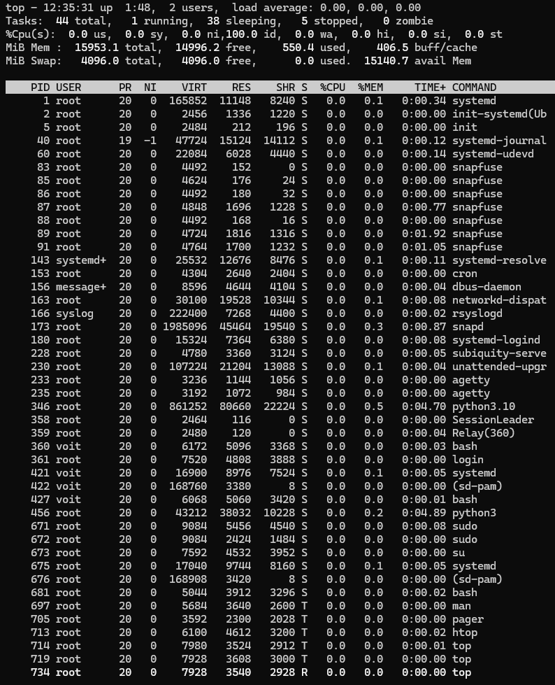

<h3 align="center"><b>top</b></h3>

<br/>

<br/>

**htop:** htop is an interactive alternative to the top command. It provides more functionality and a user-friendly interface for interacting with processes.

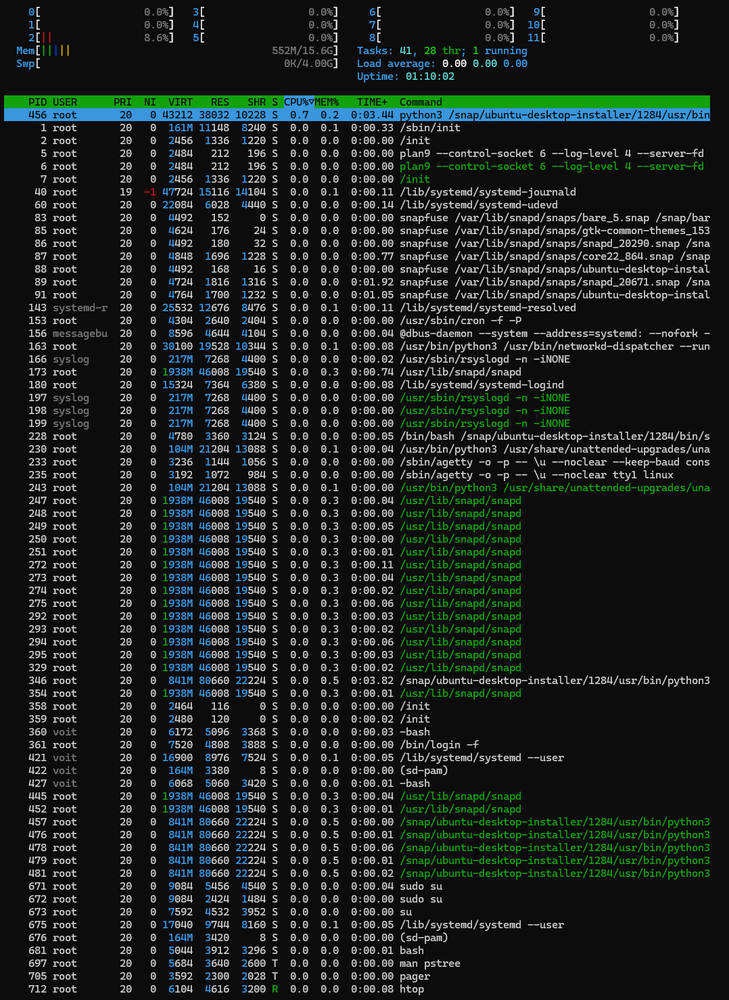

<h3 align="center"><b>htop</b></h3>

<br/>

<br/>

**ps:** The ps command allows you to display a list of processes. You can use various flags to get more information about the processes, such as ps aux to list all processes.

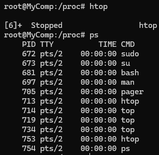

<h3 align="center"><b>ps</b></h3>

<br/>

<br/>

**pidstat:** This command provides real-time process statistics, including CPU usage, memory, and other parameters.

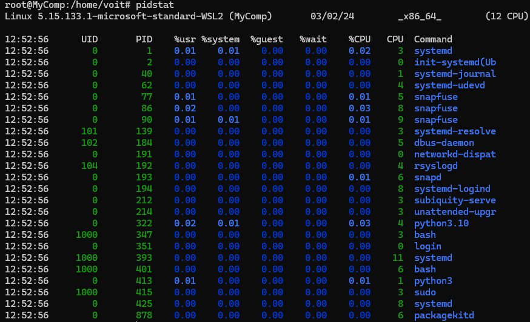

<h3 align="center"><b>pidstat</b></h3>

<br/>

<br/>

**iotop:** This command allows you to monitor the input/output (I/O) on your system, that is, disk I/O activity.

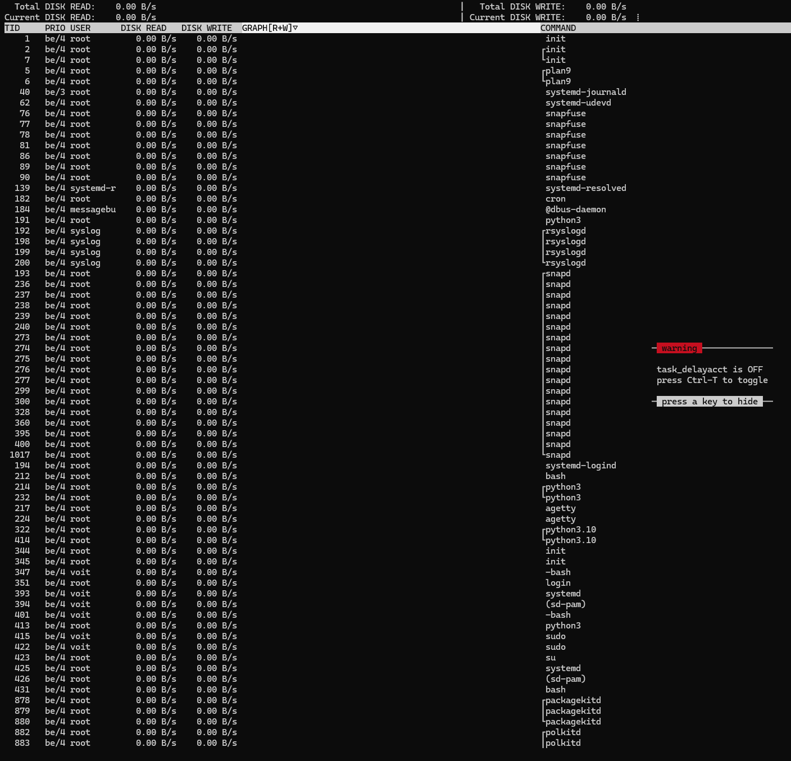

<h3 align="center"><b>iotop</b></h3>

<br/>

<br/>

**strace:** This tool tracks system calls and signals sent and received by processes.

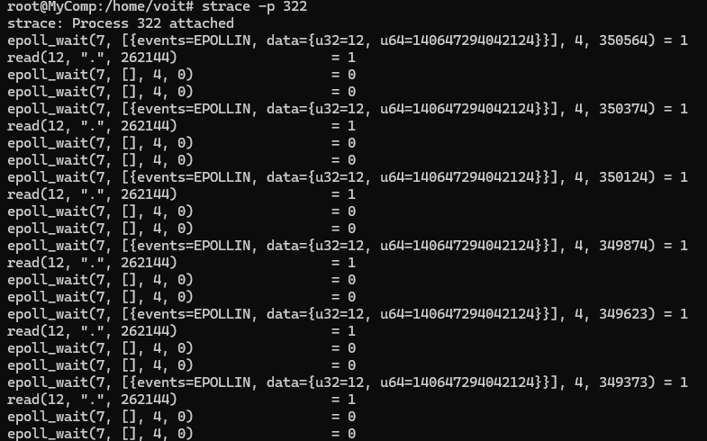

<h3 align="center"><b>strace</b></h3>

<br/>

<br/>

**lsof:** The lsof command displays a list of open files and ports on the system, including the processes that use them.


<h3 align="center"><b>lsof</b></h3>

<br/>

<br/>

2.2. Чи може команда ps у реальному часі відслідковувати стан процесів?

No, the ps command cannot track the state of processes in real-time. It only provides a snapshot of the process state at the time it is invoked.
To monitor the state of processes in real-time in Linux, the top command is  used. It displays active processes in real-time and updates the information automatically.

2.3. За якими параметрами можливе сортування процесів в команді top? Як переключатись між ними?

The top command allows sorting processes, including by the following parameters:

**ViRT:** 

**RES:**

**SHR:**

**%CPU:** Percentage of CPU time used by the process. 

**%MEM:** Percentage of physical memory used by the process.

**PID:** Process ID.

**TIME+:** Total CPU time used by the process since its start.

**COMMAND:** Name of the command or program executed by the process.

2.4. Які команди для завершення роботи процесів ви знаєте?

Commands for terminating processes:

```kill```: allows you to send signals to processes based on their process IDs (PIDs);

```killall```: allows you to stop processes by their names instead of using PID numbers;

Хід роботи.


1. Початкова робота в CLI-режимі в Linux ОС сімейства Linux:

    1.3. Запустіть свою операційну систему сімейства Linux (якщо працюєте на власному ПК та її
    встановили) та запустіть термінал.

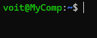

<h3 align="center"><b>Start Ubuntu</b></h3>

<br/>

<br/>

2. Дайте відповіді на наступні питання:

- Як вивести вміст директорії /proc? Де вона знаходиться та для чого призначена? Охарактеризуйте інформацію про її вміст?

To view the contents of the /proc directory, you can use the ls command in the terminal.

```ls/proc```

This command will display a list of files and folders contained in the /proc directory.

The /proc directory contains virtual files that provide information about the system's hardware, processes, and kernel runtime parameters. Each file in the /proc directory corresponds to a specific aspect of the system, and reading these files allows users and system utilities to gather detailed information about the system's configuration and current state.

Some common types of information available in the /proc directory include:

1.	Process Information: Files like /proc/[pid]/stat and /proc/[pid]/status provide detailed information about each running process, including its process ID (PID), parent process ID (PPID), memory usage, CPU usage, and more.

2.	System Information: Files like /proc/cpuinfo and /proc/meminfo provide information about the system's CPU, memory, and other hardware components.

3.	Kernel Information: Files like /proc/sys/kernel/version and /proc/sys/kernel/panic contain information about the running kernel, including its version and various configuration parameters.

4.	Network Information: Files like /proc/net/dev provide information about the system's network interfaces, including statistics on received and transmitted data.
Overall, the /proc directory serves as a convenient interface for accessing real-time system information in Linux.

- Як вивести інформацію про поточні сеанси користувачів. Якою командою це можна зробити?

You can view information about current user sessions using the who command. This command displays a list of users currently logged into the system, along with the times they logged in and other useful information about their sessions.

- Які дії можна зробити в терміналі за допомогою комбінацій Ctrl + C, Ctrl + D та Ctrl + Z?

1.	**Ctrl + C:** this combination interrupts the execution of the current command or program. It sends the INT (interrupt) signal to the process, typically resulting in its immediate termination;
2.	**Ctrl + D:**  this combination signals the end of file (EOF) in the terminal or exits you from the current shell if it is awaiting input;
3.	**Ctrl + Z:**  this combination suspends the execution of the current process and puts it into the background. It sends the STOP signal to the process, pausing its execution but not terminating it.

- Чим відрізняється фоновий процес від звичайного. Де вони використовуються?

**Foreground Process:**

a.	Executes in an active mode and displays its output on the screen.

b.	Blocks input of new commands until it completes its execution or is suspended.

c.	Often requires user interaction to terminate or continue its operation.

**Background Process:**

a.	Executes in the background mode and does not display its output on the screen.

b.	Does not block the terminal, allowing the user to enter commands while it runs.

c.	Typically used for tasks that require a long execution time or do not require active user participation.

- Опишіть наступні команди та поясніть що вони виконують – команда jobs, bg, fg.

1.	**Command jobs:**

*Description:* The jobs command displays a list of active tasks that have been launched in the current shell and are in the background mode.

*Usage:* jobs

2.	**Command bg:**

*Description:* The bg command is used to send stopped (suspended) background jobs into execution directly in the background mode.

*Usage:* bg [job_spec], where job_spec can be a job ID or % followed by its number.

3.	**Command fg:**

*Description:* The fg command is used to bring background jobs to the foreground and continue their execution in an actively interacting mode with the user.

*Usage:* fg [job_spec], where job_spec can be a job ID or % followed by its number.

- Якою командою можна переглянути інформацію про запущені в системи фонові процеси та задачі?

The command to view information about background processes and tasks running in the system is ```jobs```.

- Як призупинити фоновий процес, як його потім відновити та при необхідності перезапусти?

1) To suspend: Ctrl + Z;

2) To resume: ```fg [job number]```;

3) To restart: ```bg [job number]```.

3. Запустіть термінал, та в командному рядку виконайте наступні дії для ознайомлення з роботою з процесами:

- запустіть команду top, проаналізуйте отриманий в цій команді результат та охарактеризуйте найбільш активні процеси у системі;


<h3 align="center"><b>Command "top"</b></h3>

<br/>

<br/>

**Shift + P:** sorting mode by the level of CPU resource consumption;

**Shift + M:** sorting by memory;

**Shift + T:** sorting by process execution time;

**Shift + N:** sorting processes by number;

- призупинити виконання команди top (треба використати комбінацію клавіш);

Use combination: **Ctrl + Z**

- вивести інформацію про процеси за допомогою команди ps;


<h3 align="center"><b>Command "ps"</b></h3>

<br/>

<br/>

- наведіть 5 прикладів з використанням різних параметрів команди ps (наприклад, вивести тільки системні процеси, вивести процеси конкретного користувача, вивести дерево процесів тощо).
Опишіть, що саме роблять обрані Вами параметри

```pstree``` - displays the process tree

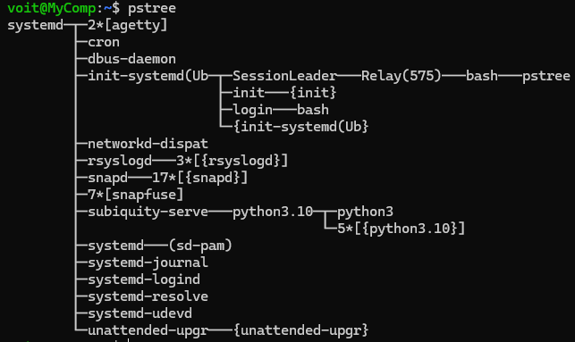

<h3 align="center"><b>Command "pstree"</b></h3>

<br/>

<br/>

```ps aux``` - displays information about all processes running on the system

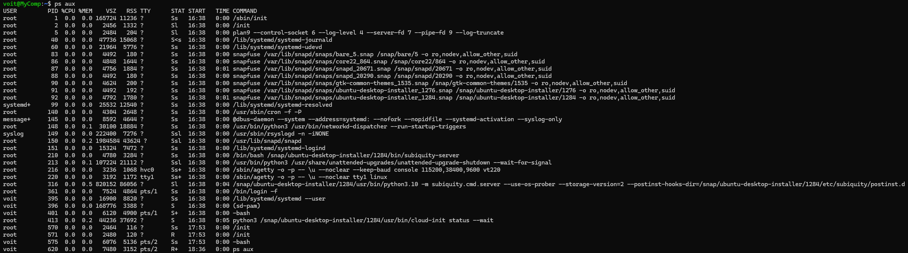

<h3 align="center"><b>Command "ps aux"</b></h3>

<br/>

<br/>

``` ps r ``` - display processes to the "running" state

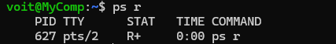

<h3 align="center"><b>Command "ps r"</b></h3>

<br/>

<br/>

```ps T``` - display information about processes that are in the "stopped" state

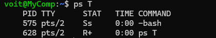

<h3 align="center"><b>Command "ps T"</b></h3>

<br/>

<br/>

```ps x``` - displays all processes, even those that are not associated with the terminal

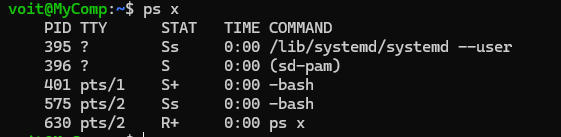

<h3 align="center"><b>Command "ps x"</b></h3>

<br/>

<br/>

- передивіться чи є у Вас запущені фонові процеси, які саме?

```sleep 200 &```

:arrow_down:

```jobs```

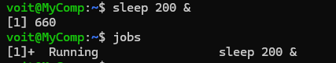

<h3 align="center"><b>Command "jobs"</b></h3>

<br/>

<br/>

***+*** it`s a backgroung procces

***&*** it`s a running into background procces

- відновити виконання призупиненого фонового процесу спочатку у позиції “на передньому плані” (foreground), потім ще раз його призупинити, а потім відновити його виконання у позиції “на задньому плані” (background)

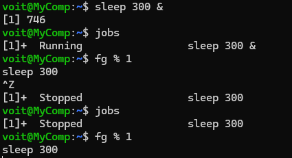

<h3 align="center"><b>From background to foreground</b></h3>

<br/>

<br/>

- завершити роботу даного фонового процесу.

Use **Ctrl + C**

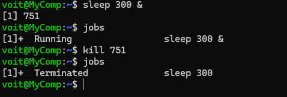

<h3 align="center"><b>Finish the procces</b></h3>

<br/>

<br/>

**Відповіді на контрольні запитання:**
1. What is the purpose of the /proc directory in Linux systems and what type of information does it store?

The /proc directory in Linux systems serves as an interface to kernel data structures and stores various system information such as process information, hardware configuration, and system settings.

2. How can you dynamically determine which among three processes is currently utilizing the most memory in Linux? Additionally, what percentage of memory does it consume from the total available memory?

To dynamically determine which process is using the most memory among three processes, you can use commands like 'top' or 'ps' to monitor memory usage. Calculate the memory usage of each process and compare them. The percentage of memory consumption can be calculated by dividing the memory usage of the process by the total available memory and then multiplying by 100.

3. How can you obtain the hierarchy of parent processes in Linux systems? Provide a description of its structure.

You can obtain the hierarchy of parent processes in Linux systems using the 'pstree' command. This command displays processes in a tree format, illustrating their parent-child relationships. The structure shows parent processes at the top with their child processes listed beneath them, forming a hierarchical tree.

What are the differences between the 'top' command and 'ps' command in Linux?

The 'top' command provides a dynamic real-time view of system processes, continuously updating information such as CPU and memory usage. On the other hand, the 'ps' command provides a snapshot of current processes running on the system at the moment the command is executed.
In comparison to 'top', what additional features does 'htop' offer?

'htop' offers additional features such as a more user-friendly interface, color-coded display, horizontal and vertical scrolling, and the ability to navigate and manipulate processes more efficiently, including the option to kill processes directly from the interface.
What components does your mobile OS include for monitoring running processes?

Components of my mobile OS for monitoring running processes may include a built-in task manager application, system monitor widgets, and settings options to view and manage processes.
Does your mobile OS support terminal management of processes? If so, how?

Yes, my mobile OS supports terminal management of processes. Users can utilize terminal applications to view processes, send signals, and manage them effectively using commands such as 'ps', 'kill', and 'top'.
Is it possible to install third-party applications on your Samsung mobile phone for organizing management and monitoring of processes? If yes, briefly describe them.

Yes, it is possible to install third-party applications on my Samsung mobile phone for managing and monitoring processes. These applications, such as Task Manager for Android or System Monitor, offer features like detailed process information, resource usage monitoring, and options to terminate or manage processes efficiently.
