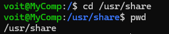
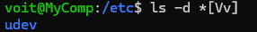
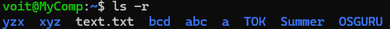

<h3 align="center">“Київський фаховий коледж зв’язку” 
Циклова комісія Комп’ютерної інженерії</h3>

 
 
 
 
 
 

<h1 align="center">ЗВІТ ПО ВИКОНАННЮ 
ЛАБОРАТОРНОЇ РОБОТИ № 5</h1>

 

<h3 align="center">з дисципліни: «Операційні системи»</h3>

<h2 align="center">Тема: “Знайомство з командами навігації по файловій системі та керування файлами та каталогами”  </h2>

    <b>Виконали студенти   групи РПЗ-13а   Команда OSGURU:   Войтенко В.С.,    Селезень Є.С.   Перевірив викладач   Сушанова В.С. </b>

 
 
 

<h2 align="center">Київ 2024</h2>

**Мета роботи:**
 
 Отримання практичних навиків роботи з командною оболонкою Bash.
 
 Знайомство з базовими командами навігації по файловій системі.
 
 Знайомство з базовими командами для керування файлами та каталогами.
 

**Матеріальне забезпечення занять:**
1. ЕОМ типу IBM PC.
2. ОС сімейства Windows та віртуальна машина Virtual Box (Oracle).
3. ОС GNU/Linux (будь-який дистрибутив).
4. Сайт мережевої академії Cisco netacad.com та його онлайн курси по Linux

**Завдання для попередньої підготовки.** 
*Готував матеріал студент Войтенко В.*

1. Прочитайте короткі теоретичні відомості до лабораторної роботи та зробіть невеликий словник базових англійських термінів з питань призначення команд та їх параметрів.

<h2 align="center"><b>A BRIEF GLOSSARY OF BASIC ENGLISH TERMS RELATED  
TO THE CLASSIFICATION OF VIRTUAL ENVIRONMENTS</b></h2>

|                       Термін англійською                   |                                    Термін українською                                            |
|------------------------------------------------------------|--------------------------------------------------------------------------------------------------|
| Hierarchical organization structure (a system of organizing elements into levels or ranks, where each level contains sub-elements related to the one above it) | Ієрархічна структура організації (система організації елементів на рівні або в рангах, де кожен рівень містить під-елементи, пов'язані з вищим)|
| The top level of the directory structure (the highest level in the hierarchy of directories within a filesystem)| Верхній рівень структури каталогів (найвищий рівень у ієрархії каталогів у файловій системі)|
| Filesystem (a method used by an operating system to organize and store data on a storage device) | Файлова система (метод, що використовується операційною системою для організації та зберігання даних на пристрої зберігання) |
| Unix file structure (the organization of files and directories in the Unix operating system) | Структура файлів Unix (організація файлів та каталогів у операційній системі Unix) |
| Linux filesystem (the organization of files and directories in the Linux operating system) | Структура файлів Linux (організація файлів та каталогів у операційній системі Linux)|
| Filesystem Hierarchy Standard (FHS) (a set of guidelines that define the structure of directories in Unix-like operating systems, including Linux) | Стандарт ієрархії файлової системи (набір рекомендацій, що визначають структуру каталогів у подібних до Unix операційних системах, включаючи Linux)  |
| Home directory (a unique directory assigned to your user account) | Домашній каталог (унікальна директорія, призначена вашому обліковому запису користувача) |
| GUI-based applications (applications that have a graphical user interface, allowing users to interact with them using visual elements such as windows, buttons, and icons) | Програми з графічним інтерфейсом користувача (програми, які мають графічний інтерфейс користувача, що дозволяє користувачам взаємодіяти з ними за допомогою візуальних елементів, таких як вікна, кнопки та піктограми) |
| Globbing (a mechanism in shell scripting that allows pattern matching against filenames) | Глобування (механізм у скриптінгу оболонки, який дозволяє порівнювати шаблони з іменами файлів) |
| Glob characters (special characters used in globbing to represent sets of filenames) | Символи глобування (спеціальні символи, які використовуються у глобуванні для представлення наборів імен файлів) |
| Filename length (the number of characters in a filename) | Довжина імені файлу (кількість символів у назві файлу) |
| Asterisk * character (used to represent zero or more of any character in a filename) | Символ зірочка * (використовується для позначення нуля або більше будь-яких символів у назві файлу) |
| Question mark ? character (represents any single character) | Знак питання ? символ (представляє будь-який окремий символ) |
| Bracket [] characters (used to match a single character by representing a range of characters that are possible match characters) | Символи дужки [] (використовуються для зіставлення одного символу шляхом представлення діапазону символів, які є можливими символами зіставлення) |
| Exclamation point ! character (used in conjunction with the square brackets to negate a range)  | Символ оклику ! (використовується разом з квадратними дужками для заперечення діапазону) |

**Завдання для попередньої підготовки.** 
*Готував матеріал студент Селезень Є.*

2. На базі розглянутого матеріалу дайте відповіді на наступні питання:

2.1 Порівняйте файлові структури Windows-подібної та Linux-подібної системи.

In Windows, the file structure has a top-level My Computer, and each device is assigned a different drive letter (e.g., C: or D:).
In Linux, the file structure is at the top level, the root directory (/), and each physical device is accessed through directories, not drive letters.

2.2 *Розкрийте поняття FHS. Як даний стандарт використовується в контексті файлових систем? 

FHS is a file system hierarchy standard that defines the structure of directories and files in Linux.
This standard provides uniformity between different Linux distributions and simplifies the work of administrators and software developers.
The FHS defines the main directories, such as /bin, /boot, /etc, /home, /tmp, /usr, and others, and their purpose.

2.3 **Перерахуйте основні команди для роботи з файлами та каталогами в Linux: створення, переміщення, копіювання, видалення. 

**Create:**
mkdir: create a new directory.
touch: create a new file or update the creation/modification time. 
**Move/rename:**
mv: move a file or directory from one location to another or rename it. 
**Copy:**
cp: Copy files or directories from one location to another. 
**Remove:**
rm: Delete files or directories.
rmdir: delete empty directories.
To delete directories with contents, use the -r or -rf option with rm.

**Завдання для попередньої підготовки.** 
*Готували матеріал студенти Войтенко В. та Селезень Є.*

**Хід роботи**

Опрацюйте всі приклади команд, що представлені у лабораторних роботах курсу NDG Linux Essentials - Lab 7: Navigating the Filesystem та Lab 8: Managing Files and Directories. Створіть таблицю для опису цих команд

|                        Назва команди                       |                                Її призначення та функціональність                                |
|------------------------------------------------------------|--------------------------------------------------------------------------------------------------|
| pwd | Визначає місце знаходження користувача у файловій системі, показує поточну робочу директорію (print working directory)|
| сd Documents| Команда cd здійснює перехід до каталогу, який у неї вказаний як аргумент. В даному випадку це каталог Documents|
| cd | Переводить користувача до домашнього каталогу |
| cd ... | Переходить в каталог вище |
| ls | Переглядає вміст поточного каталогу|
| ls / | Переглядає вміст кореневого каталогу  |
| ls -a | Відображає всі приховані файли |
| ls -l | Виводить довгий перелік відображення. Переглядає розмір, право доступу або мітки часу файлу |
| ls -lh | Представляє розмір файлу в більш зручному для читання розмірі |
| ls -d | Посилається на поточний каталог, а не на вміст у ньому |
| ls -ld | Представляє детальніший вміст для каталога (директорії) |
| ls -R | Відображає рекурсивний список файлів |
| ls -S | Відсортовує файли за розміром |
| ls -ls | Відсортовує файли в алфавітному порядку |
| ls -lSh  | Відображає файли у зрозумілому для людини вигляді |
| ls -t --full-time | Відображає повну позначку часу (включаючи години, хвилини, секунди) |
| echo /etc/t* | Відображає всі файли в каталозі /etc, які починаються з літери t |
| echo /etc/t??????? | Відображає всі файли в каталозі /etc, які починаються на літеру t і мають рівно 7 символів після символу t |
| echo /etc/*.??? | Відображає файли з трилітерним розширенням |
| echo /etc/ [gu]* | Друкує будь-який файл, який починається з символу g або u і містить нуль або більше додаткових символів |
| echo /etc/ [a-d]* | Друкує діапазон символів між a і d включно |
| echo /etc/ [!a-t]* | Відображає будь-який файл, який не починається з літер діапазону від a до t |
| ls -d /etc/e* | Відображає назву каталогів замість їхнього вмісту |
| cp /etc/hosts ~ | Копіює файл /etc/hosts у ваш домашній каталог |
| cp -v /etc/hosts ~ | Виводить повідомлення у разі успіху |
| cp -i /etc/hosts ~/example.txt | Параметр -i вимагає відповіді y або n для кожної копії |
| cp -n /etc/skel.* ~ | Параметр -n означає не переписувати |
| cp -r /etc/skel.* ~ | Дозволяє скопіювати як файли, так і каталоги |
| mv newexample.txt myexample.txt | Перейменовує файл newexample.rxt в myexample.rxt |
| mv -i newexample.txt myexample.txt | Запитує чи потрібно перезаписувати файл |
| mv -n newexample.txt myexample.txt | Не перезаписує вміст цільових файлів |
| mv -v newexample.txt myexample.txt | Показує хід виконання команди та результат |
| touch sample | Створює порожній файл |
| mkdir test | Створює директорію |
| rm sample | Видаляє файл |
| rm -i sample | Запитує чи видалити файл|
| rm -r  Videos | Видаляє каталог |

3. Робота в в терміналі (закріплення практичних навичок) обов'язково представити свої скріншоти:

Визначте ваш поточний робочий каталог;

 

 

Перейдіть до кореневого каталогу та визначте Ваш поточний робочий каталог (дві команди);

 

 

Перегляньте вміст поточного каталогу у довгому форматі (скористайтесь відповідним ключем команди ls);

 

 

Перейдіть до каталогу /usr/share та визначте Ваш поточний робочий каталог (дві команди)

 

 

Перегляньте вміст поточного каталогу включаючи і приховані файли (hidden files) (скористайтесь відповідним ключем команди ls);

 

 

*Перейдіть до каталогу /etc;

 

 

*Перегляньте вміст даного каталогу, але щоб виводило тільки назви файлів, що починаються з літери вашого імені;

 

 

*Перегляньте вміст даного каталогу, але щоб виводило тільки файли, назви яких складаються з 6 літер;

 

 

**Перегляньте вміст даного каталогу, але щоб виводило тільки файли, назви яких закінчуються на літери ваших імен, наприклад якщо ваші імена Ivan, Anna, Maks, то вибірку робиму, щоб назви файлів закінчувались на літери [i,a,m];

 

 

**Перейдіть до домашнього каталогу поточного користувача та перегляньте його вміст у рекурсивному (зворотному до алфавітного) форматі (виконати цю дію через конвеєр команд);

 

 

В поточній директорії створити директорію з назвою вашої групи;  

 

 

Переглянути оновлений вміст домашнього каталогу поточного користувача. Скористайтесь ключем -r команди ls, яку інформацію ви отримаєте?

 

 

Перейдіть у створену вами директорію з назвою Вашої групи та створіть у ній порожній файл lab5

 

 

Створити в даній директорії 3 директорії з прізвищами студентів вашої команди surname1, surname2, surname3 (команда mkdir мульти аргумента, тому всі три каталоги можна створити однією командою);

 

 

Перейдіть у перший підкаталог surname1 та створіть порожній файл з ім'ям першого студента name1;  

 

 

За допомогою команди echo "Hello, my name is Name1" > name1 внесіть у цей файл дані про студента (символ > дозволяє вивід команди echo перенаправити одразу у файл name1);

Перегляньте вміст файлу name1 за допомогою команди cat name1 (має містити щойно введену Вами інформацію)

 

 

Зробіть копію першого файлу name1 та перейменуйте її у файл з другим ім'ям студенту Вашої команди name2;

Перегляньте вміст каталогу, обидва файли мають з'явитися; 

 

 

Перегляньте вміст другого файлу cat name2 (він має поки що містити повну копію вмісту файлу name1)  

 

 

Замініть зміст файлу name2, щоб він містив відповідне ім'я другого студента за допомогою команди echo "Hello, my name is Name2" > name2

Перегляньте вміст другого файлу cat name2 (він вже має містити оновлену інформацію)

 

 

Перемістіть файл name2 у директорію surname2;

 

 

Зробіть копію першого файлу name1 та перейменуйте її у файл з третім ім'ям студенту Вашої команди name3;

 

 

Перемістіть файл name3 у директорію surname3;

Перейдіть до директорії  surname3;

Перегляньте вміст третього файлу командою cat name3 (він має містити дані про другого студента)

 

 

Замініть зміст файлу name3, щоб він містив відповідне ім'я третього студента за допомогою команди echo "Hello, my name is Name3" > name3

Перегляньте вміст файлу за допомогою  cat name3 (він вже має містити оновлену інформацію)

 

 

Поверніться до домашнього каталогу користувача;

**Перегляньте вміст даного каталогу, але щоб виводило тільки Ваш підкаталог з назвою групи та весь його вміст (підкаталоги surname1, surname2, surname3 та файли name1, name2, name3) до того ж файли та катлоги були відкоремлені кольорами (скористайтесь відповідним ключем -R команди ls та не забудьте використати спеціальний glob-шаблон [імя каталогу])

 

 

4. Опишіть дії, які виконують команди для переміщення по системі каталогів:

- команда cd / (переходить в корінний каталог)
 
- команда cd /home (переходить в директорію home)
 
- команда cd ~ (переходить в робочий каталог)
 
- команда cd (без аргумента) (переходить в робочий каталог)
 
- команда cd .. (переходить у каталог вище)
 
- команда cd ../.. (переходить на два каталоги више)
 
- команда cd - (переходить у каталог вище)

**Завдання для попередньої підготовки.** 
*Готував матеріал студент Селезень Є.*

Контрольні запитання:

1. Як можна переглянути шлях до домашньої директорії користувача за допомогою команди echo? Існує 2 способи, наведіть обидва приклади у терміналі (відповідь є у матеріалах академії cisco на сайті netacad.com)

2. *Чи можна переглянути вміст кореневого каталогу, перебуваючи у домашньому каталозі користувача без переходу у кореневий каталог? Продемонструйте це в командному рядку.
   

3. *Яким чином в терміналі можна додати інформацію в порожній файл?
   

4. **Як скопіювати та видалити існуючий каталог? Чи буде відмінність в командах, якщо каталог буде не порожній при цьому
   

5. **У якому з наведених нижче прикладів відбувається переміщення файлу? Його перейменування? Одночасно обидві дії?
     
    mv /work/tech/comp.png. /Desktop 
     
    mv /work/tech/comp.png. /work/tech/my_car.png 
     
    mv /work/tech/comp.png. /Desktop/computer.png
