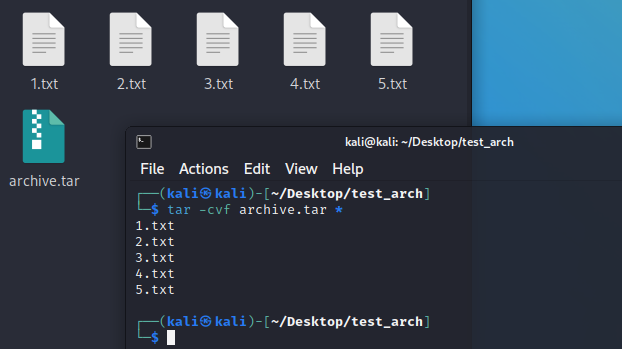
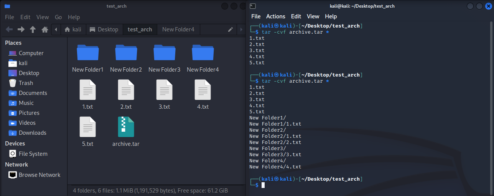
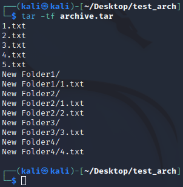
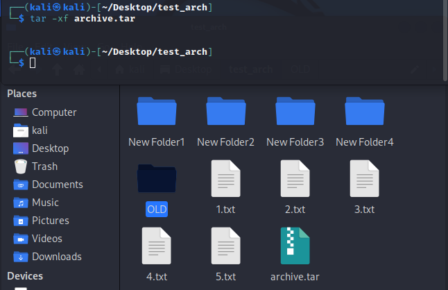
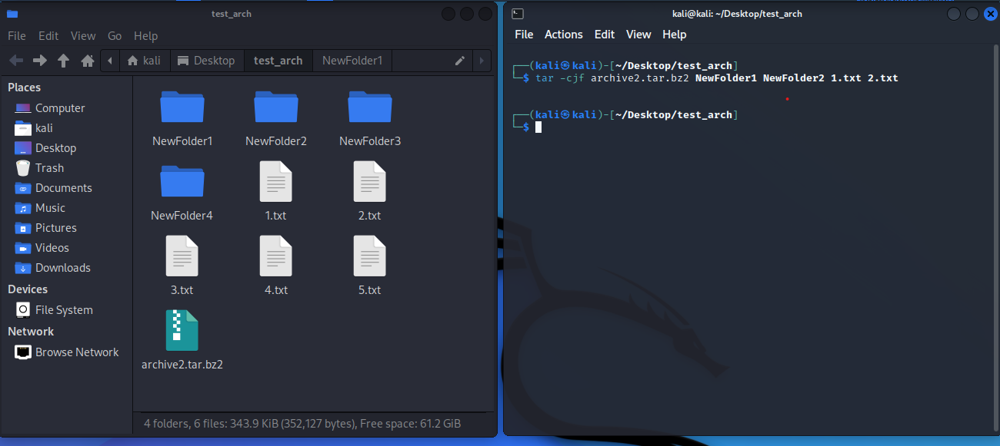
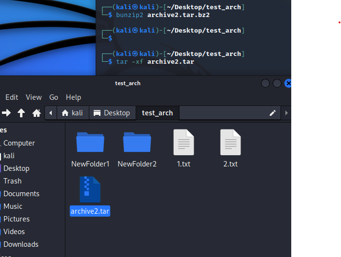
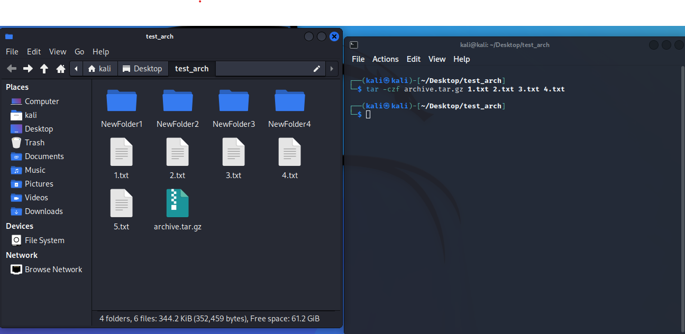
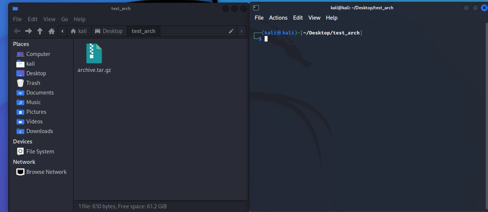
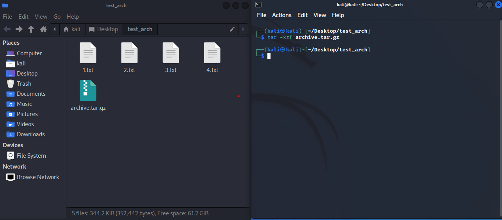

<h3 align="center">“Київський фаховий коледж зв’язку” 
Циклова комісія Комп’ютерної інженерії</h3>

 
 
 
 
 
 

<h1 align="center">ЗВІТ ПО ВИКОНАННЮ 
ЛАБОРАТОРНОЇ РОБОТИ № 6</h1>

 

<h3 align="center">з дисципліни: «Операційні системи»</h3>

<h2 align="center">Тема: “Команди Linux для архівування та стиснення даних. Робота з текстом”  </h2>

    <b>Виконали студенти   групи РПЗ-13а   Команда OSGURU:   Войтенко В.С.,    Селезень Є.С.   Перевірив викладач   Сушанова В.С. </b>

 
 
 

<h2 align="center">Київ 2024</h2>

**Мета роботи:**
 
 Отримання практичних навиків роботи з командною оболонкою Bash.
 
 Знайомство з базовими командами навігації по файловій системі.
 
 Знайомство з базовими командами для керування файлами та каталогами.
 

**Матеріальне забезпечення занять:**
1. ЕОМ типу IBM PC.
2. ОС сімейства Windows та віртуальна машина Virtual Box (Oracle).
3. ОС GNU/Linux (будь-який дистрибутив).
4. Сайт мережевої академії Cisco netacad.com та його онлайн курси по Linux

**Завдання для попередньої підготовки.** 
*Готував матеріал студент Войтенко В.*

1. Прочитайте короткі теоретичні відомості до лабораторної роботи та зробіть невеликий словник базових англійських термінів з питань призначення команд та їх параметрів.

<h2 align="center"><b>A BRIEF GLOSSARY OF BASIC ENGLISH TERMS RELATED  
TO THE CLASSIFICATION OF VIRTUAL ENVIRONMENTS</b></h2>

|                       Термін англійською                   |                                    Термін українською                                            |
|------------------------------------------------------------|--------------------------------------------------------------------------------------------------|
|  Compression (the process of reducing the size of a file or directory) | Стиснення (процес зменшення розміру файлу або каталогу )|
| Archiving (the process of backing up and saving data to a secure location, often in a compressed format) | Архівування (процес резервного копіювання та збереження даних у безпечному місці, часто в стислому форматі ) |
| Gzip (a classic compression tool that uses the DEFLATE algorithm) | Gzip (класичний інструмент стиснення, що використовує алгоритм DEFLATE) |
| Bzip2 (a compression tool that implements the Burrows-Wheeler algorithm) | Bzip2 (інструмент стиснення, який реалізує алгоритм Барроуза-Вілера) |
| Xz (a compression tool that uses the LZMA2 algorithm) | Xz (інструмент стиснення, що використовує алгоритм LZMA2) |
| Tar (a command-line utility used to manipulate and create archives)  | Tar (командний інструмент, який використовується для маніпулювання та створення архівів)  |
| Flags/Options (additional parameters passed to commands to modify their behavior) | Прапорці/опції (додаткові параметри, передані командам для зміни їх поведінки) |
| -z (gzip) (flag used with tar to indicate gzip compression) | -z (gzip)(прапорець, використовуваний з tar для позначення стиснення gzip) |
| -j (bzip2) (flag used with tar to indicate bzip2 compression) | -j (bzip2) (прапорець, використовуваний з tar для позначення стиснення bzip2) |
| -J (xz) (flag used with tar to indicate xz compression) | -j (xz) (прапорець, використовуваний з tar для позначення стиснення xz) |
| -t (tar) (flag used with tar to list the contents of an archive) | -t (tar) (прапорець, використовуваний з tar для виведення списку вмісту архіву) |
| -c (tar) (flag used with tar to create an archive) | -c (tar) (прапорець, використовуваний з tar для створення архіву) |
| -v (tar) (flag used with tar to display verbose output) | -v (tar) (прапорець, використовуваний з tar для виведення розгорнутої інформації) |
| -f (tar) (flag used with tar to specify the filename of the archive) | -f (tar) (прапорець, використовуваний з tar для вказівки імені файлу архіву) |

*Готували матеріал студенти Войтенко В. та Селезень Є.*

4. На базі розглянутого матеріалу дайте відповіді на наступні питання:

4.1 *Яке призначення команд  tar, xz, zip, bzip, gzip? Зробіть короткий опис кожної команди та виділіть їх основні параметри. Яким чином їх можна встановити.
 
**tar:**

Description: The tar command is used for creating, unpacking, and managing archives. It allows combining multiple files into one archive while preserving their directory structure, permissions, and other file attributes.
 
Main Parameters:
 
-c: Create an archive
 
-x: Extract an archive
 
-f filename: Specify the archive's name
 
-v: Verbose mode (output information)
 
-z: Compression using gzip
 
-j: Compression using bzip2
 
-J: Compression using xz
 
Installation: Tar is typically installed along with the base installation of the Linux operating system. If it's not installed, you can install it using your OS package manager.

**xz:**

Description: The xz command is used for compressing and decompressing files using the LZMA2 compression algorithm. It's commonly used to compress files or archives to reduce their size.
 
Main Parameters:
 
-z: Compress a file
 
-d: Decompress a file
 
-c: Send compressed output to standard output
 
Installation: xz can be installed using your OS package manager.

**zip:**

Description: The zip command is used for creating and unpacking ZIP archives. It allows combining multiple files and directories into one archive with compression.
Main Parameters:
 
-r: Recursively add directories
 
-9: Maximum compression level
 
-d: Delete files after compression
 
Installation: Zip is typically installed along with the base installation of the Linux operating system. If it's not installed, you can install it using your OS package manager.

**bzip:**

Description: The bzip command is used for compressing and decompressing files using the bzip2 compression algorithm. It provides more efficient compression compared to gzip but usually requires more time for compression.
Main Parameters:
 
-z: Compress a file
 
-d: Decompress a file
 
-s: Reduce memory requirements
 
Installation: bzip can be installed using your OS package manager.

**gzip:**

Description: The gzip command is used for compressing and decompressing files using the DEFLATE compression algorithm. It's a classic compression tool in the Linux environment.
Main Parameters:
 
-c: Send compressed output to standard output
 
-d: Decompress a file
 
-1 to -9: Compression level (from fastest to most efficient)
 
Installation: Gzip is typically installed along with the base installation of the Linux operating system. If it's not installed, you can install it using your OS package manager.

4.2 **Наведіть три приклади реалізації архівування та стискання даних різними командами. 
 
**tar:**

The tar command is used for creating and extracting archives. 
Example of creating an archive: tar -cvf archive.tar file1 file2 
Example of extracting an archive: tar -xvf archive.tar 

**gzip:**

The gzip command is used for compressing files. 
Example of compressing a file: gzip filename 
Example of decompressing a compressed file: gzip -d filename.gz 

**zip/unzip:**

The zip and unzip commands are used for creating and extracting ZIP archives. 
Example of creating a ZIP archive: zip archive.zip file1 file2 
Example of extracting a ZIP archive: unzip archive.zip 

4.3 *Яке призначення команд  cat, less, more, head and tail? Зробіть короткий опис кожної команди та виділіть їх основні параметри. Яким чином їх можна встановити
 
**cat:**

The cat command displays the contents of a file. 
Main parameter: cat [file] 
Installation can be done through the coreutils package. 

**less:**

The less command allows viewing file contents page by page. 
Main parameter: less [file] 
Installation can be done through the less package. 

**more:**

The more command also allows viewing file contents page by page, but pauses after each page, awaiting user action. 
Main parameter: more [file] 
Installation can be done through the util-linux package. 

**head:**

The head command outputs the first few lines of a file. 
Main parameter: head [file] 
Installation can be done through the coreutils package. 

**tail:**

The tail command outputs the last few lines of a file. 
Main parameter: tail [file] 
Installation can be done through the coreutils package. 

4.4 **Поясніть принципи роботи командної оболонки з каналами, потоками та фільтрами
 

The command-line shell operates on the principles of pipes, streams, and filters to facilitate efficient manipulation and processing of data. Here's an explanation of each: 

**Pipes**: 

Pipes allow for the seamless transfer of data between commands. The | symbol is used to connect the output of one command to the input of another.
When you use a pipe, the output produced by the command on the left side of the pipe is used as the input for the command on the right side.
For example: command1 | command2 
Here, the output of command1 is passed as input to command2. 

**Streams:** 

Streams are the primary means by which data is communicated between processes in the shell. 
There are three standard streams: 
*Standard Input (stdin):* This is where commands read input from. By default, it comes from the keyboard, but it can be redirected to come from a file or another command's output. 
*Standard Output (stdout):* This is where commands write their normal output. By default, it goes to the terminal, but it can be redirected to a file or another command's input. 
*Standard Error (stderr):* This is where commands write their error messages. Like stdout, it can be redirected. 
Redirection operators (<, >, >>) are used to manage these streams, allowing input/output redirection between files, commands, and pipes. 

**Filters:** 

Filters are commands that process input and produce output. They transform the data in some way.
They typically operate line by line, reading from stdin and writing to stdout.
Common filters include grep (search/filter), sed (stream editor), awk (text processing), sort (sorting), uniq (removing duplicates), etc.
Filters can be combined using pipes to create complex data processing pipelines.
In summary, the command-line shell leverages pipes to connect commands, streams to manage input/output channels, and filters to process data efficiently. This combination allows for powerful data manipulation and automation directly from the command line.

4.5 *Яке призначення команди grep?
 
The purpose of the **grep command** is to search for text within the output data using regular expressions. It is widely used for filtering and extracting lines of text that match a specific pattern or criteria. grep can be used as a standalone command or in conjunction with other commands through pipelines for complex search tasks. For example, using grep in combination with ls allows you to find files with specific names or extensions in a directory.

*Готував матеріал студент Войтенко В.*

**Хід роботи:**

2. Опрацюйте всі приклади команд, що представлені у лабораторних роботах курсу NDG Linux Essentials - Lab 9: Archiving and Compression та Lab 10: Working With Text. Створіть таблицю для опису цих команд

|                        Назва команди                       |                                Її призначення та функціональність                                |
|------------------------------------------------------------|--------------------------------------------------------------------------------------------------|
| gzip longfile.txt | Файл стискається викликом команди gzip із назвою файлу як аргументом|
| gzip -l longfile.txt.gz | Команда gzip надасть інформацію щодо стиснення за допомогою параметра –l |
| tar -cf alpha_files.tar alpha* | tar-файл створюється з кількох файлів назва яких починається на alpha* |
| tar -czf alpha_files.tar.gz alpha* | Архіви можна стиснути для легшого транспортування за допомогою параметра -z у команді tar |
| tar -tjf folders.tbz | Перерахувати файли в архіві, розпакувати за допомогою команди bzip2, оперувати над даним архівом |
| tar -xjf folders.tbz | Розпакування архіву за допомгою параметру –x після того, як його буде скопійовано в інший каталог |
| zip alpha_files.zip alpha* | Створення стисненого архіву під назвою alpha_files.zip |
| zip –r alpha_files.zip alpha* | Використання рекурсії, щоб повернутися до підкаталога |
| unzip -l School.zip | Параметр –l (list) команд unzip містить список файлів у архівах .zip |
| cat food.txt | Відображення файлу за допомогою команди cat |
| less words | Перегляд файлу за допомогою команди less |
| ls /etc | head | Вивід перших десяти рядків команди |
| echo “Line 1” | Стандартний вивід команд на екран |
| echo “Line 1” > example.txt | Перенаправлення стандартного виводу команд у файл |
| cat example.txt  | Перегляд вихідних даних файлу |
| echo "New line 1" > example.txt | Перезапис будь-якого вмісту існуючого файлу |
| echo "Another line" >> example.txt | Додавання до файлу нового рядка |
| ls /fake 2> error.txt | Надсилання всіх повідомлень про помилки у файл error.txt |
|s /fake /etc/ppp &> all.txt | Надсилання у файл одразу два потоки |
| ls /fake /etc/ppp > example.txt 2> error.txt | Перенаправлення потоків до різних файлів |
| sort mypasswd | Зміна рядків файлів або введення в словниковому або числовому порядку |
| sort -t: -n -k3 mypasswd | Числове сортування третього поля файлу mypasswd |
| wc /etc/passwd /etc/passwd | Надає кількість рядків, слів і байтів для файлу, а також загальну кількість рядків, якщо вказано більше одного файлу |
| cut -d: -f1,5-7 mypasswd | Відображення першого, п’ятого, сьомого поля файлу бази даних mypasswd |
| grep --color bash /etc/passwd | Фільтрація рядків у файлі або виводу іншої команди, яка відповідає вказаному шаблону |
| grep 'r..f' red.txt | Знаходження будь-якого рядка, який містить літеру r за якою слідують рівно два символи, а потім літеру f |
| grep '....' red.txt | Знаходження слів які містять чотири символи |
| grep '[0-9]' profile.txt | Знаходження символу із списку або діапазону можливих символів, що містяться в дужках |
| grep 're*d' red.txt | Знаходження нуля або більше повторень літери e |
| grep 'r[oe]*d' red.txt | Знаходження нуля або більше повторень літери o або e |
| grep '^root' passwd | Використання ^ для того, щоб на початку рядка з’явився шаблон |
| grep 'r$' alpha-first.txt | Використання $, щоб переконатися, що шаблон з’явився в кінці рядка |
| grep 're*' newhome.txt | Знаходження r, за яким йде нуль або більше букв e |
|grep 're\*' newhome.txt | Знаходження справжнього символу зірочки |
| grep -E 'colou?r' spelling.txt | Знаходження відповідності colo після якого йде нуль або один символ u , після якого йде символ r |
| grep -E 'e+' red.txt | Знаходження одного або більшої кількості символів e |
| grep -E 'gray \| grey' spelling.txt | Знаходження слова gray або grey |

3. Ознайомтесь з командою tar та за її допомогою виконати у терміналі наступні дії:

-створити файл з розширенням .tar;

 

 

-створити файл з розширенням .tar, що складається з декількох файлів і каталогів  одночасно;

 

 

-перегляду вмісту файлу;

 

 

-витягти вміст файлу tar;

 

 

-створити архівний файл tar, стиснений за допомогою bzip;

 

 

-витягти вміст файлу tar bzip;

 

 

-створити архівний tar файл, стисненого за допомогою gzip;

 

 

-витягти вміст файлу tar gzip.

 

 

 

 

1. *Як буде відбуватись перенаправлення потоків виведення в bash для наступних дій з командами (позначено як cmd) та файлами (позначено як file):

|                        Команда                       |                                Що виконує команда?                                |
|------------------------------------------------------|-----------------------------------------------------------------------------------|
| cmd 1> file | Redirects standard output to a file |
| cmd > file | Redirects standard output to a file |
| cmd 2> file | Redirects standard error to a file |
| cmd >> file | Appends standard output to a file |
| cmd &> file | Redirects both standard output and standard error to a file |
| cmd > file 2>&1 | Redirects standard output to a file and standard error to the same location as standard output |
| cmd >> file 2>&1 | Appends standard output to a file and standard error to the same location as standard output |
| cmd 2>&1 > /dev/null | Redirects standard error to the same location as standard output and then redirects standard output to /dev/null, discarding it |
| cmd 2> /dev/null | Redirects standard error to /dev/null, discarding it |
| cmd1 \| cmd2 | Output of cmd1 serves as input to cmd2. The result of executing cmd1 becomes the input for cmd2 |
| cmd1 2>&1 \| cmd2 | Redirects the standard error stream to the same place as standard output |

5. **Розгляньте наведені нижче приклади та поясніть, що виконують дані команди та який тип перенаправлення потоків вони використовують:

|           Команда (контейнер команд)           |           Що виконує команда?           |           Який потік перенапрявляє?           |
|------------------------------------------------|-----------------------------------------|-----------------------------------------------|
|   $echo "It is a new story." > story           | Writes "It is a new story." to a file named "story" | Output |
|   $ date > date.txt                            | Stores the current date and time in a file named "date.txt" | Output |
|   $ cat file1 file2 file3 > bigfile            | Concatenates the content of file1, file2, and file3 into a single file named "bigfile" | Output |
|   $ls -l >> directory                          | Appends the output of the "ls -l" command to a file named "directory" | Output |
|   $ sort < file1_unsorted > file2_sorted       | Sorts the content of file1_unsorted and saves the sorted result in file2_sorted | Input |
|   $ find -name '*.txt' > file.txt 2> /dev/null | Searches for files with the ".txt" extension and redirects the output to file.txt, while discarding any error messages | Output and Error |
|   $ cat file1_unsorted \| sort > file2_sorted  | cat file1_unsorted reads the contents of the file file1_unsorted and outputs it to standard output. The output of cat file1_unsorted is piped as input to the sort command, which sorts the lines alphabetically. sort outputs the sorted content to standard output. > redirects the standard output (stdout) from sort to the file file2_sorted, meaning the sorted data is written to the file file2_sorted | Output |
|   $ cat myfile \| grep student \| wc -l        | cat myfile reads the contents of the file myfile and outputs it to standard output. The output of cat myfile is piped as input to the grep student command, which searches for all lines containing the word "student". The output of grep student (lines containing the word "student") is piped as input to the wc -l command, which counts the number of lines. wc -l outputs the count of lines to standard output | Output |

*Готували матеріал студенти Войтенко В. та Селезень Є.*

**Контрольні запитання:**

1. Надайте порівняльну характеристику процесам стискання та архівування.

**Compression:** Reduces the size of files by removing redundant or unnecessary data. It can be lossless or lossy. Common algorithms include DEFLATE (used in ZIP, gzip) and LZMA (used in 7z, XZ). 
**Archiving:** Combines multiple files and directories into a single archive file, allowing data to be stored compactly and organized. Popular archive formats include ZIP, TAR, RAR.

2. Які програми, окрім наведених в роботі, можуть використовуватись для стискання та архівування файлів та каталогів в ОС Linux? Наведіть приклади та їх короткий опис.

**bzip2:** Used for file compression, typically provides better compression efficiency than gzip. 
$ bzip2 filename 
**xz:** Provides high compression and wide support, using the LZMA algorithm. 
$ xz filename 
**tar:** Not just an archiver, but can also be used with compression utilities like gzip, bzip2, xz. 
$ tar -czf archive.tar.gz directory    # Creating an archive with gzip compression 

3. *Порівняйте алгоритми стискання, що використовуються в командах (програмах), використовуваних в Linux. Які з алгоритмів можна вважати найшвидшим та найефективнішим?

**DEFLATE (gzip, ZIP):** Fast algorithm, generally works well with diverse data types but has lower compression efficiency compared to some other algorithms. 
**LZMA (7z, XZ):** Offers high compression efficiency but tends to work slower, especially with large data volumes. Considered one of the most efficient algorithms. 

4. *Опишіть програмні засоби для стискання та архівування, що можуть бути використані у вашому мобільному телефоні.
 

**RAR:** Mobile version of the popular RAR archiver for Android and iOS, allowing creation and extraction of archives. 
**ZArchiver:** Android app supporting various archive formats including ZIP, RAR, 7z, and more. 

5. *Опишіть та порівняйте програмні засоби для стискання та (де)архівування даних у ОС сімейства Windows.

**WinRAR:** One of the most common archivers for Windows, supporting multiple archive formats including RAR, ZIP, 7z, etc. 
**7-Zip:** Open-source software with high compression efficiency, supporting formats like 7z, ZIP, RAR, and others. 

6. **Поясніть яким чином стиснення та архівування даних може бути використано для резервування даних. В яких ще задачах системного адміністрування воно може бути використано.

Data Compression and Archiving are crucial components of the backup process and system administration. Here's how these processes can be utilized:

**Data Backup:** Compression and archiving allow creating a compact archive containing all the necessary information to restore data in case of loss or corruption. This enables storing copies of important data on external drives or in cloud storage, reducing the occupied space.

**Data Migration:** Compression and archiving can be used to transfer or copy data from one storage location to another. For example, a network administrator can archive data from one server and unpack it on another.

**Disk Space Optimization:** Data compression reduces the amount of occupied disk space, which is especially useful in conditions of limited disk space or when there is a need to reduce the volume of data transmission over the network.

**Data Delivery and Exchange:** Archive files with compressed data are easier to transfer over the network or by mail, as they occupy less space and require less time for transmission. This is particularly important when transmitting large volumes of data over the Internet or other communication channels.

**Reduction of Data Storage Costs:** Compression and archiving can reduce data storage costs in cloud storage or on physical media such as hard drives or tape drives.

**Protection against Unauthorized Access:** Encrypted archives can protect confidential data from unauthorized access, making them inaccessible to attackers even in case of media loss.

7. **Яке призначення директорії файлу /dev/null?

The purpose of the /dev/null file directory is to discard any input or data directed to it in UNIX-like operating systems. In terms of the file system, /dev/null is not a regular file but a special device used to delete or discard data directed to it.

When data or output is redirected to the /dev/null file, it is essentially just discarded, and the operating system does not store it anywhere. This is useful, for example, for discarding standard output or standard errors during command execution when you do not want them to be displayed on the screen or stored in a file.
