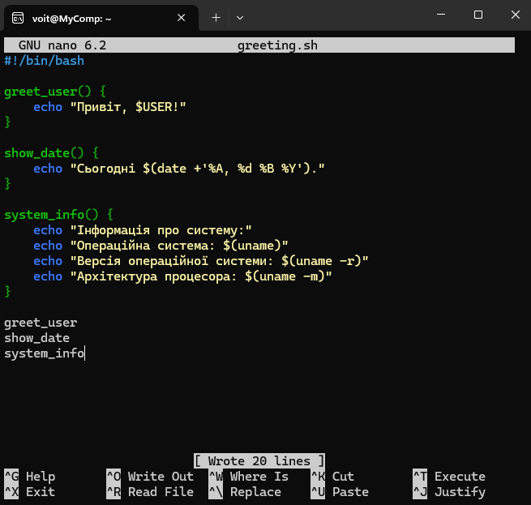

<h3 align="center">“Київський фаховий коледж зв’язку” 
Циклова комісія Комп’ютерної інженерії</h3>

 
 
 
 
 
 

<h1 align="center">ЗВІТ ПО ВИКОНАННЮ 
ЛАБОРАТОРНОЇ РОБОТИ № 7</h1>

 

<h3 align="center">з дисципліни: «Операційні системи»</h3>

<h2 align="center">Тема: “Створення скриптових сценаріїв та визначення апаратної конфігурації системи”  </h2>

    <b>Виконали студенти   групи РПЗ-13а   Команда OSGURU:   Войтенко В.С.,    Селезень Є.С.   Перевірив викладач   Сушанова В.С. </b>

 
 
 

<h2 align="center">Київ 2024</h2>

**Мета роботи:**
 
 Отримання практичних навиків роботи з командною оболонкою Bash.
 
 Знайомство з базовими командами навігації по файловій системі.
 
 Знайомство з базовими командами для керування файлами та каталогами.
 

**Матеріальне забезпечення занять:**
1. ЕОМ типу IBM PC.
2. ОС сімейства Windows та віртуальна машина Virtual Box (Oracle).
3. ОС GNU/Linux (будь-який дистрибутив).
4. Сайт мережевої академії Cisco netacad.com та його онлайн курси по Linux

**Завдання для попередньої підготовки.** 
*Готував матеріал студент Войтенко В.*

1. Прочитайте короткі теоретичні відомості до лабораторної роботи та зробіть невеликий словник базових англійських термінів з питань призначення команд та їх параметрів.

<h2 align="center"><b>A BRIEF GLOSSARY OF BASIC ENGLISH TERMS RELATED  
TO THE CLASSIFICATION OF VIRTUAL ENVIRONMENTS</b></h2>

|                       Термін англійською                   |                                    Термін українською                                            |
|------------------------------------------------------------|--------------------------------------------------------------------------------------------------|
|  Compression (the process of reducing the size of a file or directory) | Стиснення (процес зменшення розміру файлу або каталогу )|
| Archiving (the process of backing up and saving data to a secure location, often in a compressed format) | Архівування (процес резервного копіювання та збереження даних у безпечному місці, часто в стислому форматі ) |
| Gzip (a classic compression tool that uses the DEFLATE algorithm) | Gzip (класичний інструмент стиснення, що використовує алгоритм DEFLATE) |
| Bzip2 (a compression tool that implements the Burrows-Wheeler algorithm) | Bzip2 (інструмент стиснення, який реалізує алгоритм Барроуза-Вілера) |
| Xz (a compression tool that uses the LZMA2 algorithm) | Xz (інструмент стиснення, що використовує алгоритм LZMA2) |
| Tar (a command-line utility used to manipulate and create archives)  | Tar (командний інструмент, який використовується для маніпулювання та створення архівів)  |
| Flags/Options (additional parameters passed to commands to modify their behavior) | Прапорці/опції (додаткові параметри, передані командам для зміни їх поведінки) |
| -z (gzip) (flag used with tar to indicate gzip compression) | -z (gzip)(прапорець, використовуваний з tar для позначення стиснення gzip) |
| -j (bzip2) (flag used with tar to indicate bzip2 compression) | -j (bzip2) (прапорець, використовуваний з tar для позначення стиснення bzip2) |
| -J (xz) (flag used with tar to indicate xz compression) | -j (xz) (прапорець, використовуваний з tar для позначення стиснення xz) |
| -t (tar) (flag used with tar to list the contents of an archive) | -t (tar) (прапорець, використовуваний з tar для виведення списку вмісту архіву) |
| -c (tar) (flag used with tar to create an archive) | -c (tar) (прапорець, використовуваний з tar для створення архіву) |
| -v (tar) (flag used with tar to display verbose output) | -v (tar) (прапорець, використовуваний з tar для виведення розгорнутої інформації) |
| -f (tar) (flag used with tar to specify the filename of the archive) | -f (tar) (прапорець, використовуваний з tar для вказівки імені файлу архіву) |

*Готували матеріал студенти Войтенко В. та Селезень Є.*

4. На базі розглянутого матеріалу дайте відповіді на наступні питання:

4.1 *Охарактеризуйте поняття скриптового сценарію у командній оболонці.

4.2 *Яким чином створюються та редагуються скрипти, що треба зробити щоб запустити скрипт?

4.3 **Які основні компоненти материнської плати ви знаєте?

4.4 **Коротко охарактеризуйте для яких пристроїв оперують поняттями MBR та GPT?

MBR (Master Boot Record) and GPT (GUID Partition Table) are two different disk partitioning schemes used to organize information on storage devices such as hard drives. MBR was a widely used standard for BIOS-based computers, while GPT is the modern standard, particularly for devices with UEFI (Unified Extensible Firmware Interface). Therefore, MBR is used on older BIOS-based computers, while GPT is used on modern UEFI-based computers.

4.5 **В чому суть операції монтування, для чого вона потрібна?

Mounting in computer systems involves temporarily connecting a file system located on an external device to the directory hierarchy of a computer. Connecting an external device to the system and mounting it allows the computer to access files and folders stored on that device.

Mounting serves several purposes, including:

**Accessing external devices:** For example, mounting enables access to files on USB drives, external hard drives, etc.

**Working with partitions on hard drives:** Connecting and mounting disk partitions allows reading and writing data to them.

**Exchanging information between systems:** Mounting can be used to exchange files between different operating systems, such as between Linux and Windows.

**Ensuring security and confidentiality:** Some systems require mounting to ensure data security and confidentiality, such as encrypting files on an external device.

In summary, mounting is an important operation for accessing external devices and exchanging information between different systems in computer environments.

*Готував матеріал студент Войтенко В.*

**Хід роботи:**

2. Опрацюйте всі приклади команд, що представлені у лабораторних роботах курсу NDG Linux Essentials - Lab 11: Basic Scripting та Lab 12: Understanding Computer Hardware. Створіть таблицю для опису цих команд

|                        Назва команди                       |                                Її призначення та функціональність                                |
|------------------------------------------------------------|--------------------------------------------------------------------------------------------------|
| sh test.sh | Запуск скрипту |
| 
ANIMAL="penguin" 
 echo "My favorite animal is a $ANIMAL 
 | Використання змінної у скрипті |
| 
 #!/bin/bash CURRENT_DIRECTORY=`pwd` 
 echo "You are in $CURRENT_DIRECTORY" 
 | Вивід іншої команди як вміст змінної, помістивши команду в символ лапки ` |
| 
 #!/bin/bash 
 echo -n "What is your name? " 
 read NAME 
 echo "Hello $NAME!" 
 | Отримання вхідних даних від користувача скрипта і присвоєння їх змінній за допомогою команди read |
| ./test.sh Linux | Використання аргументу в скрипті |
| 
 grep -q root /etc/passwd 
 echo $? 
 | Перевірка чи успішно завершилася попередня команда |
| 
 if somecommand; then 
 /# do this if somecommand has an exit 
 code of 0 
 fi 
 | Використання розгалудження. Якщо код виходу дорівнює 0, то буде виконано вміст до закриваючого fi |
| test –f /dev/ttyS0 | Перевірка чи існує файл |
| test –d /tmp | Перевірка чи існує каталог |
| free -m | Виведення рівня використання пам’яті |
| lspci | Виведення пристроїв підключених до шини PCI |
| lsusb | Виведення пристроїв підключених до портів USB |
| fdisk, cfdisk, fsdisk | Команди для модифікації розділів MBR |
| gdisk, cdisk, sdisk | Команди для перегляду та модифікації GPT-розділів |

Створіть скриптові сценарії з виводом текстових повідомлень для користувача (продемонструйте скріншоти):

сценарій має виводити привітання до поточного користувача вказуючи поточну дату та інформацію про поточну систему;

 

 

 

 

*сценарій має виводити інформацію про апаратну конфігурацію поточної системи (використовуйте команди розглянуті в Lab 12: Understanding Computer Hardware);

 

 

 

 

**наведіть свій приклад скриптового сценарію.

 

 

 

 

 

 

**Контрольні запитання:**

В чому відмінність між командами arch та lscpu?

Якою командою можна отримати інформацію про стан використання RAM поточною системою?

*Яким чином у скриптах можна опрацьовувати змінні та створювати розгалужені та циклічні сценарії?

In scripts, variables can be processed, and branching and looping scenarios can be created using scripting languages such as Bash (for Unix-like systems) or PowerShell (for Windows).

Variable handling:

**Assigning values to variables:** For example, variable=value.
**Using variable values:** For example, echo $variable. 

Branching:

**Conditional statements:** Used to execute different code blocks depending on a specified condition. In Bash, this can be the if-else construct.

Loops:

**for loop:** Used to iterate over a block of code for each item in a list
**while loop:** Executes as long as a specified condition is true. 

These constructs enable scripts to be more flexible and automated, handling variables, making branching decisions, and repeating actions in loops as per the program's requirements.

*Які команди для перегляду стану підключення периферійних пристроїв можна використати в терміналі? 

Linux/Unix: lsusb for USB devices, lspci for PCI devices, lsblk for block devices. 
macOS: system_profiler SPUSBDataType. 
Windows: Use "Device Manager" or the command wmic path Win32_PnPEntity get caption, status to view information about connected devices. 

**Які можливості застунку gparted? 

GParted allows you to:

Create, delete, and modify disk partitions. 
Resize partitions without data loss. 
Move partitions on the disk. 
Rename partitions. 
Check and repair file systems. 
Support various file system formats. 
Edit using relative and absolute block devices. 

