<h3 align="center">“Київський фаховий коледж зв’язку” 
Циклова комісія Комп’ютерної інженерії</h3>

 
 
 
 
 
 

<h1 align="center">ЗВІТ ПО ВИКОНАННЮ 
ЛАБОРАТОРНОЇ РОБОТИ № 8</h1>

 

<h3 align="center">з дисципліни: «Операційні системи»</h3>

<h2 align="center">Тема: “Збереження службових даних системи та її мережева конфігурація”  </h2>

    <b>Виконали студенти   групи РПЗ-13а   Команда OSGURU:   Войтенко В.С.,    Селезень Є.С.   Перевірив викладач   Сушанова В.С. </b>

 
 
 

<h2 align="center">Київ 2024</h2>

**Мета роботи:**
 
 Отримання практичних навиків роботи з командною оболонкою Bash.
 
 Знайомство з базовими командами навігації по файловій системі.
 
 Знайомство з базовими командами для керування файлами та каталогами.
 

**Матеріальне забезпечення занять:**
1. ЕОМ типу IBM PC.
2. ОС сімейства Windows та віртуальна машина Virtual Box (Oracle).
3. ОС GNU/Linux (будь-який дистрибутив).
4. Сайт мережевої академії Cisco netacad.com та його онлайн курси по Linux

**Завдання для попередньої підготовки.** 
*Готував матеріал студент Войтенко В.*

1. Прочитайте короткі теоретичні відомості до лабораторної роботи та зробіть невеликий словник базових англійських термінів з питань призначення команд та їх параметрів.

<h2 align="center"><b>A BRIEF GLOSSARY OF BASIC ENGLISH TERMS RELATED  
TO THE CLASSIFICATION OF VIRTUAL ENVIRONMENTS</b></h2>

|                       Термін англійською                   |                                    Термін українською                                            |
|------------------------------------------------------------|--------------------------------------------------------------------------------------------------|
|  Processes (instances of programs running on a computer, including programs currently running and waiting to execute)  | Процеси (екземпляри програм, які виконуються на комп'ютері, включаючи програми, які запущені в даний момент і чекають на виконання) |
| Memory (physical or virtual space used to store data or programs on a computer) | Пам'ять (фізичний або віртуальний простір, який використовується для зберігання даних або програм на комп'ютері) |
| Filesystem Hierarchy Standard (standard that defines the structure of directories and files in Unix-like operating systems) | Стандарт ієрархії файлової системи (стандарт, який визначає структуру каталогів та файлів в операційній системі Unix або подібних) |
| NAT (Network Address Translation) - network address translation (technology that allows using a single external IP address for all devices in a local network) | NAT (Network Address Translation) - переклад адрес мережі (технологія, яка дозволяє використовувати один зовнішній IP-адрес для всіх пристроїв у локальній мережі) |
| Porting (process of adapting software to work on different hardware or software platforms) | Портинг (процес адаптації програмного забезпечення для роботи на різних апаратних або програмних платформах) |
| ifconfig (command in Unix and Unix-like operating systems used to configure network interfaces) | ifconfig (команда в Unix і Unix-подібних операційних системах, яка використовується для налаштування мережевих інтерфейсів) |
| ip (command in Unix and Unix-like operating systems that provides information about network interfaces and network configuration) | ip (команда в Unix і Unix-подібних операційних системах, яка надає інформацію про мережеві інтерфейси та конфігурацію мережі) |
| route (command in Unix and Unix-like operating systems used to display and edit the network routing table) | route (команда в Unix і Unix-подібних операційних системах, яка використовується для відображення та редагування таблиці маршрутизації мережі) |
| ping (command in Unix and Unix-like operating systems used to check the availability and measure the response time of network devices) | ping (команда в Unix і Unix-подібних операційних системах, яка використовується для перевірки доступності і вимірювання часу відповіді від мережевих пристроїв) |
| netstat (command in Unix and Unix-like operating systems that provides information about network connections, routes, interfaces, etc.) | netstat (команда в Unix і Unix-подібних операційних системах, яка надає інформацію про мережеві з'єднання, маршрути, інтерфейси тощо) |
| ss (command in Unix and Unix-like operating systems that provides information about socket status and supports all major packet and socket types) | ss (команда в Unix і Unix-подібних операційних системах, яка надає інформацію про статус сокетів та підтримує всі основні типи пакетів і сокетів) |
| dig (command in Unix and Unix-like operating systems used to perform DNS queries and retrieve information about domain names) | dig (команда в Unix і Unix-подібних операційних системах, яка використовується для виконання DNS-запитів та отримання інформації про доменне ім'я) |
| host (command in Unix and Unix-like operating systems that associates domain names with IP addresses and vice versa) | host (command in Unix and Unix-like operating systems that associates domain names with IP addresses and vice versa) |
| ssh (command in Unix and Unix-like operating systems that allows connecting to another computer over the network, logging in, and performing tasks on the remote machine) | ssh (команда в Unix і Unix-подібних операційних системах, яка дозволяє підключатися до іншого комп'ютера по мережі, виконувати вхід і виконувати завдання на віддаленому комп'ютері) |

*Готували матеріал студенти Войтенко В. та Селезень Є.*

4. На базі розглянутого матеріалу дайте відповіді на наступні питання:

4.1 Розкрийте поняття “псевдо файлової системи”, для чого воно потрібно системі?

"Pseudo Filesystem": A pseudo filesystem is a mechanism that allows accessing various system resources as files and directories within the operating system, although these resources may not actually exist as real files on disk but rather as virtual objects in memory.

4.2 Чому користувачі не так часто звертаються на пряму до каталогу /proc, яким чином з нього можна отримати інформацію?

Users often don't directly access the /proc directory because it contains system data that can be complex for users to interpret. Instead, users typically use other tools to obtain information, such as commands to display system information or graphical interfaces.

4.3 *Яке призначення файлів /proc/cmdline, /proc/meminfo та /proc/modules?

The files /proc/cmdline, /proc/meminfo, and /proc/modules serve the following purposes:

/proc/cmdline: This file contains parameters passed to the Linux kernel during boot. It can be used to retrieve information about parameters used during the operating system boot process, such as kernel parameters, debugging parameters, etc. 
/proc/meminfo: This file contains information about the system's memory usage. It provides data on the total memory, used memory, free memory, swap usage, and other memory-related parameters. 
/proc/modules: This file contains a list of loaded kernel modules in Linux. It can be useful for checking which modules are loaded in the current system and for debugging module loading issues. 

4.4 *Яке призначення команди free?

 The "free" command is used to display information about memory usage by the system. It shows data such as total memory, used memory, free memory, swap usage, etc. The "free" command allows for a quick overview of memory usage statistics without the need for more specialized tools.

4.5 *Для чого потрібні лог-файли, наведіть приклади їх застосування?

Log files are essential for recording events and activities that occur within a system or application. They serve several purposes, including:

**Troubleshooting and Debugging:** Log files often contain error messages, warnings, and other diagnostic information that can help system administrators and developers identify and resolve issues within the system or application. 
**Auditing and Compliance:** Log files provide a record of system and user activities, which can be useful for auditing purposes and ensuring compliance with regulations and policies. 
**Performance Monitoring:** Log files can contain performance metrics and statistics that allow administrators to monitor the performance of the system or application over time, identify bottlenecks, and optimize resources. 
**Security Monitoring:** Log files can capture security-related events, such as unauthorized access attempts, failed login attempts, and suspicious activities, helping to detect and mitigate security threats. 

Examples of log file usage include: 

**Syslog:** Syslog files (/var/log/syslog or /var/log/messages on Linux systems) contain messages from various system services, kernel, and applications, providing a comprehensive view of system activity. 
**Apache Access and Error Logs:** These logs record requests received by the Apache web server, as well as any errors encountered during the processing of those requests. They are valuable for monitoring web server performance and diagnosing issues with web applications. 
**Application Logs:** Many applications generate their log files to record events and errors specific to their operation. For example, database servers, email servers, and application servers often maintain separate log files to aid in troubleshooting and monitoring. 
**Security Logs:** Security logs, such as the Windows Event Log on Windows systems or the auth.log file on Linux systems, capture security-related events such as login attempts, privilege escalations, and firewall activity, helping administrators detect and respond to security incidents. 

4.6 **Яке призначення файлу /var/log/dmesg?

The file /var/log/dmesg serves the purpose of storing kernel ring buffer messages. These messages are generated during the system boot process and contain information about hardware detection, initialization, and other kernel-related events. 

The kernel ring buffer is a temporary data structure that holds these messages until they are read and logged by the system logging daemon (such as syslogd or systemd-journald), after which they may be written to /var/log/dmesg. 

The dmesg log file is particularly useful for diagnosing hardware-related issues, identifying driver loading problems, and understanding the sequence of events during system startup. It provides a historical record of kernel initialization messages that can aid in troubleshooting various system and hardware problems. 

4.7 **Для чого розроблено FHS?

"Purpose of FHS": The purpose of the File Hierarchy Standard (FHS) is to standardise the organisation of files across different Linux distributions. The main purpose of the FHS is to provide consistency in the location of files and directories on the Linux file system.

4.8 **Які основні команди є у Linux для перегляду та конфігурації мережі

*Готував матеріал студент Войтенко В.*

**Хід роботи:**

2. Опрацюйте всі приклади команд, що представлені у лабораторних роботах курсу NDG Linux Essentials - Lab 13: Where Data is Stored та Lab 14: Network Configuration. Створіть таблицю для опису цих команд

|                        Назва команди                       |                                Її призначення та функціональність                                |
|------------------------------------------------------------|--------------------------------------------------------------------------------------------------|
| su | Змінюємо поточного користувача на root |
| ls /proc | Переглядаємо вміст системного каталогу /proc (для цього потрібні права доступу root) |
| ls /proc/cmdline | Перегляд інформації, що передається ядру під час завантаження |
| ls /proc/ meminfo | Перегляд інформації про використання пам'яті ядра |
| ls /proc/modules | Перегляд списку модулів, завантажених у ядро |
| pstree | Відображення процесів у вигляді “дерева” |
| ps | Показує лише запущенні процеси |
| top | Відображення динамічного екранного інтерфейсу, який регулярно оновлюватиме результати роботи запущених процесів |
| free | Перегляд знімку пам’яті |
| cat | Перегляд файлів журналів |
| journalctl | Перегляд файлів журналів |
| file | Перегляд двійкових файлів журналу |
| dmesg | Перегляд повідомлень ядра |
| dpkg -L packagename | Перегляд списку файлів програм (Debian) |
| rpm -ql packagename | Перегляд списку файлів програм (Red Hat) |
| host example.com | Перегляд IP-адреси на DNS-сервері |
| ifconfig | Відображення інформації про конфігурацію мережі |
| ip | Відображає розширену функціональність і набір опцій |
| route | Переглядає таблицю, яка описує, куди надсилаються мережеві пакунки |
| ping | Визначає чи є інша машина “доступною” |
| netstat -r | Відображення інформації про мережеві з'єднання, а також для відображення таблиці маршрутизації, подібно до команди route |
| netstat -tln | Показ відкритих портів |
| ss | Показує статистики сокетів і підтримує всі основні типи пакетів і сокетів. Використовується для перегляду з'єднань, встановлених на даний момент між локальною та віддаленими машинами, а також статистики цих з'єднань |
| dig | Виконує запити до DNS-сервера, щоб визначити, чи доступна на ньому необхідна інформація |
| host | Працює з DNS, щоб зв'язати ім'я хоста з IP-адресою |
| ssh | Дозволяє вам підключитися до іншого комп'ютера через мережу, увійти в систему і виконувати завдання на віддаленому комп'ютері |
| exit | Повернення на локальний комп'ютер |

3. Виконайте практичні завдання у терміналі (продемонструйте скріншоти):
- в даній лабораторній роботі використовувалась команда cat, дослідіть її можливості та опишіть для яких задач вона призначена;

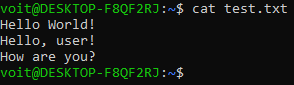

 

**cat - concatenate files and print on the standard output**

- *продемонструйте приклади, коли команда cat використовується для створення файлу, перегляду вмісту файлу, перенаправлення інформації у інший файл, склеювання декількох файлів в один;

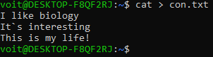

 

 

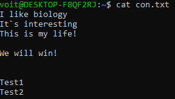

 

 

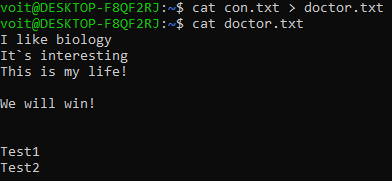

 

 

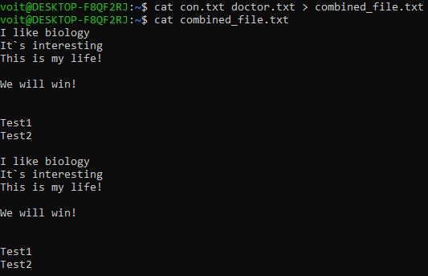

 

 

- *які параметри команди cat треба використати, щоб пронумерувати рядки файлу, відобразити недруковані символи, видалити порожні рядки?

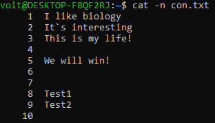

 

 

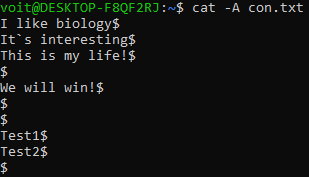

 

 

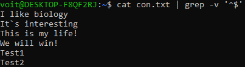

 

 

- **опишіть можливості команди dig та наведіть приклади;

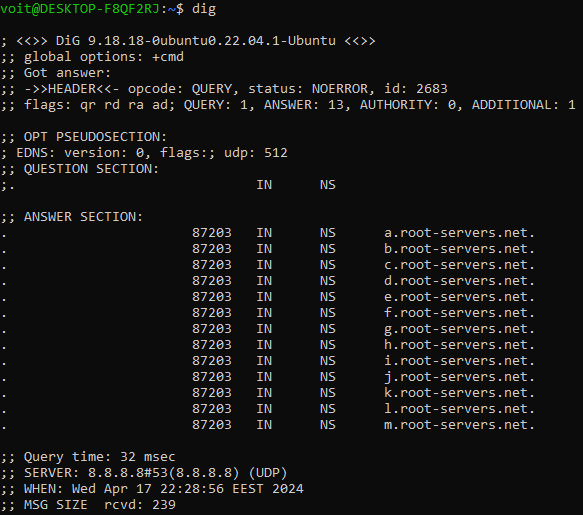

 

 

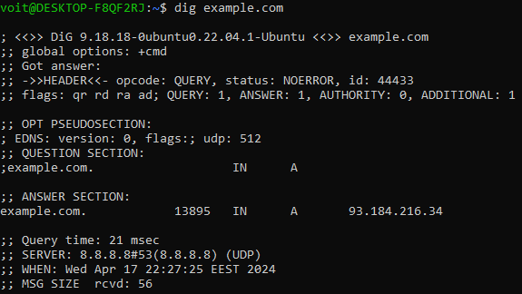

 

**dig - DNS lookup utility**

- **опишіть можливості команди netstat та наведіть приклади;.

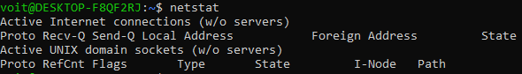

 

 

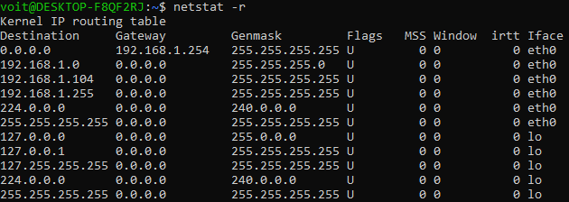

 

 

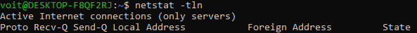

 

**netstat  - Print network connections, routing tables, interface statistics, masquerade connections, and multi‐cast memberships**

*Готували матеріал студенти Войтенко В. та Селезень Є.*

**Контрольні запитання:**

1. Як пов'язані між собою команди cat та tac?

The commands cat and tac are related in that they both deal with the content of files in UNIX-like operating systems.

So, here's how they are related:

1) cat: The cat command (short for "concatenate") is used to display the contents of files to standard output. It reads files sequentially and outputs their content in the order they are specified in the input arguments.

2) tac: The name tac (short for "reverse of cat") speaks for itself - this command does the same thing as cat, but outputs the content of files in reverse order, i.e., from the last line to the first.

2. Що робить команда ss?

The ss command is used to display socket statistics and supports all major packet and socket types.

3. В чому відмінність між командами ps --forest та pstree?

The command ps --forest displays process information in a hierarchical structure where each process is shown along with its parent process. pstree also displays processes in a tree-like structure, but it does so in a more interactive manner, outputting the process tree with its root at the top of the screen and graphically showing dependencies between processes.

4. *У яких каталогах зберігаються налаштування системи?

System settings are typically stored in the following directories:
1) /etc: System-wide configuration settings, such as configuration files for programs and services.
2) /var: Variable data, such as log files, temporary files, mailboxes, etc.
3) /usr: Additional programs, libraries, and other resources related to the system software.
4) /home: User directories where their personal settings and data are stored.
5) /root: The home directory of the system administrator.

5. *У яких каталогах можна знайти встановлені в системі програми, доступні для користувача?

6. *У яких каталогах можна знайти встановлені системні програми і програми призначені для виконання суперкористувачем?

7. **Поясніть призначення команд ping, ifconfig, traceroute.

8. **Як називаються мережеві інтерфейси в Linux?

9.  **Як за допомогою команди ifconfig вивести параметри тільки одного мережевого інтерфейсу (наприклад, eth1), а не всіх?

