<h3 align="center">“Київський фаховий коледж зв’язку”<br/>
Циклова комісія Комп’ютерної інженерії</h3>

<br/>
<br/>
<br/>
<br/>
<br/>
<br/>

<h1 align="center">ЗВІТ ПО ВИКОНАННЮ<br/>
ЛАБОРАТОРНОЇ РОБОТИ № 9</h1>

<br/>

<h3 align="center">з дисципліни: «Операційні системи»</h3>

<h2 align="center">Тема: “Захист системи та користувачів у Linux. Створення користувачів та груп” <br/></h2>


<div style="text-align: right;">
    <font size="4"><b>Виконали студенти <br/> групи РПЗ-13а <br/> Команда OSGURU: <br/> Войтенко В.С., <br/>  Селезень Є.С. <br/> Перевірив викладач <br/> Сушанова В.С. </b></font>
</div>

<br/>
<br/>
<br/>

<h2 align="center">Київ 2024</h2>

<hr>

**Мета роботи:**
<br/>
 Отримання практичних навиків роботи з командною оболонкою Bash.
<br/>
 Знайомство з базовими командами навігації по файловій системі.
<br/>
 Знайомство з базовими командами для керування файлами та каталогами.
<br/>

**Матеріальне забезпечення занять:**
1. ЕОМ типу IBM PC.
2. ОС сімейства Windows та віртуальна машина Virtual Box (Oracle).
3. ОС GNU/Linux (будь-який дистрибутив).
4. Сайт мережевої академії Cisco netacad.com та його онлайн курси по Linux

**Завдання для попередньої підготовки.**<br/>
*Готував матеріал студент Войтенко В.*


 Виконайте наступні практичні завдання у терміналі наступні дії (продемонструвати скріншоти):

- виведіть інформацію про поточного користувача різними способами (підказка використовуйте команди id та grep);


<h3 align="center"><b>id</b></h3>

<br/>

<br/>

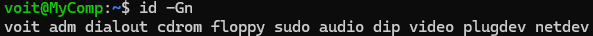

<h3 align="center"><b>id -Gn</b></h3>

<br/>

<br/>

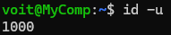

<h3 align="center"><b>id -u</b></h3>

<br/>

<br/>

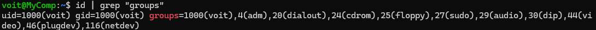

<h3 align="center"><b>id | grep "groups"</b></h3>

<br/>

<br/>

- *попрактикуйте в терміналі команди last, w та who. Порівняйте результати виводу кожної команди, які деталі відсутні в кожній із команд порівняно з іншими?

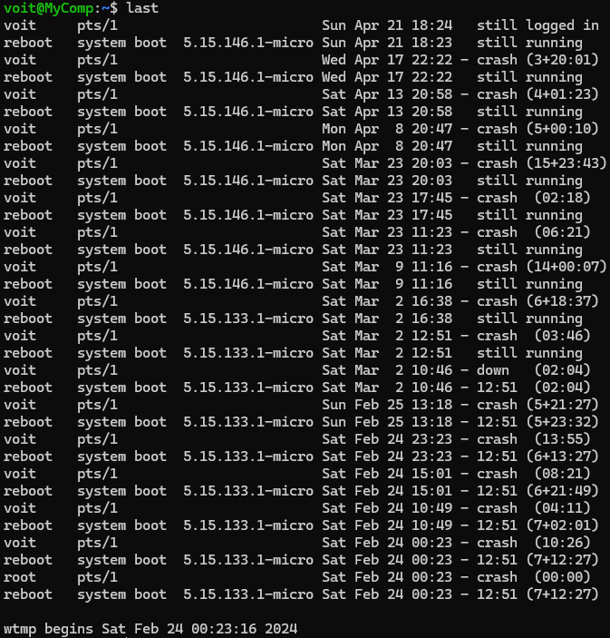

<h3 align="center"><b>Command "last"</b></h3>

<br/>

<br/>

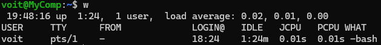

<h3 align="center"><b>Command "w"</b></h3>

<br/>

<br/>

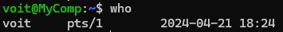

<h3 align="center"><b>Command "who"</b></h3>

<br/>

<br/>

- *створіть дві нові групи користувачів - super_admins, noob_users та good_students, визначте їх ідентифікатори;

```sudo groupadd super_admins```

```sudo groupadd noob_users```

```sudo groupadd good_students```

<h3 align="center"><b>Creating groups</b></h3>

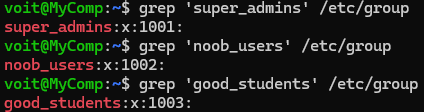

<h3 align="center"><b>Defining groups indeficators</b></h3>

<br/>

<br/>

- *для кожного члену Вашої команди за допомогою терміналу створіть нового користувача (якщо працюєте самі, то просто трьох довільних користувачів), не забудьте після створення нового користувача  одразу задати йому пароль;

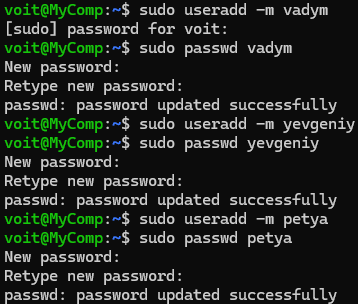

<h3 align="center"><b>Creating new users and providing them passwords</b></h3>

<br/>

<br/>

- **додайте нових користувачів у створені Вами нові групи таким чином, щоб у групах super_admins та noob_users було по 2 користувачі, один з яких є в обох групах, у групу good_students додайте - всіх трьох користувачів;

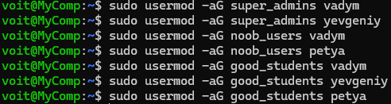

<h3 align="center"><b>Adding users to groups</b></h3>

<br/>

<br/>

- **перегляньте інформацію про групи, та які користувачі до них входять, поясніть що ви бачите;

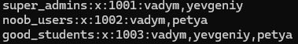

<h3 align="center"><b>Cheaking groups for users</b></h3>

<br/>

<br/>

- **видаліть першого створеного вами користувача, перегляньте чи залишиться інформація про нього в групах, де він перебував;

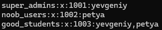

<h3 align="center"><b>Deleting user "vadym" and cheaking groups</b></h3>

<br/>

<br/>

- **видаліть другого користувача, перегляньте чи залишиться інформація про нього в групах, де він перебував; 

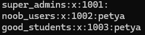

<h3 align="center"><b>Deleting user "yevgeniy" and cheaking groups</b></h3>

<br/>

<br/>

- **видаліть третього користувача, перегляньте чи залишиться інформація про нього в групах, де він перебував; 

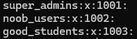

<h3 align="center"><b>Deleting user "petya" and cheaking groups</b></h3>

<br/>

<br/>

- **перегляньте інформацію про існуючі групи користувачів;


<h3 align="center"><b>Cheaking groups</b></h3>

<br/>

<br/>

- **видаліть створені Вами групи користувачів;

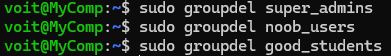

<h3 align="center"><b>Deleting groups</b></h3>

<br/>

<br/>

- **перегляньте інформацію про існуючі групи користувачів.


<h3 align="center"><b>Cheaking groups</b></h3>

<br/>

<br/>

*Готував матеріал студент Селезень Є.*

**Контрольні запитання:**

1. Чому в конфігураційних файлах паролі не зберігається в явному вигляді?

Passwords are typically not stored in plain text in configuration files for security reasons. Instead, they are often hashed using cryptographic algorithms to protect them from unauthorized access.

2. Чому не рекомендується виконувати повсякденні операції, використовуючи обліковий запис root?

Using the root account for everyday operations is not recommended due to the potential danger of granting full system access privileges, which could lead to unintended consequences such as accidental deletion of important files or installation of malicious software.

3. *У чому відмінність механізмів отримання особливих привілеїв su і sudo?

The su (Switch User) mechanism allows users to switch their user ID to another, typically root, provided the user has the permission to do so and enters the correct password. sudo (Superuser Do), on the other hand, gives users limited ability to execute commands as another user, most often root, typically requiring the user's own password.

4. *Чому домашній каталог користувача root не розміщено в каталозі /home?

The root user's home directory is not located in /home for security reasons, as the root account has the highest level of system access privileges, and access to its home directory could potentially be unsafe.

5. *Для чого використовується команда getent?

The getent command is used to obtain information about databases used by system services, such as /etc/passwd, /etc/group, and others.

6. *Як можна змінити пароль користувача?

You can change a user's password using the passwd command. Simply execute the passwd command and provide the new password when prompted.

7. **Яким чином можна видалити існуючі групи користувачів? Чи залишиться інформація про них десь у системі?

Existing user groups can be deleted using the groupdel command. Information about them may remain in system logs or other system files, but the groups themselves will be deleted.

8. **Яке призначення команди chage?

The chage command is used to change password expiry and aging information for a user account.

9. **Які параметри команди usermod ви вважаєте найбільш використовуваними?

The most commonly used parameters of the usermod command include -a (add user to group), -G (change user's groups), -c (change user's comment/description), -l (change username), and -p (change password).

Conclusion:

In the course of the lab, we learned the basic commands for navigating the file system, basic commands for managing files and directories. We learned how to work with groups and users.

