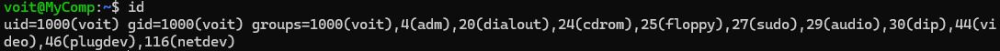

<h3 align="center">“Київський фаховий коледж зв’язку” 
Циклова комісія Комп’ютерної інженерії</h3>

 
 
 
 
 
 

<h1 align="center">ЗВІТ ПО ВИКОНАННЮ 
ЛАБОРАТОРНОЇ РОБОТИ № 8</h1>

 

<h3 align="center">з дисципліни: «Операційні системи»</h3>

<h2 align="center">Тема: “Збереження службових даних системи та її мережева конфігурація”  </h2>

    <b>Виконали студенти   групи РПЗ-13а   Команда OSGURU:   Войтенко В.С.,    Селезень Є.С.   Перевірив викладач   Сушанова В.С. </b>

 
 
 

<h2 align="center">Київ 2024</h2>

**Мета роботи:**
 
 Отримання практичних навиків роботи з командною оболонкою Bash.
 
 Знайомство з базовими командами навігації по файловій системі.
 
 Знайомство з базовими командами для керування файлами та каталогами.
 

**Матеріальне забезпечення занять:**
1. ЕОМ типу IBM PC.
2. ОС сімейства Windows та віртуальна машина Virtual Box (Oracle).
3. ОС GNU/Linux (будь-який дистрибутив).
4. Сайт мережевої академії Cisco netacad.com та його онлайн курси по Linux

**Завдання для попередньої підготовки.** 
*Готував матеріал студент Войтенко В.*

 Виконайте наступні практичні завдання у терміналі наступні дії (продемонструвати скріншоти):

- виведіть інформацію про поточного користувача різними способами (підказка використовуйте команди id та grep);

<h3 align="center"><b>id</b></h3>

 

 

<h3 align="center"><b>id -Gn</b></h3>

 

 

<h3 align="center"><b>id -u</b></h3>

 

 

<h3 align="center"><b>id | grep "groups"</b></h3>

 

 

- *попрактикуйте в терміналі команди last, w та who. Порівняйте результати виводу кожної команди, які деталі відсутні в кожній із команд порівняно з іншими?

<h3 align="center"><b>Command "last"</b></h3>

 

 

<h3 align="center"><b>Command "w"</b></h3>

 

 

<h3 align="center"><b>Command "who"</b></h3>

 

 

- *створіть дві нові групи користувачів - super_admins, noob_users та good_students, визначте їх ідентифікатори;

- *для кожного члену Вашої команди за допомогою терміналу створіть нового користувача (якщо працюєте самі, то просто трьох довільних користувачів), не забудьте після створення нового користувача  одразу задати йому пароль;

- **додайте нових користувачів у створені Вами нові групи таким чином, щоб у групах super_admins та noob_users було по 2 користувачі, один з яких є в обох групах, у групу good_students додайте - всіх трьох користувачів;

- **перегляньте інформацію про групи, та які користувачі до них входять, поясніть що ви бачите;

- **видаліть першого створеного вами користувача, перегляньте чи залишиться інформація про нього в групах, де він перебував;

- **видаліть другого користувача, перегляньте чи залишиться інформація про нього в групах, де він перебував; 

- **видаліть третього користувача, перегляньте чи залишиться інформація про нього в групах, де він перебував; 

- **перегляньте інформацію про існуючі групи користувачів;

- **видаліть створені Вами групи користувачів;

- **перегляньте інформацію про існуючі групи користувачів.

*Готували матеріал студенти Войтенко В. та Селезень Є.*

**Контрольні запитання:**

1. Чому в конфігураційних файлах паролі не зберігається в явному вигляді?

2. Чому не рекомендується виконувати повсякденні операції, використовуючи обліковий запис root?

3. *У чому відмінність механізмів отримання особливих привілеїв su і sudo?

4. *Чому домашній каталог користувача root не розміщено в каталозі /home?

5. *Для чого використовується команда getent?

6. *Як можна змінити пароль користувача?

7. **Яким чином можна видалити існуючі групи користувачів? Чи залишиться інформація про них десь у системі?

8. **Яке призначення команди chage?

9. **Які параметри команди usermod ви вважаєте найбільш використовуваними?

Conclusion:

