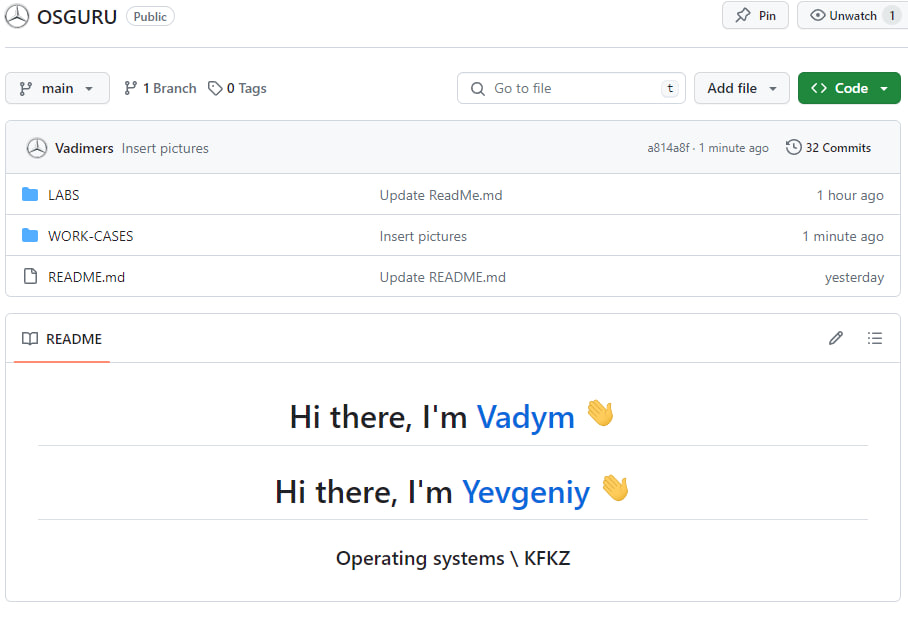

<h3 align="center">“Київський фаховий коледж зв’язку” 
Циклова комісія Комп’ютерної інженерії</h3>

 
 
 
 
 
 

<h1 align="center">ЗВІТ ПО ВИКОНАННЮ 
Work-Case № 1</h1>

 

<h3 align="center">з дисципліни: «Операційні системи»</h3>

<h2 align="center">Тема: “Git та GitHub”</h2>

    <b>Виконали студенти   групи РПЗ-13а   Команда OSGURU:   Войтенко В.С.,    Селезень Є.С.   Перевірив викладач   Сушанова В.С. </b>

 
 
 

<h2 align="center">Київ 2024</h2>

 
 

1. Опишіть для чого використовують git, які основні дії та команди в ньому виконують.

Git is a version control system used to track changes in the file system during software development. It allows developers to collaborate on projects, track changes, branch development, merge changes, and mark versions of a program. Here are some of the basic actions and commands that are performed in Git:

**git init:** This command initializes a new Git repository in the current directory.

**git clone:** Clones an existing Git repository from a remote server to your computer.

**git add:** Adds modified or new files to the staging area for later commit.

**git commit:** Commits changes that have been added to a stage and creates a new commit with those changes in the local repository.

**git push:** Uploads local commits to a remote repository.

**git pull:** Updates the local repository by pulling changes from the remote repository and merging them into your working copy.

**git branch:** Creates a new branch or displays a list of branches in the repository.

**git checkout:** Switches between branches or restores files from a specific commit.

**git merge:** Combines changes from one branch into another.

**git status:** Shows the current status of the working tree and stage.

**git log:** Displays a list of commits in the repository along with their hashes, authors, dates, and messages.

 
 

2. Що таке "комміт", як він дозволяє відслідковувати зміни у файлах?

A commit is a record of the changes you made to a repository in the Git version control system. Each commit contains information about which files have been changed, who made the changes and when, and comments about the changes.

When you commit, Git creates a new checkpoint that can be used to restore previous versions of files. This allows you to keep track of the history of changes in your project. Each time you commit, it captures the current state of the files and saves them to the repository.

To view the list of commits in the repository, you can use the git log command. It's a good practice to commit frequently with clear comments to make it easier to work with your project and to find certain changes in the future.

3. Зареєструйте власний git-аккаунт (gitlab, github або інша платформа).

Створіть новий публічний репозиторій, який будете використовувати для додавання всіх виконаних робіт з дисципліни «Операційні системи» (якщо працюєте в команді долучіть інших учасників команди до його редакторів).

4. Розмістіть свій перший колективний звіт про виконаний Work-case 1 (презентацію, текстовий файл, html-сторінку) у даному репозиторії. У git мають бути комміти від кожного учасника команди

[//]: # (https://itproger.com/ua/news/kratkaya-instruktsiya-po-git-osnovnie-ponyatiya-i-komandi)

