<h3 align="center">“Київський фаховий коледж зв’язку” 
Циклова комісія Комп’ютерної інженерії</h3>

 
 
 
 
 
 

<h1 align="center">ЗВІТ ПО ВИКОНАННЮ 
Work-Case № 2</h1>

 

<h3 align="center">з дисципліни: «Операційні системи»</h3>

<h2 align="center">Тема: “Створення нової віртуальної машини”</h2>

    <b>Виконали студенти   групи РПЗ-13а   Команда OSGURU:   Войтенко В.С.,    Селезень Є.С.   Перевірив викладач   Сушанова В.С. </b>

 
 
 

<h2 align="center">Київ 2024</h2>

1. Встановіть на своїй домашній робочій станції гіпервізор ІІ типу – Virtual
Box, VMWare Workstation, Hyper-V (або інший на Ваш вибір).

2. Опишіть набір базових дій в встановленому Вами гіпервізорі:
   
● Створення нової віртуальної машини;

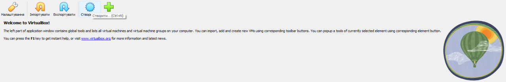

<h3 align="center"><b>Creating the machine</b></h3>

 

 

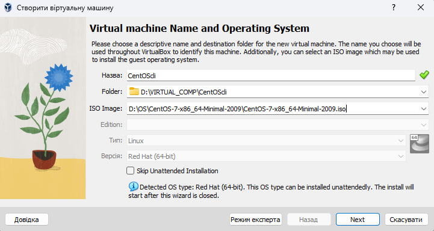

<h3 align="center"><b>Selecting the folder and ISO Image</b></h3>

 

 

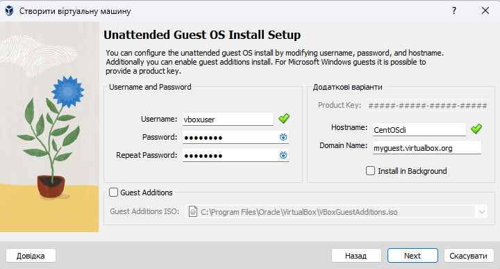

<h3 align="center"><b>Choosing username and password</b></h3>

 

 

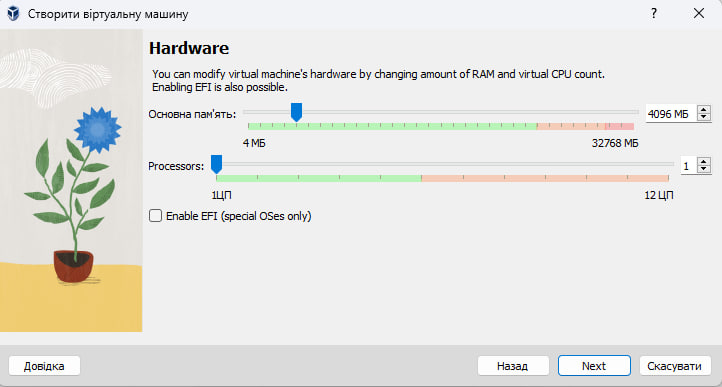

<h3 align="center"><b>Choosing RAM size and count proccesors</b></h3>

 

 

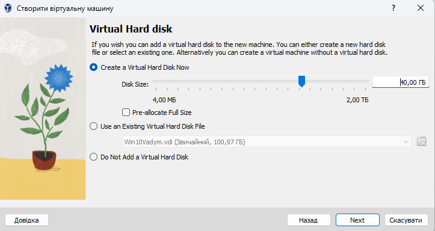

<h3 align="center"><b>Choosing virtual hard disc size</b></h3>

 

 

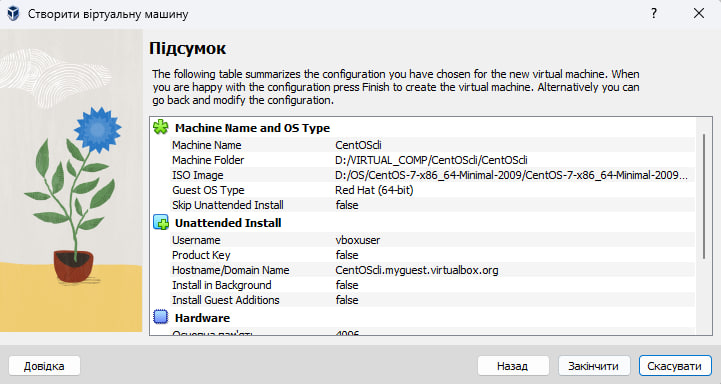

<h3 align="center"><b>Result</b></h3>

 

 

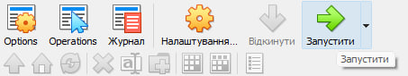

<h3 align="center"><b>Starting machine</b></h3>

 

 

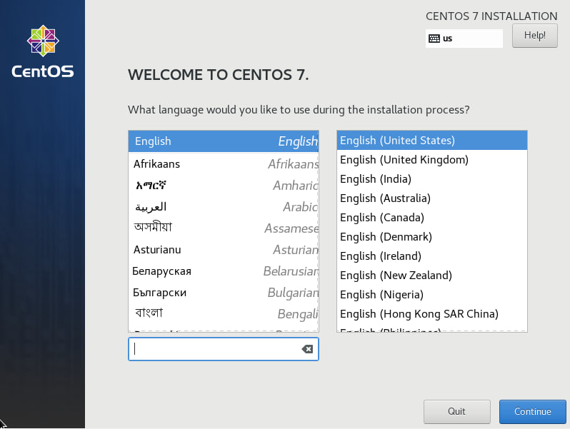

<h3 align="center"><b>Choosing language</b></h3>

 

 

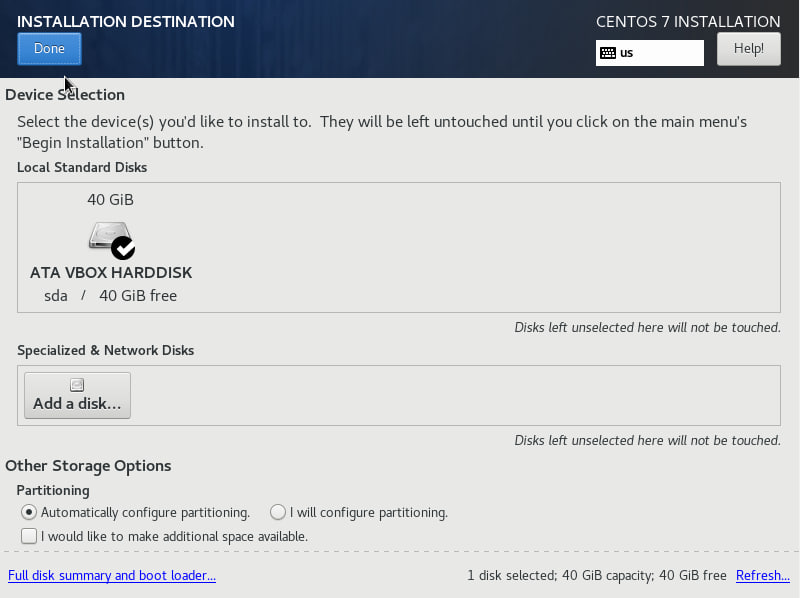

<h3 align="center"><b>Automatically configure partitioning</b></h3>

 

 

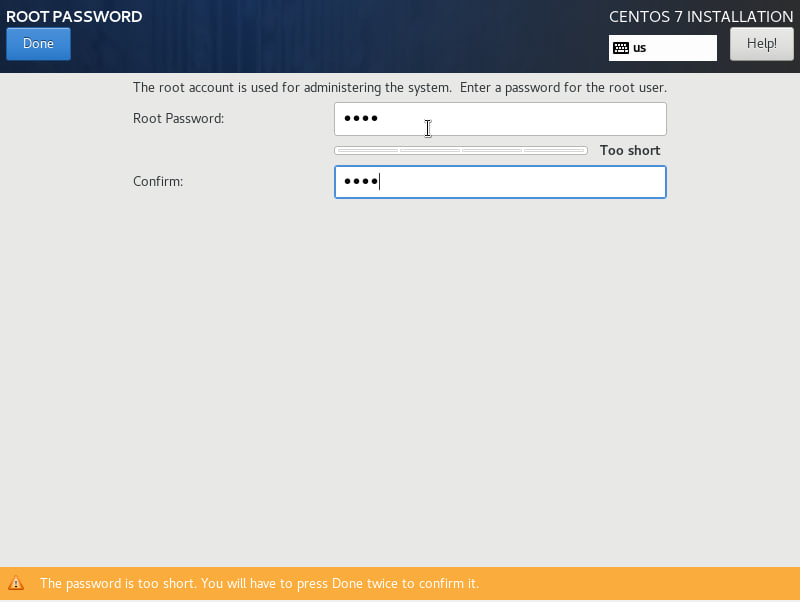

<h3 align="center"><b>Inputting password</b></h3>

 

 

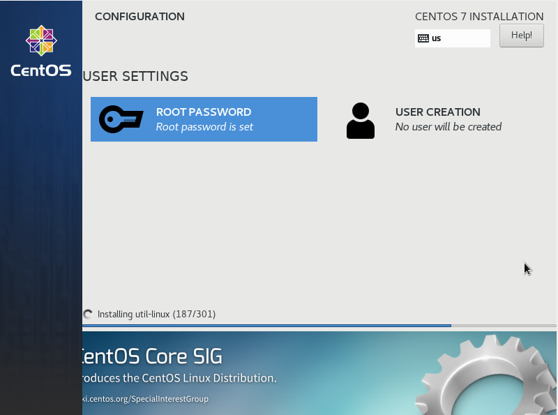

<h3 align="center"><b>Configuration screen</b></h3>

 

 

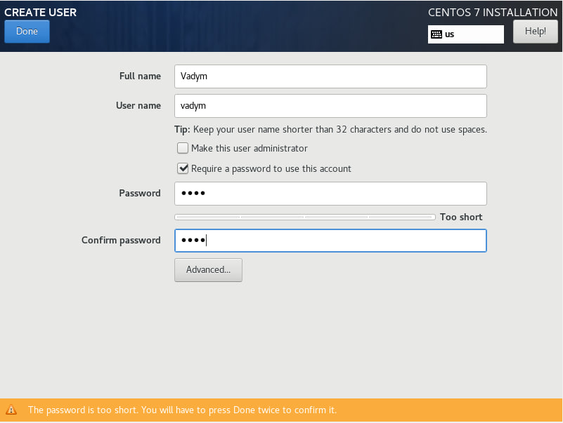

<h3 align="center"><b>Creating user and his password</b></h3>

 

 

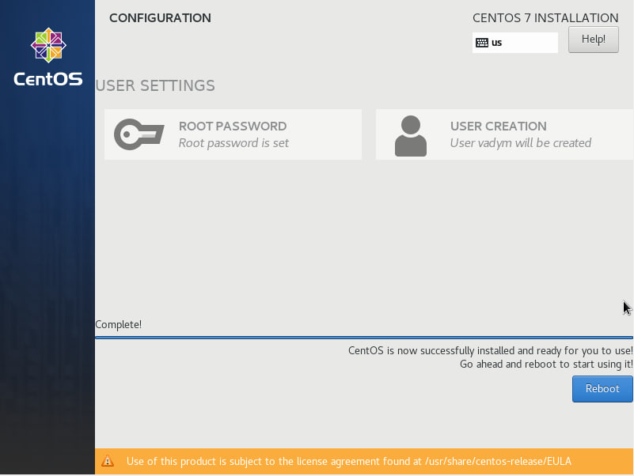

<h3 align="center"><b>Pressing reboot</b></h3>

 

 

● Вибір/додавання доступного для віртуальної машини обладнання;

● Налаштування мережі та підключення до точок Wi-Fi;

● Можливість роботи з зовнішніми носіями (flash-пам’ять).
