<h3 align="center">“Київський фаховий коледж зв’язку”<br/>
Циклова комісія Комп’ютерної інженерії</h3>

<br/>
<br/>
<br/>
<br/>
<br/>
<br/>

<h1 align="center">ЗВІТ ПО ВИКОНАННЮ<br/>
Work-Case № 2</h1>

<br/>

<h3 align="center">з дисципліни: «Операційні системи»</h3>

<h2 align="center">Тема: “Створення нової віртуальної машини”</h2>


<div style="text-align: right;">
    <font size="4"><b>Виконали студенти <br/> групи РПЗ-13а <br/> Команда OSGURU: <br/> Войтенко В.С., <br/>  Селезень Є.С. <br/> Перевірив викладач <br/> Сушанова В.С. </b></font>
</div>

<br/>
<br/>
<br/>

<h2 align="center">Київ 2024</h2>

<hr>

1. Встановіть на своїй домашній робочій станції гіпервізор ІІ типу – Virtual
Box, VMWare Workstation, Hyper-V (або інший на Ваш вибір).

2. Опишіть набір базових дій в встановленому Вами гіпервізорі:
   
● Створення нової віртуальної машини;


<h3 align="center"><b>Create the machine</b></h3>

<br/>

<br/>


<h3 align="center"><b>Select the folder and ISO Image</b></h3>

<br/>

<br/>


<h3 align="center"><b>Choose username and password</b></h3>

<br/>

<br/>


<h3 align="center"><b>Choose RAM size and count proccesors</b></h3>

<br/>

<br/>


<h3 align="center"><b>Choose virtual hard disc size</b></h3>

<br/>

<br/>


<h3 align="center"><b>Result</b></h3>

<br/>

<br/>


<h3 align="center"><b>Start machine</b></h3>

<br/>

<br/>


<h3 align="center"><b>Choose language</b></h3>

<br/>

<br/>


<h3 align="center"><b>Automatically configure partitioning</b></h3>

<br/>

<br/>


<h3 align="center"><b>Input password</b></h3>

<br/>

<br/>


<h3 align="center"><b>Configuration screen</b></h3>

<br/>

<br/>


<h3 align="center"><b>Create user and his password</b></h3>

<br/>

<br/>


<h3 align="center"><b>Press reboot</b></h3>

<br/>

<br/>

● Налаштування мережі в режимі CLI.

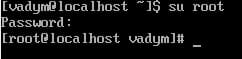

<h3 align="center"><b>Transfer into root</b></h3>

<br/>

<br/>

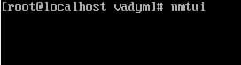

<h3 align="center"><b>Enter nmtui and entrance in network manager</b></h3>

<br/>

<br/>

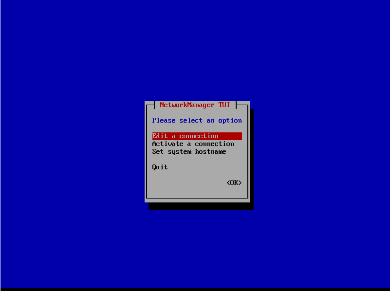

<h3 align="center"><b>Choose edit a connection</b></h3>

<br/>

<br/>

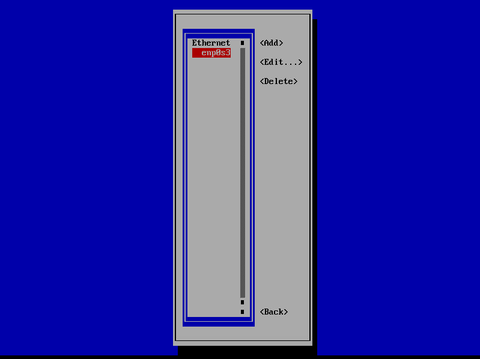

<h3 align="center"><b>Choose enp0s3</b></h3>

<br/>

<br/>

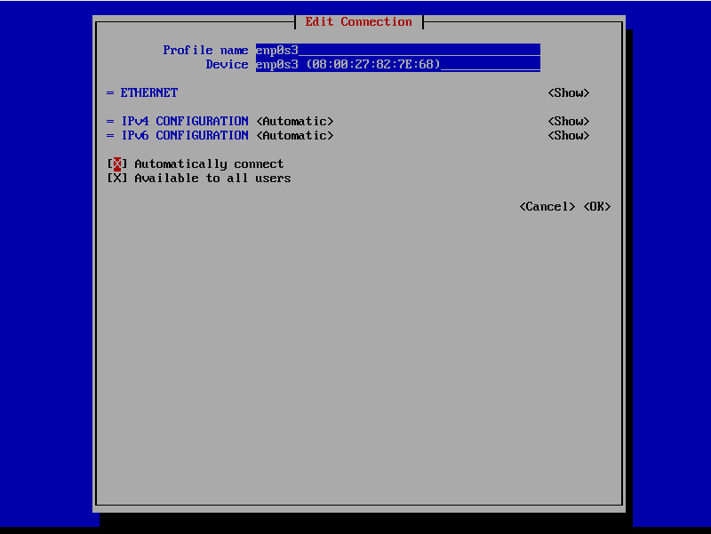

<h3 align="center"><b>Make Automatically connect</b></h3>

<br/>

<br/>


<h3 align="center"><b>Enter service network restart</b></h3>

<br/>

<br/>

● Встановлення графічної оболонки GNOME.

```yum update```

:arrow_down:

```sudo yum -y groups install "GNOME Desktop"```

:arrow_down:

```echo "exec gnome-session" >> ~/.xinitrc```

:arrow_down:

```startx```

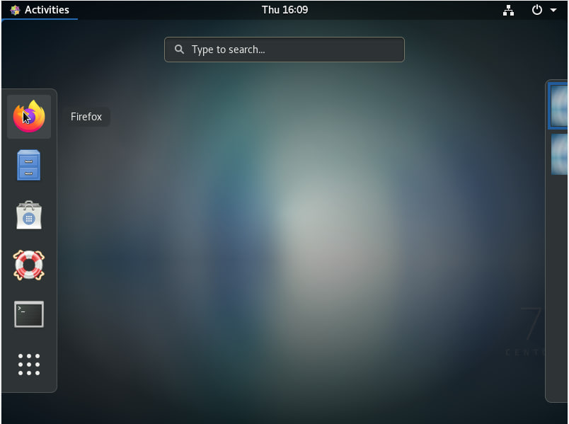

<h3 align="center"><b>Desktop</b></h3>

<br/>

<br/>

● Можливість роботи з зовнішніми носіями (flash-пам’ять).

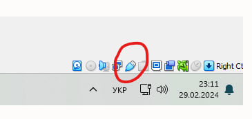

<h3 align="center"><b>Choose flash drive at the bottom left</b></h3>

<br/>

<br/>

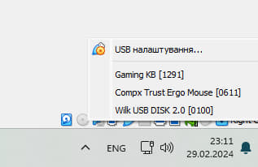

<h3 align="center"><b>Enter Wilk USB DISK 2.0</b></h3>

<br/>

<br/>

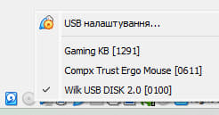

<h3 align="center"><b>This entered</b></h3>

<br/>

<br/>

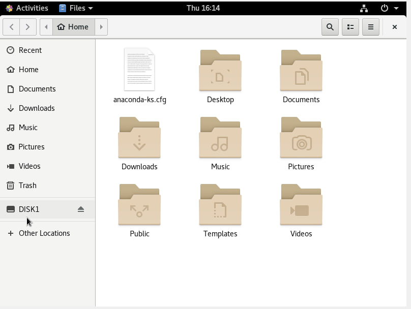

<h3 align="center"><b>File manager</b></h3>

<br/>

<br/>

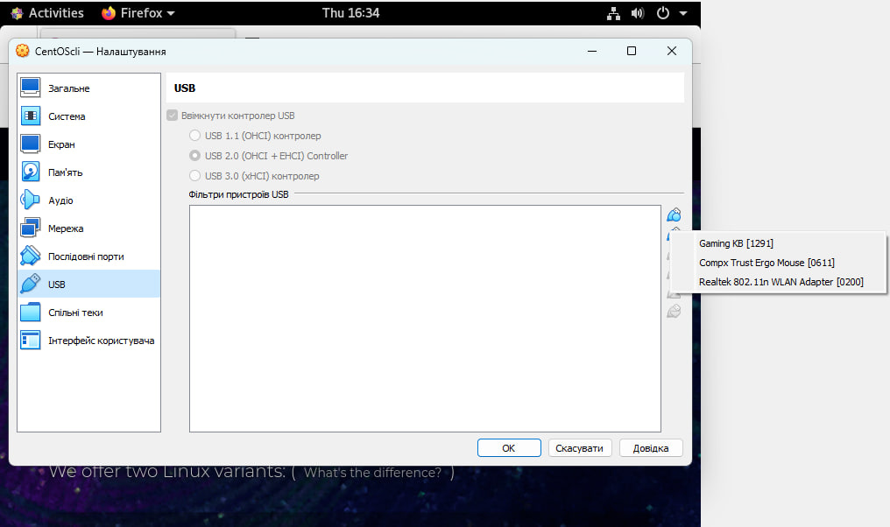

<h3 align="center"><b>Second variant</b></h3>

<br/>

<br/>

● Налаштування мережі та підключення до точок Wi-Fi;

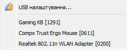

<h3 align="center"><b>Select Wi-FI module (Realtek 802.11n WLAN Adapter)</b></h3>

<br/>

<br/>

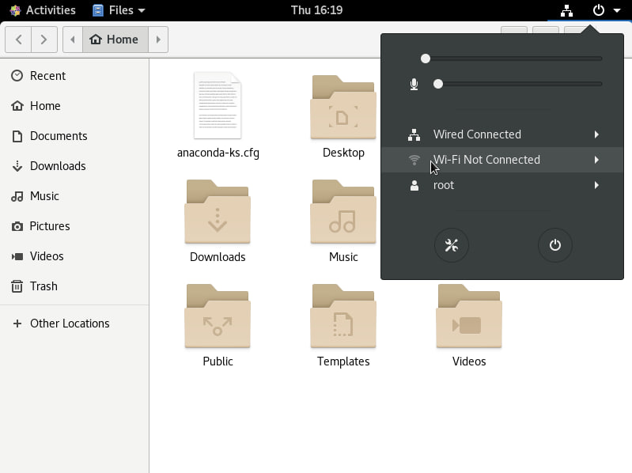

<h3 align="center"><b>Click on the chit down button above and press on WI-FI configurations</b></h3>

<br/>

<br/>

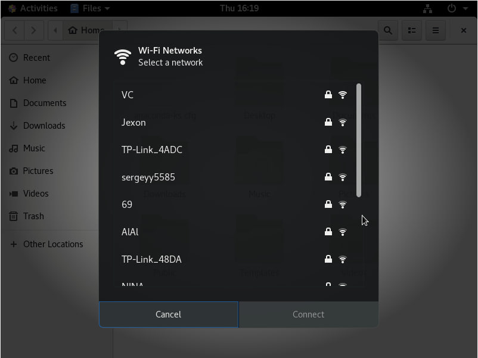

<h3 align="center"><b>Choose desire WI-FI point</b></h3>

<br/>

<br/>

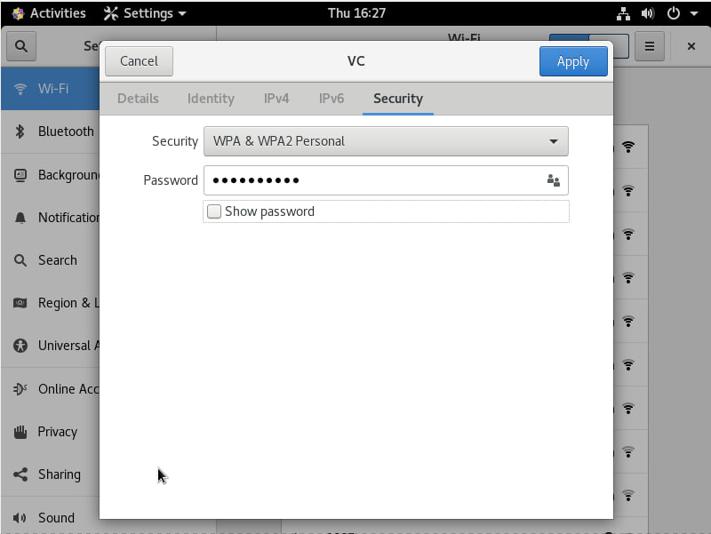

<h3 align="center"><b>Enter correct password</b></h3>

<br/>

<br/>

4. Створіть другу віртуальну машину.

```sudo yum install epel-release -y```

:arrow_down:

```sudo yum groupinstall "X Window system" -y```

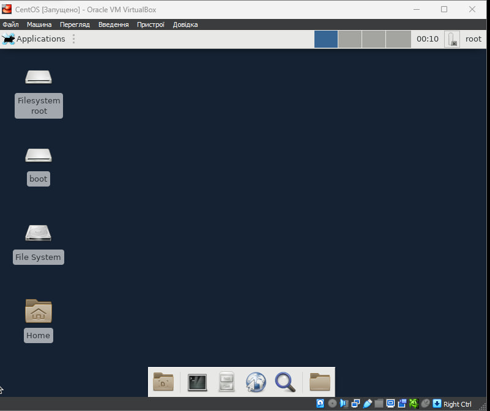

<h3 align="center"><b>Xfce</b></h3>

<br/>

<br/>

● встановіть додатково ще другу графічну оболонку (їх можливий перелік
можна знайти в лабораторній роботі №1) та порівняйте її можливості з
GNOME.

