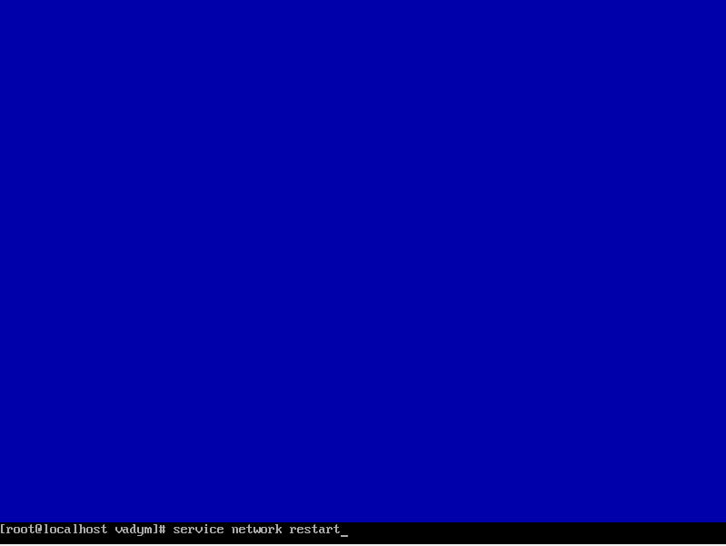

<h3 align="center">“Київський фаховий коледж зв’язку”<br/>
Циклова комісія Комп’ютерної інженерії</h3>

<br/>
<br/>
<br/>
<br/>
<br/>
<br/>

<h1 align="center">ЗВІТ ПО ВИКОНАННЮ<br/>
Work-Case № 2</h1>

<br/>

<h3 align="center">з дисципліни: «Операційні системи»</h3>

<h2 align="center">Тема: “Створення нової віртуальної машини”</h2>


<div style="text-align: right;">
    <font size="4"><b>Виконали студенти <br/> групи РПЗ-13а <br/> Команда OSGURU: <br/> Войтенко В.С., <br/>  Селезень Є.С. <br/> Перевірив викладач <br/> Сушанова В.С. </b></font>
</div>

<br/>
<br/>
<br/>

<h2 align="center">Київ 2024</h2>

<hr>

1. Встановіть на своїй домашній робочій станції гіпервізор ІІ типу – Virtual
Box, VMWare Workstation, Hyper-V (або інший на Ваш вибір).

2. Опишіть набір базових дій в встановленому Вами гіпервізорі:
   
● Створення нової віртуальної машини;


<h3 align="center"><b>Create the machine</b></h3>

<br/>

<br/>


<h3 align="center"><b>Select the folder and ISO Image</b></h3>

<br/>

<br/>


<h3 align="center"><b>Choose username and password</b></h3>

<br/>

<br/>


<h3 align="center"><b>Choose RAM size and count proccesors</b></h3>

<br/>

<br/>


<h3 align="center"><b>Choose virtual hard disc size</b></h3>

<br/>

<br/>


<h3 align="center"><b>Result</b></h3>

<br/>

<br/>


<h3 align="center"><b>Start machine</b></h3>

<br/>

<br/>


<h3 align="center"><b>Choose language</b></h3>

<br/>

<br/>


<h3 align="center"><b>Automatically configure partitioning</b></h3>

<br/>

<br/>


<h3 align="center"><b>Input password</b></h3>

<br/>

<br/>


<h3 align="center"><b>Configuration screen</b></h3>

<br/>

<br/>


<h3 align="center"><b>Create user and his password</b></h3>

<br/>

<br/>


<h3 align="center"><b>Press reboot</b></h3>

<br/>

<br/>

● Налаштування мережі в режимі CLI.


<h3 align="center"><b>Transfer into root</b></h3>

<br/>

<br/>


<h3 align="center"><b>Enter nmtui and entrance in network manager</b></h3>

<br/>

<br/>


<h3 align="center"><b>Choose edit a connection</b></h3>

<br/>

<br/>


<h3 align="center"><b>Choose enp0s3</b></h3>

<br/>

<br/>


<h3 align="center"><b>Make Automatically connect</b></h3>

<br/>

<br/>



<h3 align="center"><b>Enter service network restart</b></h3>

<br/>

<br/>

● Встановлення графічної оболонки GNOME.

```yum update```

:arrow_down:

```sudo yum -y groups install "GNOME Desktop"```

:arrow_down:

```echo "exec gnome-session" >> ~/.xinitrc```

:arrow_down:

```startx```


<h3 align="center"><b>Desktop</b></h3>

<br/>

<br/>

● Можливість роботи з зовнішніми носіями (flash-пам’ять).


<h3 align="center"><b>Choose flash drive at the bottom left</b></h3>

<br/>

<br/>


<h3 align="center"><b>Enter Wilk USB DISK 2.0</b></h3>

<br/>

<br/>


<h3 align="center"><b>This entered</b></h3>

<br/>

<br/>


<h3 align="center"><b>File manager</b></h3>

<br/>

<br/>


<h3 align="center"><b>Second variant</b></h3>

<br/>

<br/>

● Налаштування мережі та підключення до точок Wi-Fi;


<h3 align="center"><b>Select Wi-FI module (Realtek 802.11n WLAN Adapter)</b></h3>

<br/>

<br/>


<h3 align="center"><b>Click on the chit down button above and press on WI-FI configurations</b></h3>

<br/>

<br/>


<h3 align="center"><b>Choose desire WI-FI point</b></h3>

<br/>

<br/>


<h3 align="center"><b>Enter correct password</b></h3>

<br/>

<br/>

4. Створіть другу віртуальну машину.

```sudo yum install epel-release -y```

:arrow_down:

```sudo yum groupinstall "X Window system" -y```


<h3 align="center"><b>Xfce</b></h3>

<br/>

<br/>

● встановіть додатково ще другу графічну оболонку (їх можливий перелік
можна знайти в лабораторній роботі №1) та порівняйте її можливості з
GNOME.

Xfce and GNOME are two popular desktop environments for Linux and other open-source operating systems. While both provide a graphical user interface (GUI) to interact with the system, there are numerous variations between Xfce and GNOME in terms of design philosophy, user interface, resource utilization, and customization choices.<br/>
Here's a comparison of their abilities:<br/>

*Resource Usage:*

Xfce is known for being lightweight and efficient in terms of system resources. It's a great choice for older or less powerful hardware.
Gnome, on the other hand, tends to be more resource-intensive compared to Xfce. It offers more visual effects and features that may require more system resources.

*Customization:*

Xfce is highly customizable, allowing users to easily tweak and configure various aspects of the desktop environment such as themes, panel layouts, and keyboard shortcuts.
Gnome provides some customization options but tends to prioritize a more streamlined and consistent user experience out of the box. It may require more effort to customize compared to Xfce.

*User Interface:*

Gnome has a modern and polished user interface with a focus on simplicity and user-friendly design. It features a dock-style panel at the top (by default) and a Activities Overview for managing applications and workspaces.
Xfce has a more traditional desktop interface with a panel at the top or bottom (configurable) and a hierarchical menu system. It's straightforward and familiar for users coming from other desktop environments like Windows.

*Feature Set:*

Gnome comes with a rich set of features out of the box, including built-in support for virtual desktops, a powerful file manager (Nautilus), and extensive accessibility options.
Xfce provides a solid set of features including a lightweight file manager (Thunar), customizable panels, desktop icons, and support for multiple workspaces.

*Integration:*

Gnome tends to integrate well with GTK-based applications and offers a consistent user experience across the board.
Xfce also integrates well with GTK applications but is generally more flexible in terms of supporting applications from different toolkits.

*Community and Support:*

Both Gnome and Xfce have active communities providing support, documentation, and a range of third-party themes and plugins to enhance the desktop experience.

In summary, Xfce excels in its lightweight nature and high level of customization, making it a great choice for users who prioritize performance and flexibility. Gnome, on the other hand, offers a more polished and modern user interface with a richer feature set, suitable for users who prefer a more integrated and streamlined desktop experience, even if it comes at the cost of slightly higher system resource usage. Ultimately, the choice between Gnome and Xfce depends on individual preferences, hardware capabilities, and specific use cases.
