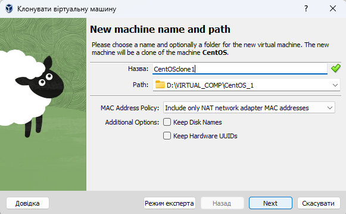
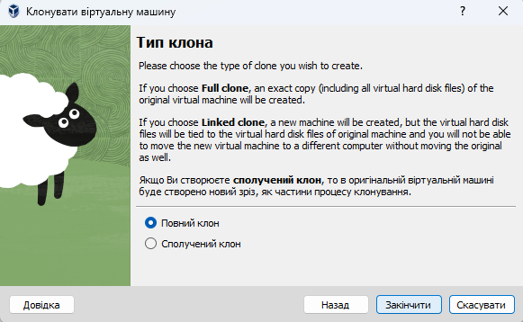
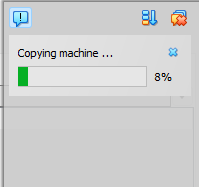
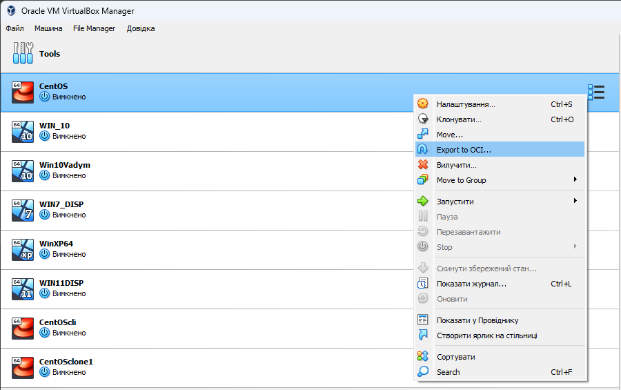
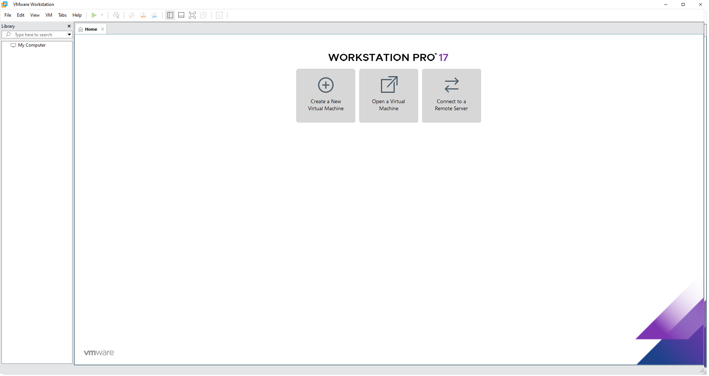
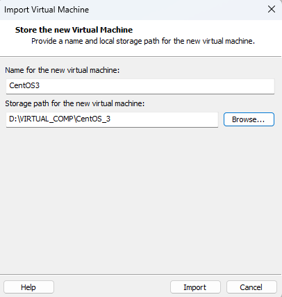
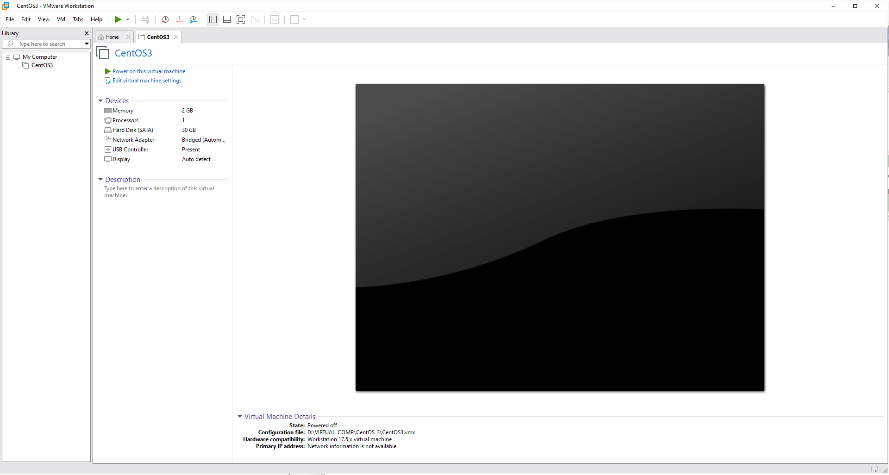
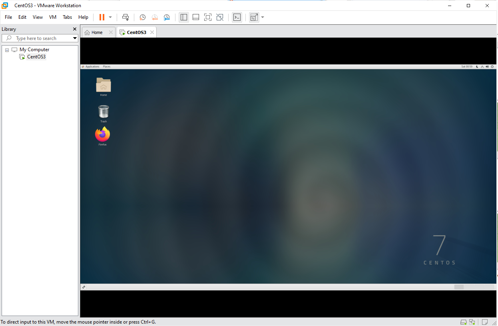

<h3 align="center">“Київський фаховий коледж зв’язку” 
Циклова комісія Комп’ютерної інженерії</h3>

 
 
 
 
 
 

<h1 align="center">ЗВІТ ПО ВИКОНАННЮ 
Work-Case № 2</h1>

 

<h3 align="center">з дисципліни: «Операційні системи»</h3>

<h2 align="center">Тема: “Створення нової віртуальної машини”</h2>

    <b>Виконали студенти   групи РПЗ-13а   Команда OSGURU:   Войтенко В.С.,    Селезень Є.С.   Перевірив викладач   Сушанова В.С. </b>

 
 
 

<h2 align="center">Київ 2024</h2>

1. В робочому середовищі віртуальної машини Virtual Box, VMWare Workstation (або інший на Ваш вибір) необхідно виконати:
   
● Клонування вашої віртуальної робочої ОС (Work-case 2). Яким чином це можна зробити? Продемонструйте всі етапи;

<h3 align="center"><b>Choose "Clone"</b></h3>

 

 

<h3 align="center"><b>Choose "Name"</b></h3>

 

 

<h3 align="center"><b>Choose "Full key"</b></h3>

 

 

<h3 align="center"><b>Copying machine...</b></h3>

 

 

● Може виникнути необхідність перенесення (клонування) ОС у інше віртуальне середовище. Які треба виконати дії для експорту вашої віртуальної робочої ОС?

<h3 align="center"><b>Choose "Export to OCI"</b></h3>

 

 

<h3 align="center"><b>Choose "Open Virtulization Format 1.0"</b></h3>

 

 

<h3 align="center"><b>Choose "Finish"</b></h3>

 

 

<h3 align="center"><b>Start "VMWare"</b></h3>

 

 

<h3 align="center"><b>Choose "File -> Open"</b></h3>

 

 

<h3 align="center"><b>Choose "Import"</b></h3>

 

 

<h3 align="center"><b>Choose "Power on this virtual machine"</b></h3>

 

 

<h3 align="center"><b>CentOS in VMWare</b></h3>

 

 

2. В ході роботи одна робоча віртуальна машина може взаємодіяти з іншою. Для цього необхідно між ними розгорнути мережу. Опишіть які типи організації мережевих з’єднань підтримуються в середовищі віртуальних машин, в чому особливість кожного з них:

● Мережевий міст (Bridged);

● Внутрішня мережа (Internal Network).