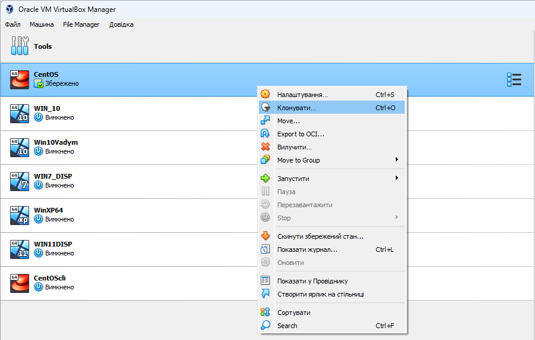
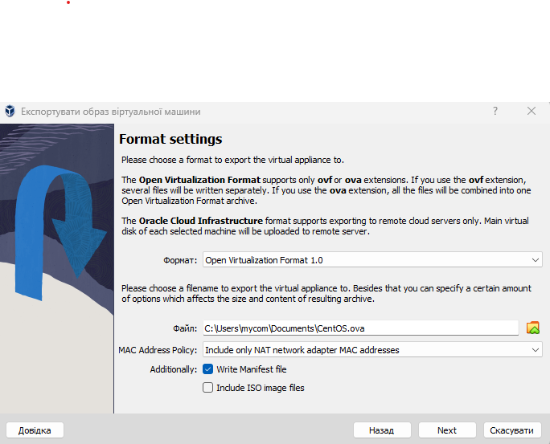
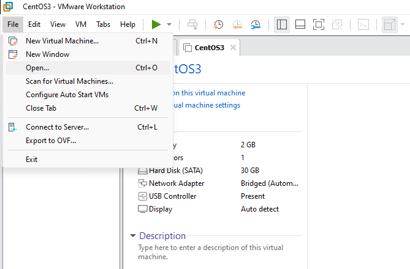

<h3 align="center">“Київський фаховий коледж зв’язку” 
Циклова комісія Комп’ютерної інженерії</h3>

 
 
 
 
 
 

<h1 align="center">ЗВІТ ПО ВИКОНАННЮ 
Work-Case № 3</h1>

 

<h3 align="center">з дисципліни: «Операційні системи»</h3>

<h2 align="center">Тема: “Клонування віртуальних машин”</h2>

    <b>Виконали студенти   групи РПЗ-13а   Команда OSGURU:   Войтенко В.С.,    Селезень Є.С.   Перевірив викладач   Сушанова В.С. </b>

 
 
 

<h2 align="center">Київ 2024</h2>

1. В робочому середовищі віртуальної машини Virtual Box, VMWare Workstation (або інший на Ваш вибір) необхідно виконати:
   
● Клонування вашої віртуальної робочої ОС (Work-case 2). Яким чином це можна зробити? Продемонструйте всі етапи;

<h3 align="center"><b>Choose "Clone"</b></h3>

 

 

<h3 align="center"><b>Choose "Name"</b></h3>

 

 

<h3 align="center"><b>Choose "Full key"</b></h3>

 

 

<h3 align="center"><b>Copying machine...</b></h3>

 

 

● Може виникнути необхідність перенесення (клонування) ОС у інше віртуальне середовище. Які треба виконати дії для експорту вашої віртуальної робочої ОС?

<h3 align="center"><b>Choose "Export to OCI"</b></h3>

 

 

<h3 align="center"><b>Choose "Open Virtulization Format 1.0"</b></h3>

 

 

<h3 align="center"><b>Choose "Finish"</b></h3>

 

 

<h3 align="center"><b>Start "VMWare"</b></h3>

 

 

<h3 align="center"><b>Choose "File -> Open"</b></h3>

 

 

<h3 align="center"><b>Choose "Import"</b></h3>

 

 

<h3 align="center"><b>Choose "Power on this virtual machine"</b></h3>

 

 

<h3 align="center"><b>CentOS in VMWare</b></h3>

 

 

2. В ході роботи одна робоча віртуальна машина може взаємодіяти з іншою. Для цього необхідно між ними розгорнути мережу. Опишіть які типи організації мережевих з’єднань підтримуються в середовищі віртуальних машин, в чому особливість кожного з них:

<h3 align="center"><b>Install Filezilla</b></h3>

 

 

<h3 align="center"><b>Print "yum install filezilla"</b></h3>

 

 

<h3 align="center"><b>Connect a computer</b></h3>

 

 

● Мережевий міст/проміжний адаптор (Bridged);

<h3 align="center"><b>Bridget mode</b></h3>

 

 

<h3 align="center"><b>View IP adress</b></h3>

 

 

<h3 align="center"><b>Create new file via filezilla on another PC</b></h3>

 

 

● Внутрішня мережа (Internal Network).

<h3 align="center"><b>Get setting for intnet network</b></h3>

 

 

 

 

<h3 align="center"><b>Transmit file with main into clone</b></h3>

 

 

3. Розгорніть мережу між вашою робочою ОС та її клоном (завдання 1):

Обидві ОС мають мати вихід у мережу Інтернет. Відкрийте браузер та перегляньте будь-яке відео в youtube

<h3 align="center"><b>Print "yum install filezilla"</b></h3>

 

 

4. Яким чином можна організувати обмін інформацією між вашою основною ОС (наприклад Windows) та віртуальними ОС? Скопіюйте довільний аудіо- файл з вашої основної ОС на робочий стіл віртуальної ОС та її клона. Як зробити зворотну дію, коли треба документ з робочого столу віртуальної ОС скопіювати до вашої основної робочої ОС?

<h3 align="center"><b>Choose "Shared folders"</b></h3>

 

 

<h3 align="center"><b>Choose "Devices" -> "Drad and Drop" -> "Bidirectional"</b></h3>

 

 

<h3 align="center"><b>Choose way, name and press a OK</b></h3>

 

 

 

 

 

 

 

 

 

 

 

 

 

 

 

 

Висновок 

In this article, we have explored the basic aspects of working with virtual machines in various virtual environments such as VirtualBox and VMWare Workstation. We looked at the process of cloning virtual operating systems and exporting them to another virtual environment.
In the process of setting up a network between virtual machines, we considered various types of network connections, such as NAT, Bridged, Host-only, and Internal Network, each of which has its own characteristics and purpose.
We have successfully deployed a network between virtual operating systems, configured Internet access, exchanged messages over the local network, and set up a shared network folder for both operating systems.
Next, we studied the methods of exchanging information between virtual operating systems and the main OS, considered the process of copying an audio file from the main OS to the desktop of virtual machines, as well as the opposite action - copying a document from the desktop of virtual machines to the main OS.
In cases where some tasks could not be completed completely, we have indicated the methodology for performing them or possible reasons for failure.
Thus, this work allowed us to gain practical skills in working with virtual machines and their interaction with the network and the main operating system. 
