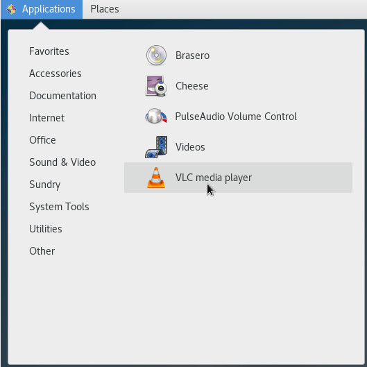
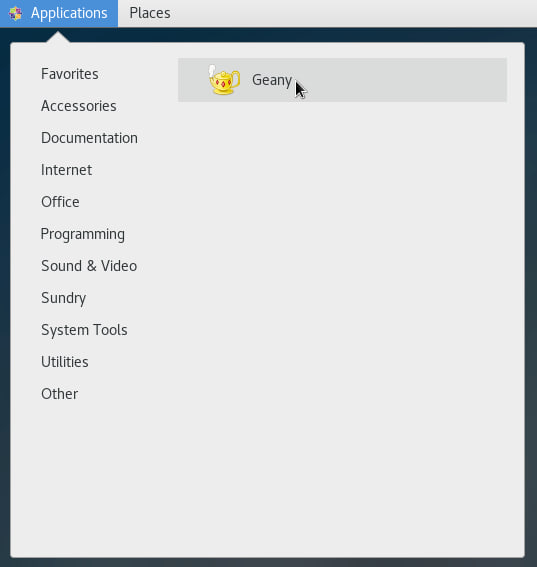
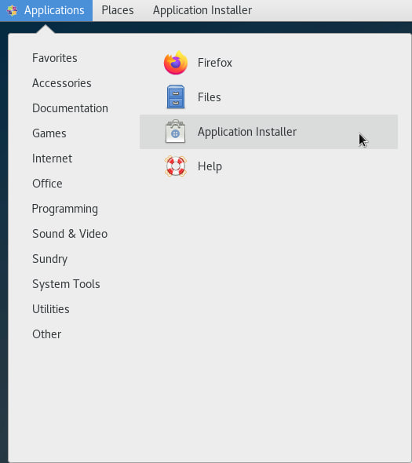

<h3 align="center">“Київський фаховий коледж зв’язку” 
Циклова комісія Комп’ютерної інженерії</h3>

 
 
 
 
 
 

<h1 align="center">ЗВІТ ПО ВИКОНАННЮ 
Work-Case № 4</h1>

 

<h3 align="center">з дисципліни: «Операційні системи»</h3>

<h2 align="center">Тема: “Робота з менеджерами пакетів”</h2>

    <b>Виконали студенти   групи РПЗ-13а   Команда OSGURU:   Войтенко В.С.,    Селезень Є.С.   Перевірив викладач   Сушанова В.С. </b>

 
 
 

<h2 align="center">Київ 2024</h2>

1. В ході роботи досить часто виникає необхідність встановлювати нові програми та додатки. Для цього необхідно в терміналі вміти працювати з менеджерами пакетів:

● Дайте розгорнуте визначення таким поняттям як «пакет» та «репозиторій».
 
A **package** is a collection of files that contains programs, libraries, configuration files, and other components that are necessary for the installation and proper operation of a software product or application. Each package usually has its own unique identifier, version, and dependencies that point to other packages that need to be installed or that it uses.

Packages make it easy to distribute, install, and update software on operating systems. They can be used to manage programs as well as to resolve dependencies between different software components.

A **repository** is a centralized storage of software for a particular operating system or distribution. A repository usually stores software packages, their metadata, and other information about them. Repositories provide users with access to software to install, update, and manage it.

Repositories are maintained by operating system developers or relevant communities that ensure that the packages are up-to-date and secure. Users can choose the repositories they want to use, as well as add their own repositories to access specialized software.

● Надайте короткий огляд існуючих менеджерів пакетів у Linux. Охарактеризуйте їх основні можливості.

**APT (Advanced Package Tool)**
 
Використовується в Debian та на його основі заснованих дистрибутивах, таких як Ubuntu.
 
Основна команда: apt-get.
 
Можливості: встановлення, оновлення, видалення пакетів, пошук пакетів, керування залежностями, автоматичне вирішення конфліктів.

**DNF (Dandified Yum):**
 
Використовується в Fedora, CentOS та інших дистрибутивах на основі Fedora.
 
Основна команда: dnf.
 
Можливості: встановлення, оновлення, видалення пакетів, пошук пакетів, керування залежностями, автоматичне вирішення конфліктів.

**Pacman:**
 
Використовується в Arch Linux та його споріднених дистрибутивах.
 
Основна команда: pacman.
 
Можливості: оновлення, встановлення, пошук пакетів, видалення пакетів пакетів, керування залежностями, автоматичне вирішення конфліктів.

**ZYpp (ZYpper):**
 
Використовується в openSUSE та SUSE Linux Enterprise.
 
Основна команда: zypper.
 
Можливості: встановлення, оновлення, видалення пакетів, пошук пакетів, автоматичне вирішення конфліктів, керування залежностями.

2. Визначте який менеджер пакетів використовує ваш дистрибутив Linux.
 
Опишіть основні команди для роботи з ним:

● Пошук, скачування та установка необхідних пакетів, яких у Вашій системі немає (зі сховища по замовчуванню, з нового репозиторію тощо).
 
yum search "package name" (search for packages by name or keywords)

yum install "package name" (installing the package)

yum update (update all installed packages to the latest versions)

yum groupintall "package name" (installing a group of packages)

● Перегляд інформації про встановлені та доступні пакети.
 
yum list installed ( view installed packages)

yum list available (view the packages available for installation)

yum info "package name"( detailed information about the package)

● Видалення непотрібних або застарілих пакетів.
 
yum remove "package name" (delete a package)

yum autoremove (remove packages that are no longer needed)

● Оновлення менеджера пакетів.
 
yum upgrate (update the yum package manager itself to the latest version)

3. Встановіть у терміналі через менеджер пакетів на свою систему:

● Новий відео- чи аудіоплейер.

sudo yum install epel-release
 
:arrow_down:
 
https://download1.rpmfusion.org/free/el/rpmfusion-free-release-7.noarch.rpm
 
:arrow_down:
 
sudo yum install vlc

 

 

● Середовище для мови програмування, що ви вивчаєте.

yum install geany

 

 

1. Яким чином можна встановити нові програми через магазини додатків та менеджери пакетів у графічному середовищі. Наведіть свої приклади.

 

 

Consulution:

In this task, we've learned the importance of package management in our Linux system. Understanding terms like "package" and "repository" is crucial. We explored various package managers like apt, yum, and pacman, each offering unique features for tasks such as searching, installing, and updating packages.

Identifying and mastering basic commands for our specific package manager ensures smooth system maintenance. We successfully installed new software, including a video or audio player and a programming language environment, directly from the terminal.

We also discussed installing software through graphical application stores, highlighting the versatility of package management systems.

Overall, mastering package management is essential for maintaining our system's integrity, ensuring access to software, and upholding stability and security.
